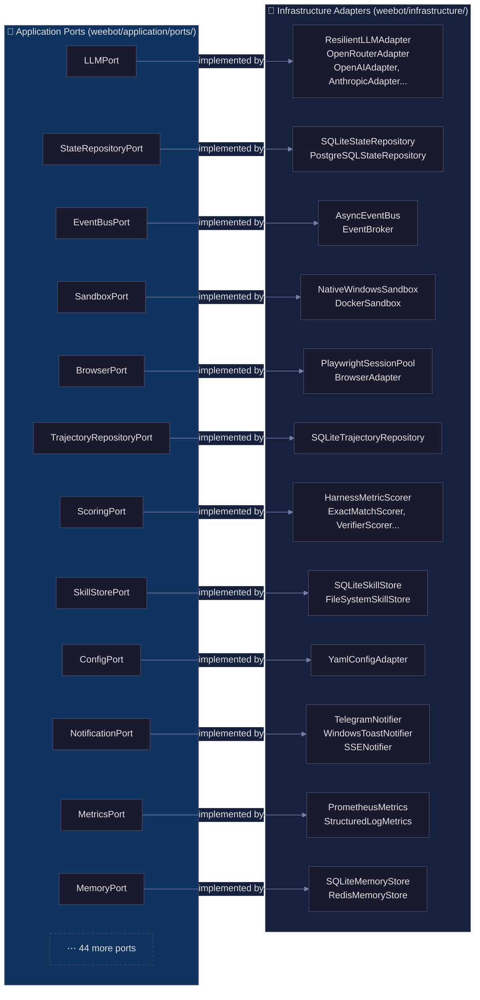

# ARCHITECTURE.md — weebot AI Orchestrator

**Last updated:** 2026-06-30 (Mermaid diagram added)
**Architecture score:** 8.0/10 (post-Architecture 8-of-10 Plan — all 7 mandatory + 2 optional items done)
**Last audit:** Implementation Audit Report — APPROVED WITH MINOR DEVIATIONS (2026-06-30)
**Maturity:** Production
**Paradigm:** Clean Architecture (Hexagonal Ports & Adapters) + CQRS Mediator + State-Machine Flows

---

## Recent Changes (2026-06-07)

## Architecture Remediation Update (2026-06-18)

**Audit score:** 6/10 → **Estimated: 7.5-8.0/10** (post-remediation)
**Remediation plan:** ARCHITECTURE_REMEDIATION_PLAN.md
**ExecutorAgent:** 1,414 lines → 803 lines (−43%), 4 collaborators extracted

### Completed Changes

| Change | Files |
|--------|-------|
| ExecutorAgent extraction | `_cascade.py`, `_tool_executor.py`, `_context_compressor.py`, `_error_handler.py` |
| Port creation (SkillStorePort, TrajectoryRepositoryPort) | `ports/skill_store_port.py`, `ports/trajectory_repository_port.py` |
| Application→infrastructure leakage fix | 6 handlers/flows updated; `transfer_handler.py` DI-injected |
| Core layer boundary fix | `scan_for_injection` → `infrastructure/security/` |
| Mutable state fixes | `_TOOL_TIERS` accessors, `reset_all_buckets()`, `_reset_metrics_cache()` |
| Metrics bridge | `services/metrics_bridge.py`; 3 callers updated |
| CQRS handler split | `handlers.py` (779→321 lines) → 8 individual handler files |
| Deprecated port deletion | `capability_gate_port.py`, `truth_binding_port.py` |

### New Architecture Decision Records

**ADR-006:** Port Rationalization (2026-06-18) — Delete ports with <2 implementations and no planned polymorphism. 2 deprecated ports deleted. 27 single-impl ports retained as they have callers.

**ADR-007:** ExecutorAgent Extraction (2026-06-18) — Split 1,414-line god class into 5 focused units: orchestrator (`_base.py`, ~800 lines), cascade executor (295 lines), tool executor (198 lines), context compressor (149 lines), error handler (129 lines).

**ADR-008:** Port Rationalization v2 (2026-06-18) — ToolDiscoveryPort and TaskQueuePort deleted (zero non-TYPE_CHECKING runtime callers). Plan's original estimate of "39 deletable ports" corrected to 2 — remaining 30 single-impl ports all have DI registrations or runtime consumers and are retained with planned-polymorphism documentation.

**ADR-009:** FlowRouter Extraction (2026-06-18) — State-transition routing logic extracted from PlanActFlow.run() into FlowRouter.resolve_initial_state(). Routing decisions now testable in isolation. Session context mutations (flag clearing, misalignment recording) preserved via tuple return (FlowState, Session).

### v2 Completed Changes (2026-06-18)

| Change | Files | Impact |
|--------|-------|--------|
| FlowRouter extraction | `flows/flow_router.py`, `flows/plan_act_flow.py` | State routing testable in isolation |
| `query_handlers.py` split | 3 files (session/plan/active) | 445→avg 150 lines per file |
| `_handle_step_completion` extraction | `agents/executor/_base.py` | execute_step reduced ~40 lines |
| `reset_global_pool()` added | `infrastructure/browser/session_pool.py` | Test isolation for browser pool |
| Port cleanup v2 | `ToolDiscoveryPort`, `TaskQueuePort` deleted | 2 unused ABCs removed |
| Cascade integration tests | `tests/integration/test_cascade_integration.py` | 8 tests, env-var gated |
| Architecture fitness tests | `test_architecture_fitness.py` | 5 new tests (39 total) |

### Remaining Debt

| # | Item | Severity | Status |
|---|------|----------|--------|
| D15 | `plan_act_flow.py` imports 29 modules (target 20) | LOW | FlowRouter extraction done; further reduction needs DI refactoring |
| D16 | `_base.py` still 823 lines (target 620) | MEDIUM | `_handle_step_completion` extracted; preamble (~100 lines) still inline |
| D17 | Application services read files/env directly (14 sites) | LOW | `FileStoragePort` exists; migration deferred as config files are acceptable |
| D18 | Failure signature handler 310 lines (limit 350) | LOW | Near limit; split in next pass if growth continues |

---

## Architecture Diagram

> Generated 2026-06-30. Mermaid live-editor compatible.

### Layer Boundaries & Dependency Direction

Dependencies flow **inward**: each outer layer depends on the layer(s) it wraps, never outward. Domain is pure — zero imports from any other layer. Infrastructure implements ports defined by Application/Domain; Interfaces wire everything via the DI container.

```mermaid
%%{init: {'theme':'base','themeVariables': {
  'primaryColor': '#1a1a2e',
  'primaryTextColor': '#e0e0e0',
  'primaryBorderColor': '#4a4a6a',
  'lineColor': '#7c7caa',
  'secondaryColor': '#16213e',
  'tertiaryColor': '#0f3460'
}}}%%
graph TD
    subgraph interfaces["🔌 Interfaces — Entry Points"]
        direction LR
        CLI["<b>CLI</b><br/>click commands<br/>harness / flow / dream"]
        WEB["<b>Web API</b><br/>FastAPI / WebSocket / SSE<br/>routers / middleware"]
        GATEWAYS["<b>Gateways</b><br/>Discord / Slack / Telegram"]
        UI["<b>Next.js UI</b><br/><i>weebot-ui/</i>"]
    end

    subgraph tools["🛠️ Tools — Agent Tool Layer"]
        direction LR
        TOOL_BROWSER["<b>BrowserTool</b><br/>browser-use + Playwright"]
        TOOL_BASH["<b>BashTool</b><br/>sandboxed shell exec"]
        TOOL_PYTHON["<b>PythonTool</b><br/>sandboxed code runner"]
        TOOL_FILE["<b>FileEditorTool</b><br/>read / write / patch"]
        TOOL_OTHER["39+ tools<br/>image gen, mail,<br/>voice, scheduling..."]
    end

    subgraph app["🧠 Application — Orchestration"]
        direction LR
        FLOWS["<b>Flows</b><br/>PlanActFlow • ChatFlow<br/>HarnessOptFlow • SkillOptFlow"]
        AGENTS["<b>Agents</b><br/>Planner • Executor • Critic<br/>Dreamer • Retention"]
        CQRS["<b>CQRS</b><br/>Mediator • Commands<br/>Queries • Handlers"]
        DI["<b>DI Container</b><br/>Container + mixins"]
        SERVICES["<b>Services</b><br/>Task Runner • Model Selection<br/>Harness • Scoring • Regression"]
    end

    subgraph infra["🏗️ Infrastructure — Adapters"]
        direction LR
        LLM["<b>LLM Adapters</b><br/>OpenRouter • OpenAI • Anthropic<br/>DeepSeek • Moonshot • Resilient"]
        PERSIST["<b>Persistence</b><br/>SQLite • PostgreSQL<br/>Event Store • Trajectory Repo"]
        BROWSER["<b>Browser</b><br/>Playwright Pool"]
        SANDBOX["<b>Sandbox</b><br/>Native • Docker"]
        OBSERV["<b>Observability</b><br/>StructLog • Prometheus<br/>Metrics • Tracing • Health"]
        MCP["<b>MCP</b><br/>Client Bridge • Toolkit"]
    end

    subgraph domain["🎯 Domain — Pure Entities"]
        direction LR
        MODELS["<b>Models</b><br/>Session • Plan • Event<br/>CodeReview • Step • ToolCall"]
        PORTS["<b>Protocol Ports</b><br/>IModelProvider • IRepository<br/>ITool • EventPublisher"]
        SERVICES_DOM["<b>Services</b><br/>Session Memory • Working Memory<br/>Human Interaction"]
    end

    subgraph core["⚙️ Core — Cross-Cutting"]
        direction LR
        BASH_GUARD["Bash Guard<br/>(security sandbox)"]
        CASCADE["Model Cascade<br/>(model routing)"]
        SAFETY["Safety<br/>(egress / circuit breaker)"]
        LOGGING["Structured Logger<br/>(trace / correlation ID)"]
    end

    interfaces -->|"depends on"| app
    interfaces -->|"composition root"| infra
    app -->|"depends on"| domain
    infra -->|"implements ports"| app
    infra -->|"implements ports"| domain
    tools -->|"depends on"| app
    tools -->|"uses"| core
    app -->|"uses"| core
    core -.->|"(no inward deps)"| domain

    style interfaces fill:#1a1a2e,stroke:#4a4a6a,color:#e0e0e0
    style tools fill:#16213e,stroke:#4a4a6a,color:#e0e0e0
    style app fill:#0f3460,stroke:#4a4a6a,color:#e0e0e0
    style infra fill:#0f3460,stroke:#4a4a6a,color:#e0e0e0
    style domain fill:#1a3a2e,stroke:#4a6a4a,color:#e0e0e0
    style core fill:#3a2a1a,stroke:#6a5a3a,color:#e0e0e0
```

### Port / Adapter Mapping

**56+ ports** are defined in `weebot/application/ports/`. Key mappings below show which adapter(s) implement each port:

### Architecture Enforcement

Architecture boundaries are enforced at three levels:

| Level | Mechanism | What It Checks |
|-------|-----------|----------------|
| **Static (CI)** | `.importlinter` — 4 contracts | Domain purity, tools-no-db, infra-no-app-services, interfaces-no-infra |
| **Dynamic (CI)** | `tests/unit/test_architecture_fitness.py` (44+ tests) | AST-based: layer boundaries, port contracts, import rules |
| **Lint (CI)** | `scripts/lint_async_io.py` | Blocking I/O inside async def (open(), sqlite3.connect(), etc.) |
| **Lint (CI)** | Ruff `B` rules (bugbear) | Mutable defaults, bare except, etc. |

See `AGENTS.md` → Architecture Rules for the full dependency matrix.
