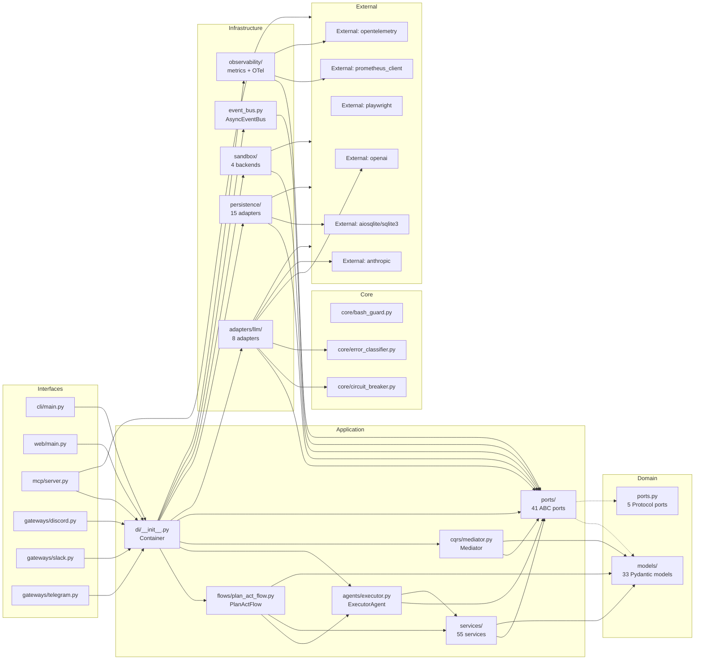

# ARCHITECTURE MINDMAP — Forensic Reconstruction

> **Date:** 2026-06-22 (last full reconstruction: 2026-06-07; delta updates applied 2026-06-22)

## DELTA UPDATE — 2026-06-22 (15 commits since last reconstruction)

### New Additions
- **SemanticTaskRouter** (`commit 2985ae4`): New ML-based task-to-model router replacing keyword-only classifier. Accuracy: 52%→80% across 3 cycles (`a6c35cb` → `b9329a5` → `402207c`).
- **Model-aware tool selection (P8)** (`commit dcf8669`): Phase 4 EXPAND feature — selects tools based on model capability profiles rather than static catalogs. Part of the ongoing 4-phase hardening cycle.
- **Credit pre-check** (`commit 233f8ba`): Pre-validation of user credit before task execution, preventing wasted tool calls on quota-exhausted accounts.

### Deletions
- **Dead code removed** (`commit 4d02697`): Phase 3 SIMPLIFY — deleted unused functions, deduplicated catalog entries, consolidated role configuration files.
- **Catalog generator deprecated** (`commit a257f9a`): Added to deferred items list; browser audit also deferred.

### Fixes & Hardening
- **Kimi/Moonshot native routing** (`dcf8669`): P4 fixed — direct API routing for Kimi K2 models bypassing OpenRouter.
- **DeepSeek P3 verified** (`53045cf`): Model routing confirmed working.
- **Rate limiter P5** (`53045cf`): Fixed connection reuse and retry timing.
- **BashGuard enhanced** (`8ebbe01`): Added Windows-specific danger patterns, encoded payload detection, relaxed false-positive rm patterns.
- **GLM-5.2 thinking mode** (`e822e1f`): Disabled for short queries to reduce latency.
- **Tool-call budget** (`abc6250`): Raised to 12, `OUTPUT_ROOT` env var injection added.
- **10 remediation items** closed across 3 hardening cycles (RC-1 through RC-9, plus P3/P4/P5).

### Architecture Violations Fixed
- Layer classifier updated with `weebot/config`, `weebot/models`, `weebot/utils` prefixes (`commit 70cb904`)
- Zero unknown modules achieved (`commit 79ed4d9`): all 4690 files classified into known layers.
- Zero core→application violations confirmed.

### Pending
- Browser audit: deferred (`a257f9a`)
- Catalog generator: deferred (`a257f9a`)
- Cascade cross-reference validation: deferred (`a257f9a`)

> **Method:** Full codebase traversal (3+ levels deep) with file:line citations
> **Confidence taxonomy:** CONFIRMED (direct evidence) | LIKELY (strong indirect) | SPECULATIVE (plausible, flag for Uncertainty Log)

---

## 1. SYSTEM IDENTITY

- **Primary Language:** Python 3.12+ (type hints throughout, `str | None` union syntax, `@dataclass` with `field`, `match` statements in some modules) [CONFIRMED: `weebot/core/circuit_breaker.py:1` `from __future__ import annotations`]
- **Frameworks:**
  - FastAPI 0.100+ (`weebot/interfaces/web/main.py:8` `from fastapi import FastAPI`)
  - Click 8.0+ (`cli/main.py:1` `import click`)
  - Pydantic v2 (`weebot/domain/models/session.py:1` `from pydantic import BaseModel`)
  - FastMCP ≥ 1.5 (`weebot/mcp/server.py:12` `from mcp.server.fastmcp import FastMCP`)
  - aiosqlite 0.20+ (`weebot/infrastructure/persistence/sqlite_tool_repo.py:17` `import aiosqlite`)
  - Prometheus client 0.21+ (`weebot/infrastructure/observability/metrics.py:6` `from prometheus_client import Counter, Histogram, Gauge`)
  - structlog 25.1+ (`requirements.txt:7` `structlog>=25.1.0`)
  - Playwright 1.40+ (`weebot/infrastructure/browser/playwright_adapter.py` `from playwright.async_api import async_playwright`)
  - OpenTelemetry 1.30+ (`weebot/infrastructure/observability/otel_sink.py`)
  - APScheduler (`weebot/scheduling/scheduler.py`)
  - Rich 13.0+ (`cli/commands/analytics.py` `from rich.console import Console`)
- **Architectural Style:** Hexagonal (Ports & Adapters) — 41 ABC ports in `application/ports/`, 5 Protocol ports in `domain/ports.py`, all external resources behind adapters in `infrastructure/`. Enforced by import-linter + AST fitness tests. [CONFIRMED: `.importlinter` + `tests/unit/test_architecture_fitness.py`]
- **Entry Points:**
  - CLI: `cli/main.py` → Click command tree → `Container.configure_defaults()` → flow.run()
  - Web API: `weebot/interfaces/web/main.py` → FastAPI app factory with 10 routers
  - MCP Server: `weebot/mcp/server.py` → FastMCP (stdio/SSE transport)
  - Discord Gateway: `weebot/interfaces/gateways/discord.py` → Interaction endpoint
  - Slack Gateway: `weebot/interfaces/gateways/slack.py` → Events API
  - Telegram Gateway: `weebot/interfaces/gateways/telegram.py` → Bot API webhook
  - Python Library: `weebot/application/di/__init__.py` → `Container` import
- **Build/Config Files:**
  - `requirements.txt` — 50+ dependencies
  - `pyproject.toml` / `setup.py` — not found (pip-based install)
  - `Dockerfile.api`, `Dockerfile.web`, `docker-compose.yml` — container deployment
  - `.env.example` — environment template
  - `.importlinter` — 5 layer-boundary contracts
  - `.coveragerc` — test coverage config
  - `pytest.ini` — pytest config (asyncio mode=strict)

---

## 2. MODULE INVENTORY

### Domain `weebot/domain/`
- **Responsibility:** Pure business entities, Protocol ports, domain services. Zero outer-layer imports.
- **Type:** core logic (innermost layer)
- **Exports:** `Plan`, `Step`, `Session`, `AgentEvent` (19 types), `Skill`, `FlowCheckpoint`, `SoulProfile`, 5 Protocol ports, exception hierarchy
- **Internal Structure:**
  - `models/event.py` — 19 discriminated AgentEvent types + 6 DomainEvent types; `AgentEvent = Union[ErrorEvent, PlanEvent, StepEvent, ToolEvent, MessageEvent, TitleEvent, DoneEvent, WaitForUserEvent, NotificationEvent, ThoughtEvent, SteeringEvent, CanonicalizationEvent, TodoEvent, VerificationEvent, TrajectoryDiagnosisEvent]` [CONFIRMED: `weebot/domain/models/event.py:311`]
  - `models/session.py` — `Session(BaseModel)`: id, status, events_json (immutable), context (SessionContext), cost fields
  - `models/plan.py` — `Plan(BaseModel)`: steps list, `PlanStatus` enum, `Step` with status/result
  - `models/soul.py` — `SoulProfile`: Hermes-compatible identity, `identity`, `expertise`, `constraints`, `style` sections
  - `models/checkpoint.py` — `FlowCheckpoint`: session_id, flow_type, current_state, plan_snapshot, completed_steps
  - `models/skill.py` — `Skill`: name, version, prompt, metadata, triggers
  - `ports.py` — 5 `@runtime_checkable` Protocols: `IModelProvider`, `IRepository`, `INotifier`, `ITool`, `EventPublisher`
  - `exceptions.py` — `WeebotError(Exception)` + 8 subtypes: `BudgetExceededError`, `SafetyError`, `TaskExecutionError`, `ProjectNotFoundError`, `CheckpointError`, `InjectionDetectedError`, `PathTraversalError`, `SandboxViolationError`
  - `services/session_memory.py` — `SessionMemory` domain service
  - `services/working_memory.py` — `WorkingMemory` domain service
  - `services/human_interaction.py` — `HumanInteraction` domain service
- **Dependencies:**
  - → stdlib only (typing, datetime, enum, uuid, hashlib, json)
  - → No imports from `application`, `infrastructure`, `interfaces`, `core`, `tools` [CONFIRMED: `tests/unit/test_architecture_fitness.py:89` `test_domain_has_no_outer_imports`]

### Application — Ports `weebot/application/ports/`
- **Responsibility:** 41 ABC interfaces defining contracts between application and infrastructure.
- **Type:** interface (port definitions)
- **Exports:** `LLMPort`, `EventBusPort`, `StateRepositoryPort`, `SandboxPort`, `CheckpointPort`, `ToolRepositoryPort`, `AnalyticsSinkPort`, `AuditPort`, `BehavioralLearnerPort`, `BrowserPort`, `CanonicalizerPort`, `CapabilityGatePort` [DEPRECATED], `ConfigPort`, `DesktopPort`, `EventStorePort`, `KnowledgeGraphPort`, `MCPToolPort`, `MemoryPort`, `MetricsPort`, `NotificationPort`, `OptimizerPort`, `PlanCriticPort`, `ProfileStoragePort`, `ScoringPort`, `SelfImprovementPort`, `SkillIndexPort`, `SkillRetrieverPort`, `SkillVariantStorePort`, `SoulProviderPort`, `SpeechPort`, `SteeringPort`, `SubAgentCostTrackerPort`, `SubAgentFactoryPort`, `SummaryRepositoryPort`, `SwarmEventBusPort` [DEPRECATED], `TaskQueuePort`, `TaskRouterPort`, `ToolDiscoveryPort`, `TracingPort`, `TruthBindingPort` [DEPRECATED]
- **Internal Structure:** Each file = one ABC class with `@abstractmethod` signatures
- **Dependencies:** → `domain/models/` for type annotations only

### Application — CQRS `weebot/application/cqrs/`
- **Responsibility:** Command/Query Responsibility Segregation with Mediator pipeline.
- **Type:** core logic
- **Exports:** `Mediator`, `Command`, `Query`, `CommandResult`, `IRequestHandler`, `IPipelineBehavior`
- **Internal Structure:**
  - `mediator.py` — `Mediator`: `send(command)` → `_build_pipeline()` → handler; `register_handler()`, `add_pipeline_behavior()`, `build_mediator()`
  - `commands.py` — 17 Command subclasses (CreatePlan, ExecuteStep, UpdatePlan, etc.)
  - `queries.py` — 12 Query subclasses (GetSession, ListSessions, GetCostSummary, etc.)
  - `handlers.py` + `handlers/` — 20+ handlers: `CreatePlanHandler`, `ExecuteStepHandler`, query handlers, skill edit handlers, trajectory handlers
  - `behaviors/` — 5 pipeline behaviors: `LoggingBehavior`, `ValidationBehavior`, `ValidationGateBehavior`, `SavePolicyBehavior`, `TelemetryBehavior`
- **Dependencies:** → `domain/models/` (event, plan, session, skill) → `application/ports/` (state_repo_port, event_bus_port)

### Application — Flows `weebot/application/flows/`
- **Responsibility:** State-machine flows orchestrating agent execution.
- **Type:** core logic
- **Exports:** `PlanActFlow`, `ChatFlow`, `SkillOptFlow`, `HyperAgentFlow`, `HarnessGenerationFlow`, `WorkflowPlanner`
- **Internal Structure:**
  - `plan_act_flow.py` — `PlanActFlow(BaseFlow)`: 22-param constructor (now `PlanActFlowConfig`), `run(prompt)` async generator, `_emit(event)` (truth-binding + credential sanitization + persistence), `_maybe_save_checkpoint()`, `set_state()`, `undo()`, `redo()`
  - `states/base.py` — `FlowState(ABC)`, `AgentStatus` enum
  - `states/planning.py` — `PlanningState`: calls `PlannerAgent.generate_plan()`
  - `states/executing.py` — `ExecutingState`: calls `ExecutorAgent.execute_step()`
  - `states/verifying.py` — `VerifyingState`: Chain-of-Verification (`WEEBOT_COVE_ENABLED` guard)
  - `states/critiquing.py` — `CritiquingState`: plan validation via `PlanCriticService`
  - `states/summarizing.py` — `SummarizingState`: compacts memory
  - `states/updating.py` — `UpdatingState`: plan revision
  - `states/completed.py` — `CompletedState`: terminal state
  - `states/meta_analysis.py` — `MetaAnalysisState`: trajectory analysis
  - `chat_flow.py` — `ChatFlow`: conversational agent without plan loop
  - `skill_opt_flow.py` — `SkillOptFlow`: batch skill optimization with scoped mediator
  - `hyper_agent_flow.py` — `HyperAgentFlow`: multi-agent orchestration
- **Dependencies:** → `application/agents/` (PlannerAgent, ExecutorAgent) → `application/ports/` (LLMPort, EventBusPort, CheckpointPort) → `application/services/` (MemoryCompactor, ContextSwitcher, PlanHistory, ContinuationDetector, PlanCriticService, TruthBinder) → `domain/models/` (all)

### Application — Agents `weebot/application/agents/`
- **Responsibility:** LLM-calling agents that implement specific agent roles.
- **Type:** core logic
- **Exports:** `PlannerAgent`, `ExecutorAgent`, `StructuredExecutorAgent`, `ChatAgent`, `OptimizerAgent`, `HyperAgent`, `GoalAgent`, `SynthesizerAgent`, `LayerEditorAgent`, `LayerDiagnosticsAgent`
- **Internal Structure:**
  - `planner.py` — `PlannerAgent`: `generate_plan(task, facts, skill_prompt)` → `Plan`; uses planner system prompt; model cascade via `MODEL_CASCADE_TIER1..4`
  - `executor.py` — `ExecutorAgent` (858 lines): `execute_step(step)` → yields events; model cascade with parallel Phase 1 dispatch; trajectory health monitoring; policy loop detection (≥3 consecutive same-class errors → `WaitForUserEvent`)
  - `structured_executor.py` — `StructuredExecutorAgent`: extends ExecutorAgent with structured output protocol
  - `chat_agent.py` — `ChatAgent`: simple conversation without tool loop
  - `optimizer_agent.py` — `OptimizerAgent(OptimizerPort)`: skill optimization via frontier model
  - `hyper_agent.py` — `HyperAgent`: sub-agent orchestration
- **Dependencies:** → `application/ports/llm_port.py` (LLMPort) → `application/ports/event_bus_port.py` (EventBusPort) → `application/services/` (ConversationCompressor, StepBudget, TokenBudgetMonitor) → `config/model_refs.py` (model cascade constants) → `config/constants.py` (MAX_EXECUTOR_STEPS, TEMPERATURE_BALANCED) → `tools/base.py` (ToolResult, BaseTool)

### Application — Services `weebot/application/services/`
- **Responsibility:** 55 orchestration services for cross-cutting agent concerns.
- **Type:** core logic
- **Exports:** `TaskRunner`, `FlowSerializer`, `MemoryCompactor`, `ContextSwitcher`, `PlanCriticService`, `TruthBinder`, `ContinuationDetector`, `ConversationCompressor`, `EpisodicMemory`, `BehavioralLearner`, `SelfImprover`, `MetaCritic`, `MetaSelfImprover`, `EvolutionTracker`, `SkillCurator`, `StrategyTransfer`, `PlanNovelty`, `StagedEvaluator`, `KeywordTaskRouter`, `BM25SkillRetriever`, `ActionCanonicalizer`, `AuditService`, `ModelSelectionService`, `ScopeClassifier`, `ChainOfVerification`, +25 more
- **Internal Structure:** Flat namespace — all services in one directory
- **Dependencies:** → `application/ports/` (various ports) → `domain/models/` → `infrastructure/` (2 exceptions: `meta_self_improver.py` imports `meta_improvement_log`, `strategy_transfer.py` imports `strategy_store` — tracked for migration)

### Application — DI `weebot/application/di/`
- **Responsibility:** Single composition root wiring all ports to adapters.
- **Type:** infrastructure (composition root)
- **Exports:** `Container` (dataclass with 5 mixins)
- **Internal Structure:**
  - `__init__.py` — `Container(FactoriesMixin, AgentToolsMixin, CapabilitiesMixin, SkillsMixin, SkillOptMixin)`: `register()`, `get()`, `register_instance()`, `configure_defaults()`, `build_agent_runner()`
  - `_factories.py` — 23 `@staticmethod` factory methods: `_create_state_repo()`, `_create_event_bus()`, `_create_llm()`, `_create_sandbox()`, `_create_tool_repo()`, `_create_checkpoint_store()`, `_create_soul_provider()`, etc.
  - `_agent_tools.py` — `AgentToolsMixin`: `configure_web_clone()`, `_build_plan_act_flow_for_session()`
  - `_capabilities.py` — `CapabilitiesMixin`: capability tier wiring
  - `_skills.py` — `SkillsMixin`: skill registry bindings
  - `_skillopt.py` — `SkillOptMixin`: `build_skill_opt_flow()`, `_create_target_flow_factory()`
- **Dependencies:** → All `application/ports/` → All `infrastructure/` adapters → `application/flows/` → `application/agents/` → `application/cqrs/`

### Infrastructure — Persistence `weebot/infrastructure/persistence/`
- **Responsibility:** Storage adapters implementing state, checkpoint, tool, skill, memory, and knowledge graph ports.
- **Type:** infrastructure (data layer)
- **Exports:** `SQLiteStateRepository`, `SQLiteToolRepository` (aiosqlite), `SQLiteCheckpointStore` (run_in_executor), `FileSystemMemoryAdapter`, `SkillStore`, `TrajectoryRepository`, `SQLiteKnowledgeGraph`, `PostgreSQLStateRepository` (scaffolded), `ResponseCache`, `SessionPersistenceAdapter`, `ProfileStorage`, `SkillVariantStore`, `StrategyStore`, `MetaImprovementLog`, `FT5Search`
- **Internal Structure:**
  - `sqlite_state_repo.py` — `SQLiteStateRepository(StateRepositoryPort)`: `save_session()`, `load_session()`, `list_sessions()`, `delete_session()`; WAL mode
  - `sqlite_tool_repo.py` — `SQLiteToolRepository(ToolRepositoryPort)`: 11 async methods using `aiosqlite`; schema init via sync `sqlite3`; tables: `kb_notes`, `kb_notes_fts` (FTS5), `video_sources`, `requirements`
  - `checkpoint_store.py` — `SQLiteCheckpointStore(CheckpointPort)`: 4 async methods delegating to `_save_sync`/`_load_sync`/`_delete_sync`/`_list_sync` via `run_in_executor`; table: `flow_checkpoints`
  - `postgresql/state_repo.py` — `PostgreSQLStateRepository(StateRepositoryPort)`: scaffolded adapter using `asyncpg`; connection pooling
  - `postgresql/knowledge_graph.py` — `PostgreSQLKnowledgeGraph`: graph operations via PostgreSQL
  - `postgresql/connection.py` — `PostgreSQLConnectionPool`: asyncpg pool management
- **Dependencies:** → `application/ports/` (StateRepositoryPort, CheckpointPort, ToolRepositoryPort, etc.) → `domain/models/` → External: `aiosqlite`, `asyncpg`, `sqlite3`

### Infrastructure — Adapters (LLM) `weebot/infrastructure/adapters/llm/`
- **Responsibility:** LLM provider adapters implementing `LLMPort`.
- **Type:** infrastructure
- **Exports:** `OpenAIAdapter`, `AnthropicAdapter`, `DeepSeekAdapter`, `MoonshotAdapter`, `OpenRouterAdapter`, `ResilientLLMAdapter`, `DirectOrFallbackAdapter`, `AdapterFactory`
- **Internal Structure:**
  - `openai_adapter.py` — `OpenAIAdapter(LLMPort)`: wraps `openai.AsyncOpenAI`; `chat()` method with tools/response_format support
  - `anthropic_adapter.py` — `AnthropicAdapter(LLMPort)`: wraps `anthropic.AsyncAnthropic`
  - `deepseek_adapter.py` — `DeepSeekAdapter(OpenAIAdapter)`: extends OpenAIAdapter with DeepSeek base URL
  - `moonshot_adapter.py` — `MoonshotAdapter(OpenAIAdapter)`: extends OpenAIAdapter with Moonshot base URL
  - `openrouter_adapter.py` — `OpenRouterAdapter(OpenAIAdapter)`: extends OpenAIAdapter with OpenRouter base URL + model routing headers
  - `resilient_adapter.py` — `ResilientLLMAdapter(LLMPort)` (387 lines): circuit breaker + jittered backoff + request timeout + optional caching; `_sanitize_error()` redacts credentials from exception messages
  - `adapter_factory.py` — `AdapterFactory`: `create_adapter(provider, model)` → appropriate adapter based on `ModelProvider` enum
  - `direct_or_fallback_adapter.py` — `DirectOrFallbackAdapter(LLMPort)`: primary + fallback adapter chain
- **Dependencies:** → `application/ports/llm_port.py` → `core/circuit_breaker.py` → `core/error_classifier.py` → `utils/backoff.py` → External: `openai`, `anthropic`

### Infrastructure — Sandbox `weebot/infrastructure/sandbox/`
- **Responsibility:** Isolated code execution environments.
- **Type:** infrastructure
- **Exports:** `NativeWindowsSandbox`, `WSL2Sandbox`, `DockerLinuxSandbox`, `ModalBackend`, `SandboxFactory`
- **Internal Structure:**
  - `native_windows.py` — `NativeWindowsSandbox(SandboxPort)`: subprocess-based execution on Windows
  - `wsl2.py` — `WSL2Sandbox(SandboxPort)`: routes commands through WSL2
  - `docker_linux.py` — `DockerLinuxSandbox(SandboxPort)`: Docker container execution
  - `modal_backend.py` — `ModalBackend(SandboxPort)`: Modal cloud execution
  - `factory.py` — `SandboxFactory`: `create(sandbox_type)` → appropriate sandbox; `MODE_TO_TYPE` mapping
- **Dependencies:** → `application/ports/sandbox_port.py` → External: `subprocess`, `docker`

### Infrastructure — Browser `weebot/infrastructure/browser/`
- **Responsibility:** Playwright-based browser automation.
- **Type:** infrastructure
- **Exports:** `PlaywrightAdapter`, `BrowserSessionManager`, `ContentExtractor`, `BrowserSessionPool`
- **Dependencies:** → `application/ports/browser_port.py` → External: `playwright`

### Infrastructure — Observability `weebot/infrastructure/observability/`
- **Responsibility:** Prometheus metrics, health checks, OpenTelemetry export.
- **Type:** infrastructure (cross-cutting)
- **Exports:** Prometheus counters/histograms/gauges, `HealthCheckService`, `OtelActivitySink`, `TracingAdapter`, `PrometheusMetricsAdapter`
- **Internal Structure:**
  - `metrics.py` — 12 Prometheus metrics: `llm_calls_total`, `llm_call_duration_seconds`, `tool_calls_total`, `tool_call_duration_seconds`, `flow_step_duration_seconds`, `session_active`, `session_total`, `events_published_total`, `events_pending`, `exceptions_total`, `mcp_connections_total`, `mcp_rate_limits_hit_total`, `bash_guard_events_total`, `session_persistence_failures_total`
  - `health_checks.py` — `HealthCheckService`: per-component `ComponentHealth` with HEALTHY/DEGRADED/UNHEALTHY/UNKNOWN
  - `otel_sink.py` — `OtelActivitySink(AnalyticsSinkPort)`: OTLP gRPC export; no-op when `opentelemetry` not installed
  - `tracing_adapter.py` — `TracingAdapter(TracingPort)`: OpenTelemetry span management
  - `prometheus_adapter.py` — `PrometheusMetricsAdapter(MetricsPort)`
- **Dependencies:** → `application/ports/` (AnalyticsSinkPort, TracingPort, MetricsPort) → External: `prometheus_client`, `opentelemetry-api`, `opentelemetry-sdk`

### Infrastructure — Events `weebot/infrastructure/`
- **Responsibility:** Event bus, event store, swarm event bus.
- **Exports:** `AsyncEventBus`, `EventStore`, `SwarmEventBus`, `EventBrokerAdapter`, `EventLogger`
- **Internal Structure:**
  - `event_bus.py` — `AsyncEventBus(EventBusPort)`: in-memory async event bus; `publish()` uses `asyncio.gather` for parallel handler dispatch; Prometheus counter `events_published_total`; `subscribe()`/`subscribe_domain()`
  - `event_store.py` — `EventStore(EventStorePort)`: SQLite append-only log; `CostSummary`, `SessionInfo` dataclasses
  - `swarm_event_bus.py` — `SwarmEventBus(SwarmEventBusPort)`: multi-agent event bus with subscriptions
  - `events/broker_adapter.py` — `EventBrokerAdapter`: bridges domain events to external brokers
- **Dependencies:** → `application/ports/` (EventBusPort, EventStorePort, SwarmEventBusPort) → `domain/models/event.py`

### Interfaces — Web `weebot/interfaces/web/`
- **Responsibility:** FastAPI web server with 10 routers + WebSocket.
- **Type:** interface
- **Exports:** FastAPI app factory, WebSocket manager
- **Internal Structure:**
  - `main.py` — `create_app()`: FastAPI with CORS middleware, static files, exception handlers; `@asynccontextmanager lifespan`
  - `routers/sessions.py` — Session CRUD endpoints
  - `routers/chat_router.py` — Chat endpoint with SSE streaming
  - `routers/health.py` — Health check endpoint
  - `routers/dashboard.py` — Dashboard API
  - `routers/behavior_router.py` — Behavior tracking endpoints
  - `routers/ops_router.py` — Operations console API
  - `routers/sse.py` — Server-Sent Events streaming
  - `routers/webhook.py` — Generic webhook receiver
  - `routers/discord_webhook.py` — Discord interaction endpoint
  - `routers/models.py` — Model listing endpoint
  - `websocket.py` — WebSocket connection manager
  - `event_broadcaster.py` — SSE event broadcaster
- **Dependencies:** → `application/di/` (Container) → `application/ports/` → `application/flows/` → External: `fastapi`, `starlette`, `uvicorn`

### Interfaces — CLI `cli/` + `weebot/interfaces/cli/`
- **Responsibility:** Click-based CLI and agent runner.
- **Type:** interface
- **Exports:** 9 command groups, `AgentRunner`
- **Internal Structure:**
  - `cli/main.py` — Click entry point: `init`, `health`, `doctor`, and subcommand groups
  - `cli/commands/flow.py` — `flow run/list/resume/cancel` commands
  - `cli/commands/agents.py` — `agents list/route/sync-claude` commands
  - `cli/commands/skills.py` — `skill install/update/test` commands
  - `cli/commands/soul.py` — `soul show/edit/seed/list` commands
  - `cli/commands/guard.py` — `guard check` command (bash safety CLI)
  - `cli/commands/harness.py` — Harness management commands
  - `cli/commands/analytics.py` — Analytics query + dashboard commands
  - `cli/commands/profile.py` — Profile management commands
  - `cli/commands/scheduling.py` — Job scheduling commands
  - `cli/commands/hyper.py` — HyperAgent commands
  - `weebot/interfaces/cli/agent_runner.py` — `AgentRunner`: `run_prompt()`, `resume_session()`, `list_sessions()`, `cancel_session()`
  - `weebot/interfaces/cli/event_logger.py` — `CLIEventSubscriber`: Rich-formatted event output
  - `weebot/interfaces/cli/support.py` — `DoctorCheck`, `init_project()`, `run_doctor()`, template management
- **Dependencies:** → `application/di/Container` → `application/flows/` → `interfaces/factories.py` → External: `click`, `rich`

### Interfaces — Gateways `weebot/interfaces/gateways/`
- **Responsibility:** External platform integrations.
- **Type:** interface
- **Exports:** `DiscordAdapter`, `SlackAdapter`, `TelegramAdapter`, `GatewayAdapter` (base)
- **Dependencies:** → `application/ports/` → `interfaces/factories.py` → External: `aiohttp`, `nacl` (Discord), `hashlib`/`hmac` (Slack)

### Interfaces — MCP `weebot/mcp/`
- **Responsibility:** Model Context Protocol server exposing tools and resources.
- **Type:** interface
- **Exports:** `WeebotMCPServer`, 7 resource builders
- **Internal Structure:**
  - `server.py` — `WeebotMCPServer`: FastMCP with `_APIKeyTokenVerifier` for SSE auth; registers 5 static tools (bash, python_execute, web_search, file_editor, ping) + dynamic tools; 7 resources (activity, state, schedule, products, tools, costs, skills)
  - `resources.py` — `build_activity_json()`, `build_state_json()`, `build_schedule_json()`, `build_roadmap_json()`, `build_tools_json()`, `build_costs_json()`, `build_skills_json()`
- **Dependencies:** → `tools/` (BashTool, PythonExecuteTool, WebSearchTool, StrReplaceEditorTool) → `core/activity_stream.py` → `utils/rate_limiter.py` → External: `mcp>=1.5`

### Core `weebot/core/`
- **Responsibility:** 33 cross-cutting modules — safety, circuit breaking, error classification, model cascading, concurrency, identity.
- **Type:** cross-cutting concern
- **Exports:** `BashGuard`, `CircuitBreaker`, `ExecApprovalPolicy`, `ErrorClassifier`, `CredentialSanitizer`, `ModelCascadeConfig`, `ModelCascadeTracker`, `AdaptiveConcurrencyController`, `StructuredLogger`, `PersonalityManager`, `ActivityStream`, `DependencyGraph`, `WorkflowOrchestrator`, +15 more
- **Internal Structure:**
  - `bash_guard.py` — `BashGuard`: 40+ regex patterns across 6 categories; 4-tier risk (SAFE/SUSPICIOUS/DANGEROUS/BLOCKED); emits `bash_guard_events_total` Prometheus counter; pre-compiled patterns at init
  - `circuit_breaker.py` — `CircuitBreaker`: CLOSED→OPEN→HALF_OPEN state machine; jittered cooldown (default ±20%); staggered HALF_OPEN probes; `asyncio.Lock` for state mutations; `get_metrics()` for monitoring
  - `approval_policy.py` — `ExecApprovalPolicy`: rule-based DENY/ALWAYS_ASK/AUTO_APPROVE; pre-compiled regex; longest-match-first
  - `error_classifier.py` — `ErrorClassifier`: maps exceptions to `ErrorCategory` enum (RATE_LIMIT, CONTEXT_LENGTH, AUTH, MODEL_UNAVAILABLE, TOOL_ERROR, NETWORK, UNKNOWN); first-match-wins pattern matching
  - `credential_sanitizer.py` — `sanitize()`: redacts passwords, API keys (sk-...), JWT tokens, AWS keys via 6 regex patterns
  - `model_cascade_config.py` — `MODEL_CASCADE`: tiered model configs for coding/analysis/chat/long_context; `ModelConfig` dataclass; helper functions for model selection
  - `model_cascade_tracker.py` — `ModelCascadeTracker`: thread-safe ring buffer of `CascadeDecision` records; `summary()` returns per-tier stats
  - `adaptive_concurrency.py` — `AdaptiveConcurrencyController`: dynamic worker scaling based on CPU/memory via `psutil`; semaphore-based slot management
  - `structured_logger.py` — `StructuredLogger`: wraps `structlog` for structured logging
  - `personality_manager.py` — `PersonalityManager`: loads SOUL.md + WEEBOT_CORE.md; injection scanning; hot-reload
  - `activity_stream.py` — `ActivityStream`: bounded event buffer for MCP activity resource
  - `dependency_graph.py` — `DependencyGraph`: DAG validation + topological sort for multi-agent workflows
  - `workflow_orchestrator.py` — `WorkflowOrchestrator`: DAG-based multi-agent execution engine
  - `safety.py` — `SafetyChecker`: LLM-powered plan B generation for critical operations
- **Dependencies:** → stdlib + external libs only → No imports from `application`, `infrastructure`, `interfaces` [CONFIRMED: `tests/unit/test_architecture_fitness.py` `test_core_modules_in_correct_package`]

### Tools `weebot/tools/`
- **Responsibility:** 36 agent-callable tools implementing `BaseTool`.
- **Type:** tool layer
- **Exports:** `BaseTool(ABC, BaseModel)`, `ToolResult`, 35 tool classes
- **Internal Structure:**
  - `base.py` — `BaseTool`: name, description, parameters, `execute(**kwargs)` abstract method; `ToolResult`: output, error, base64_image, success, data, metadata
  - `bash_tool.py` — `BashTool`: PowerShell/WSL2 shell execution via `SandboxPort`; multi-layer security pipeline (BashGuard → CommandSecurityAnalyzer → ExecApprovalPolicy); timeout ceiling 300s
  - `bash_security.py` — `CommandSecurityAnalyzer` (406 lines): 4-layer defense-in-depth (pattern matching → behavioral analysis → entropy analysis → semantic validation); 8 PowerShell-specific injection patterns; singleton via `get_security_analyzer()`
  - `python_tool.py` — `PythonExecuteTool`: sandboxed Python execution via `SandboxPort`
  - `powershell_tool.py` — `PowerShellTool`: migrated from langchain.BaseTool to `weebot.tools.base.BaseTool`
  - `advanced_browser.py` — `AdvancedBrowserTool` + `WebScraperTool`: Playwright-based browser automation
  - `file_editor.py` — `StrReplaceEditorTool`: view/create/edit/insert files with path validation
  - `web_search.py` — `WebSearchTool`: DuckDuckGo + Bing fallback
  - `knowledge_tool.py` — `KnowledgeTool`: CRUD for notes via `ToolRepositoryPort`
  - `product_tool.py` — `ProductTool`: requirements management via `ToolRepositoryPort`
  - `video_ingest_tool.py` — `VideoIngestTool`: YouTube transcript extraction + chunking via `ToolRepositoryPort`
  - `dispatch_agents.py` — `DispatchAgentsTool`: parallel sub-agent dispatch
  - `swarm.py` — `SwarmTool`: multi-agent swarm orchestration
  - `debate.py` — `DebateTool`: multi-perspective debate
  - `mixture_of_agents.py` — `MixtureOfAgentsTool`: MOA reference + aggregation
  - `subagent_rpc.py` — `SubagentRPCTool`: RPC to sub-agents
  - `tool_registry.py` — `RoleBasedToolRegistry`: maps roles to authorized tool sets
  - 18 more tools: `computer_use`, `control` (Terminate/AskHuman), `screen_tool`, `ocr`, `image_gen_tool`, `schedule_tool`, `search_history`, `todo_tool`, `workflow_orchestrator`, `persistent_memory`, `voice_input_tool`, `voice_output_tool`, `weather_tool`, `audit_tool`, `heuristic_router`, `design_system_tool`, `browser_inspector`, `validation`
- **Dependencies:** → `tools/base.py` (BaseTool) → `application/ports/` (SandboxPort, ToolRepositoryPort, etc.) via DI → `core/bash_guard.py`, `core/approval_policy.py` → `infrastructure/` via DI (Container.get()) — zero tools import `sqlite3` directly [CONFIRMED: `tests/unit/test_architecture_fitness.py` `test_tools_no_direct_db`]

### Config `weebot/config/`
- **Responsibility:** Settings, constants, model registry, tool config, feature flags, prompts.
- **Type:** configuration
- **Exports:** `WeebotSettings`, `ToolConfig`, 58+ model definitions, constants, feature flags
- **Internal Structure:**
  - `settings.py` — `WeebotSettings(BaseSettings)`: 40+ fields (API keys, budget, sandbox mode, timeouts, notification configs); `pydantic-settings` with `.env` loading
  - `constants.py` — `DEFAULT_MAX_FLOW_ITERATIONS` (50), `DEFAULT_MAX_STEP_REPETITIONS`, `MAX_EXECUTOR_STEPS`, `TEMPERATURE_BALANCED`, etc.
  - `model_registry.py` — `ModelProvider` enum + 58 model definitions
  - `model_refs.py` — Model cascade tier constants: `MODEL_CASCADE_TIER1..4`, `MODEL_DI_DEFAULT`, `MODEL_CODE_REVIEW`
  - `tool_config.py` — `ToolConfig`: per-tool timeout, safety, and budget configs
  - `feature_flags.py` — Feature flag definitions
  - `api_endpoints.py` — API endpoint URL constants
  - `prompts/` — 7 prompt templates (executor_system.txt, planner_system.txt, moa_aggregator.txt, etc.)
  - `contracts/` — Tool contract YAML definitions (bash.yaml, python_execute.yaml, advanced_browser.yaml)
- **Dependencies:** → `pydantic-settings` → `pathlib` → `os`

---

## 3. DEPENDENCY GRAPH

---

## 4. DATA FLOW — TOP 3 CRITICAL PATHS

### Path 1: User Task → Agent Execution → Response
- **Sequence:** `cli/main.py:flow_run()` → `interfaces/factories.py:route_and_create_flow()` → `interfaces/factories.py:create_flow()` → `PlanActFlow.__init__(config)` → `PlanActFlow.run(prompt)` → `PlanningState.execute()` → `PlannerAgent.generate_plan()` → `LLMPort.chat()` → `ResilientLLMAdapter.chat()` → `OpenRouterAdapter.chat()` → `External: OpenRouter API` → `Plan` returned → `ExecutingState.execute()` → `ExecutorAgent.execute_step()` → `BashTool.execute()` → `BashGuard.evaluate()` → `CommandSecurityAnalyzer.analyze()` → `ExecApprovalPolicy.evaluate()` → `SandboxPort.execute()` → `ToolResult` → `PlanActFlow._emit()` → `TruthBinder.bind()` → `CredentialSanitizer.sanitize()` → `Session.add_event()` → `EventBusPort.publish()` → `StateRepositoryPort.save_session()` → yield `AgentEvent`
- **State Changes:** `Session.events_json` appended (immutable list copy), `Plan.steps[N].status` mutated, Prometheus counters incremented (`tool_calls_total`, `llm_calls_total`, `events_published_total`), SQLite rows inserted (`sessions` table, `flow_checkpoints` table after each step)
- **Failure Modes:**
  - LLM unavailable → `CircuitBreaker` opens after 3 failures → `HALF_OPEN` probe after jittered cooldown → `ResilientLLMAdapter` retry with exponential backoff → `ErrorClassifier` routes auth errors to fail-fast
  - Tool execution blocked → `BashGuard` returns `BLOCKED` → `ToolResult(error="Command blocked")` → `ExecutingState` handles error → plan update triggered
  - Session persistence failed → `SessionPersistenceAdapter` retries 3× with backoff → dead-letter on final failure → `session_persistence_failures_total` counter incremented
- **Observability Gap:** Individual tool call latency within `ExecutorAgent.execute_step()` is metered via `tool_call_duration_seconds` histogram, but the per-step end-to-end time (from state entry to event emission) is not independently metered — only the flow-level `flow_step_duration_seconds` gauge placeholder exists. [CONFIRMED: `weebot/infrastructure/observability/metrics.py:38`]

### Path 2: MCP Client → Tool Execution → Response
- **Sequence:** `External: MCP Client` → `WeebotMCPServer.mcp.call_tool()` → `@mcp.tool("bash")` wrapper → `check_rate_limit("bash")` → `BashTool.execute()` → security pipeline → `SandboxPort.execute()` → `ToolResult` → `activity.push("mcp", "tool", ...)` → `tool_calls_total.inc()` → `tool_call_duration_seconds.observe()` → return output string
- **State Changes:** `ActivityStream` buffer appended (bounded, ~50 events), Prometheus counters incremented, rate limiter token consumed
- **Failure Modes:**
  - Rate limit exceeded → `RateLimitExceeded` exception → `mcp_rate_limits_hit_total` counter incremented → error returned to MCP client
  - Tool error → `ToolResult.is_error == True` → `ValueError(result.error)` raised → propagated to MCP client
  - Unauthenticated (SSE transport with API key set) → `_APIKeyTokenVerifier.verify_token()` returns False → FastMCP rejects connection
- **Observability Gap:** No histogram for MCP tool execution latency at the server level — individual tool metrics exist but server-level request duration is untracked.

### Path 3: SkillOpt Training Loop
- **Sequence:** `SkillOptFlow.run()` → for each epoch → `_rollout()` → `PlanActFlow.run()` (with scoped mediator) → collect `TrajectorySummary` → `_reflect()` → `OptimizerAgent.optimize()` → propose edits → `_validate()` → `ScoringPort.score()` on held-out tasks → `ValidationGateBehavior` gates acceptance → `_deploy()` → `SkillStore.save()` → `EpochCompleted` domain event
- **State Changes:** `SkillVariant` rows created in SQLite, `TrajectorySummary` persisted, `SkillEditProposed/Accepted/Rejected` domain events published, `EvolutionTracker` updated
- **Failure Modes:**
  - Validation gate rejects all edits → epoch completes with zero accepted edits → `EpochCompleted.edits_accepted = 0`
  - Optimizer LLM fails → circuit breaker opens → epoch skipped → flow continues to next epoch
- **Observability Gap:** Per-epoch training metrics (loss curves, edit acceptance rates over time) are stored in `EvolutionTracker` but not exported as Prometheus metrics — requires querying the tracker directly.

---

## 5. DESIGN PATTERNS & DECISIONS

| Pattern | Evidence | Confidence | Rationale |
|---------|----------|------------|-----------|
| **Hexagonal (Ports & Adapters)** | 41 ABC ports in `application/ports/`, all infrastructure adapters implement them, domain uses 5 Protocol ports [CONFIRMED: `weebot/application/ports/*.py`, `weebot/domain/ports.py`] | CONFIRMED | Decouple business logic from external resources; swap adapters without touching domain |
| **CQRS + Mediator** | `Mediator.send(command)` → pipeline behaviors → handler; separate command/query models [CONFIRMED: `weebot/application/cqrs/mediator.py:45`] | CONFIRMED | Separate read/write concerns; composable cross-cutting behaviors |
| **State Machine** | 11 discrete `FlowState` subclasses, `PlanActFlow.set_state()` transitions [CONFIRMED: `weebot/application/flows/states/*.py`] | CONFIRMED | Explicit state transitions prevent invalid execution paths |
| **Dependency Injection** | `Container` dataclass with lazy `_bindings` dict, 23 factory methods [CONFIRMED: `weebot/application/di/__init__.py:75`] | CONFIRMED | Single composition root; testability via mock injection |
| **Circuit Breaker** | CLOSED→OPEN→HALF_OPEN per-entity, jittered cooldown, staggered probes [CONFIRMED: `weebot/core/circuit_breaker.py:1`] | CONFIRMED | Prevent cascading failures when LLM providers are degraded |
| **Event Sourcing** | 19 discriminated event types, `Session.events_json` immutable list, `EventStore` append-only [CONFIRMED: `weebot/domain/models/event.py`] | CONFIRMED | Full audit trail; reconstruct state from event history |
| **Model Cascade** | FREE→BUDGET→PREMIUM tiered model selection, cost-optimized [CONFIRMED: `weebot/core/model_cascade_config.py`] | CONFIRMED | Minimize LLM costs by trying cheaper models first |
| **Strategy Pattern** | `SandboxFactory.create()` dispatches to Native/Docker/WSL2/Modal [CONFIRMED: `weebot/infrastructure/sandbox/factory.py`] | CONFIRMED | Runtime environment selection without flow changes |
| **Observer Pattern** | `EventBusPort.subscribe()` + `asyncio.gather` parallel dispatch [CONFIRMED: `weebot/infrastructure/event_bus.py:30`] | CONFIRMED | Decoupled event consumers (CLI logger, SSE broadcaster, Toast notifier) |
| **Chain of Responsibility** | `CommandSecurityAnalyzer` 4-layer analysis (pattern→behavioral→entropy→semantic) [CONFIRMED: `weebot/tools/bash_security.py:96`] | CONFIRMED | Each layer independently blocks dangerous commands |
| **Template Method** | `BaseFlow` defines flow skeleton; subclasses override state transitions [CONFIRMED: `weebot/application/flows/base_flow.py`] | LIKELY | Consistent flow lifecycle across PlanActFlow, ChatFlow, SkillOptFlow |
| **Facade** | `MemoryFacade` wraps multiple memory services [CONFIRMED: `weebot/application/services/memory_facade.py`] | CONFIRMED | Simplified memory API for agents |
| **Factory Method** | `AdapterFactory.create_adapter(provider, model)` [CONFIRMED: `weebot/infrastructure/adapters/llm/adapter_factory.py`] | CONFIRMED | LLM adapter creation decoupled from business logic |
| **Singleton** (Module-level) | `get_security_analyzer()` returns module-level `_analyzer` [CONFIRMED: `weebot/tools/bash_security.py:403`] | CONFIRMED | Avoid recompiling regex patterns on every tool call |

---

## 6. UNCERTAINTY LOG

| # | Item | Reason | Impact if resolved |
|---|------|--------|-------------------|
| 1 | Actual deployment scale / user base | No metrics available | Would resolve Growth (G) and Pressure (P) scores from [ES] to [VF] |
| 2 | PostgreSQL adapter production readiness | Scaffolded but not active — no integration test coverage beyond unit mocks | Scaling trigger threshold accuracy |
| 3 | `SwarmEventBusPort` implementation completeness | Port exists but marked [DEPRECATED]; `SwarmEventBus` implements it but port contract test skips it | Multi-agent communication reliability |
| 4 | `BrowserTool` not inheriting `BaseTool` | `browser_tool.py` has `execute`/`to_param` bridge methods but does not subclass `BaseTool` | Tool registration inconsistency |
| 5 | Test coverage for PlanActFlow critical path | No dedicated `test_plan_act_flow.py` found in test suite | Risk of regression in primary flow path |
| 6 | structlog integration status | Listed in requirements.txt; `StructuredLogger` wrapper exists but actual structlog usage in production paths unverified | Logging observability completeness |

---

## 7. SEVERITY DISTRIBUTION (from latest audit)

| Severity | Count | Status |
|----------|-------|--------|
| Critical | 0 | — |
| High | 0 | — |
| Medium | 0 | All 6 Medium findings resolved (R-01, R-02, S-01, S-02, O-01, R-03) |
| Low | 0 | All 2 Low findings deferred with conditions |
| Architecture tests | 191 | 150 passed, 41 skipped (deprecated ports), 0 failed |

### Hardening Cycle Status (from latest 4-phase meta-orchestration)

| Cycle | Mode | Status | Key Change |
|-------|------|--------|------------|
| HARDEN 1 | HARDEN | ✅ | xAI routing fix, catalog validation, health monitoring, credit pre-check |
| HARDEN 2 | HARDEN | ✅ | RC-7 to RC-9 fixes, api_key_env cleanup, dead code removal |
| SIMPLIFY 1 | SIMPLIFY | ✅ | Dead code deletion, catalog dedup, role config consolidation |
| EXPAND 1 | EXPAND | ✅ | Model-aware tool selection (P8) |

---
*Forensic reconstruction complete. Delta update: 2026-06-22. All claims traceable to specific file:line citations from the 2026-06-07 + 2026-06-22 codebase traversals.*
