# ARCHITECTURE MINDMAP

> Last updated: 2026-03-04 — updated after 10-enhancement implementation (Sprints 1-6): MCP auto-registration, OTel/Parquet sinks, Flow Checkpoint/Resume, Flow Serializer, Cascade Tracker, Bash Guard CLI, Doctor --fix, Ops Console API, Skill Marketplace resource

---

## 1. SYSTEM IDENTITY

- **Primary Language:** Python 3.12+
- **Frameworks:**
  - FastAPI (web server — `weebot/interfaces/web/main.py`)
  - Click (CLI — `cli/main.py`)
  - Pydantic v2 (all domain models and settings)
  - FastMCP / `mcp>=1.5` (MCP server — `weebot/mcp/server.py`)
  - asyncio (concurrency throughout application layer)
  - aiosqlite (async SQLite — persistence layer)
  - APScheduler (background scheduling — `weebot/scheduling/scheduler.py`)
  - Playwright via `playwright.async_api` (browser automation — `weebot/infrastructure/browser/`)
  - Prometheus / prometheus_client (metrics — `weebot/infrastructure/observability/metrics.py`)
  - structlog (structured logging — `run.py` bootstrap; audit finding: dependency listed but never imported in production code paths)
  - LangChain `BaseTool` (legacy inheritance in `PowerShellTool` — being migrated out)
  - Rich (CLI rendering — `cli/main.py`)
  - diskcache (optional L2 LLM cache — `weebot/infrastructure/cache/llm_cache.py`)
  - OpenAI SDK / `openai.AsyncOpenAI` (used by OpenAI, Anthropic, DeepSeek, OpenRouter adapters)
- **Architectural Style:** Modular monolith implementing Clean Architecture (Hexagonal). Strict dependency inversion enforced by convention: Interfaces → Infrastructure → Application → Domain (no reverse imports).
- **Entry Points:**
  - `run.py` — Interactive REPL. Creates `Container()` directly (no longer uses `get_container()` singleton — Phase 2.3).
  - `cli/main.py` — Click command group (`flow`, `agents`, `health`, `costs`, `doctor`, `init`, `behavior`).
  - `weebot/interfaces/web/main.py` — FastAPI ASGI app with WebSocket support for real-time event streaming.
  - `run_mcp.py` — MCP server launcher (stdio + SSE transport via FastMCP).
  - `examples/` — Standalone usage examples (not imported by main code).
- **Build/Config Files:**
  - `.env` / `.env.example` — API keys, timeout overrides, daily budget, `SANDBOX_MODE`, `DISCORD_PUBLIC_KEY`, `DISCORD_BOT_TOKEN`, `SKILLHUB_INDEX_URL`
  - `docker/weebot-tool-env.Dockerfile` — Custom Docker image for sandbox tool execution (Enhancement 5)
  - `pytest.ini` — Test runner config
  - `weebot/config/settings.py` — `WeebotSettings` (pydantic-settings, reads `.env`)
  - `weebot/config/constants.py` — Module-level constants (timeouts, model defaults, workspace root)
  - `weebot/config/model_refs.py` — Canonical model identifier strings
  - `weebot/config/drift_monitoring.yaml` — Drift detection thresholds
  - `docs/alerting_rules.yaml` — Prometheus alerting rules
  - `weebot-ui/` — Separate React/Vite frontend (TypeScript, not part of Python build)
  - `weebot/GitNexus-main/` — Vendored sub-project (TypeScript knowledge-graph tool; not a Python package)

---

## 2. MODULE INVENTORY

### Domain `weebot/domain/`
- **Responsibility:** Pure business logic and immutable entity definitions — zero external dependencies.
- **Type:** Core logic
- **Exports:** `Plan`, `Step`, `Session`, `AgentEvent`, `Skill`, `TrajectorySummary`, port Protocols
- **Internal Structure:**
  - `models/plan.py` — `Plan`, `Step`, `StepStatus`, `PlanStatus` (immutable Pydantic, mutation returns new copies)
  - `models/session.py` — `Session`, `SessionStatus`; embeds `SessionMemory` as a private attribute for fast event lookup
  - `models/event.py` — Full `AgentEvent` discriminated union: `ErrorEvent`, `PlanEvent`, `StepEvent`, `ToolEvent`, `MessageEvent`, `TitleEvent`, `DoneEvent`, `WaitForUserEvent`, `ThoughtEvent`, `NotificationEvent`; also SkillOpt domain events: `TrajectoryScored`, `SkillEditProposed/Accepted/Rejected`, `EpochCompleted`
  - `models/skill.py` — `Skill`, `SkillVersion`, `SkillEditApplied`, `TransferResult`, `SkillMetadata` (full version history + optimization state)
  - `models/trajectory.py` — `TrajectorySummary`, `OptimizationBatch` (input to SkillOpt optimizer)
  - `models/skill_edit.py` — `SkillEdit` operations (append/insert_after/replace/delete)
  - `models/benchmark_task.py` — `BenchmarkTask` (evaluation harness)
  - `models/user_profile.py` — `UserProfile`
  - `ports.py` — `IModelProvider`, `IRepository`, `INotifier`, `ITool`, `EventPublisher` (all `Protocol`/`runtime_checkable`)
  - `services/session_memory.py` — `SessionMemory` O(1) plan lookup index over event list
  - `services/working_memory.py` — `WorkingMemory` (key-value fact store for session context)
  - `services/human_interaction.py` — `HumanInteraction` service
  - `legacy_models.py` — Pre-Clean-Arch models: `Task`, `Project`, `Checkpoint`, `AgentConfig`, `Memory`, `Role`, `AgentState`, `ToolCallSpec`, `Message` (kept for backward compat)
  - `checkpoint.py` — `FlowCheckpoint`, `StepCheckpoint` (mid-flow state serialization for crash recovery)
  - `tool_manifest.py` — `ToolManifest` (tool metadata: name, description, roles, mcp_safe, mcp_requires_confirm)
  - `exceptions.py` — Typed domain exceptions
- **Dependencies:**
  - → External: pydantic v2 (model validation and serialisation only)

---

### Application — Ports `weebot/application/ports/`
- **Responsibility:** Abstract interface contracts between application and infrastructure layers.
- **Type:** Core logic
- **Exports:** `LLMPort`, `StateRepositoryPort`, `EventBusPort`, `SandboxPort`, `BrowserPort`, `NotificationPort`, `ScoringPort`, `OptimizerPort`, `EventStorePort`, `SummaryRepoPort`, `ToolRepositoryPort`, `SpeechPort`, `DesktopPort`, `SkillIndexPort`
- **Internal Structure:**
  - `llm_port.py` — `LLMPort` ABC (`chat()` abstract method), `LLMResponse` value object
  - `state_repo_port.py` — `StateRepositoryPort` ABC (CRUD for `Session`)
  - `event_bus_port.py` — `EventBusPort` ABC (`publish`, `subscribe`)
  - `sandbox_port.py` — `SandboxPort` ABC (`execute_shell`, `execute_python`)
  - `browser_port.py` — `BrowserPort` ABC (`navigate`, `extract_content`)
  - `notification_port.py` — `NotificationPort` ABC
  - `scoring_port.py` — `ScoringPort` ABC (benchmark scoring)
  - `optimizer_port.py` — `OptimizerPort` ABC (SkillOpt reflection)
  - `event_store_port.py` — `EventStorePort` ABC (immutable event log)
  - `summary_repo_port.py` — `SummaryRepoPort` ABC
  - `tool_repository_port.py` — `ToolRepositoryPort` ABC
  - `speech_port.py` — `SpeechPort` ABC (`transcribe()`, `synthesize()`) — Enhancement 1 (OpenClaw)
  - `desktop_port.py` — `DesktopPort` ABC (`start()`, `stop()`, `set_status()`, `show_overlay()`, `show_response()`) — Enhancement 4 (OpenClaw)
  - `skill_index_port.py` — `SkillIndexPort` ABC (`fetch_index()`, `search()`, `download()`) — Enhancement 6 (OpenClaw)
  - `analytics_port.py` — `AnalyticsSinkPort` ABC (`push(event)`, `flush()`) — Enhancement 6 (10-enhancements)
  - `checkpoint_port.py` — `CheckpointPort` ABC (`save()`, `load()`, `delete()`, `list_checkpointed_sessions()`) — Enhancement 8
  - `tool_discovery_port.py` — `ToolDiscoveryPort` ABC (`list_tools(role)`, `get_tool(name)`) — Enhancement 1
- **Dependencies:**
  - → Domain: `AgentEvent`, `Session`, `LLMResponse`

---

### Application — Agents `weebot/application/agents/`
- **Responsibility:** LLM-calling agents that create plans and execute steps.
- **Type:** Core logic
- **Exports:** `PlannerAgent`, `ExecutorAgent`, `StructuredExecutorAgent`, `ChatAgent`, `OptimizerAgent`
- **Internal Structure:**
  - `planner.py` — `PlannerAgent`: calls LLM with JSON plan schema, parses response into `Plan`. System prompts: `PLANNER_SYSTEM_PROMPT`, `UPDATE_PLAN_SYSTEM_PROMPT`, `SPEC_FILE_RULE`.
  - `executor.py` — `ExecutorAgent`: ReAct loop with `StepBudget` (25 steps max), model cascade (FREE → BUDGET → PRIMARY), stuck detection (repeated identical signatures ≥4, or budget exhaustion), `ConversationCompressor` at 75% context window.
  - `structured_executor.py` — `StructuredExecutorAgent`: variant that enforces structured JSON output via Pydantic.
  - `chat_agent.py` — `ChatAgent`: single-turn chat without planning.
  - `optimizer_agent.py` — `OptimizerAgent`: reflects on `OptimizationBatch` to propose `SkillEdit` operations.
- **Dependencies:**
  - → Ports: `LLMPort`, `EventBusPort`
  - → Domain: `Plan`, `Step`, `AgentEvent`
  - → Services: `ConversationCompressor`, `StepBudget`, `TokenBudgetMonitor`
  - → Tools: `ToolCollection`
  - → Config: `MAX_EXECUTOR_STEPS`, `TEMPERATURE`, model refs

---

### Application — Flows `weebot/application/flows/`
- **Responsibility:** Stateful orchestration loops that sequence agents and handle transitions.
- **Type:** Core logic
- **Exports:** `PlanActFlow`, `SkillOptFlow`, `ChatFlow`, `WorkflowPlanner`
- **Internal Structure:**
  - `plan_act_flow.py` — `PlanActFlow`: State machine. States: IDLE → PLANNING → EXECUTING → UPDATING → SUMMARIZING → COMPLETED. Owns `_plan`, `_session`, `_planner`, `_executor`. Has `max_step_repetitions` guard per step.
  - `skill_opt_flow.py` — `SkillOptFlow`: Implements paper Figure 2 (Rollout → Reflect → Merge → Rank → Apply → Validate → Slow Update) with configurable epochs/batch sizes.
  - `chat_flow.py` — `ChatFlow`: Single-exchange stateless flow.
  - `workflow_planner.py` — `WorkflowPlanner`: Multi-step workflow with parallel sub-tasks.
  - `states/planning.py` — `PlanningState`: Dispatches `CreatePlanCommand` via mediator.
  - `states/executing.py` — `ExecutingState`: Calls `ExecutorAgent.execute_step()`; guards against step repetition (> `max_step_repetitions`); transitions to UPDATING on failure.
  - `states/updating.py` — `UpdatingState`: Dispatches `UpdatePlanCommand` via mediator with `reason=f"Step {id} {status}"` (missing failure context — see execution-reliability-fix-plan.md Fix 6).
  - `states/summarizing.py` — `SummarizingState`: Builds session summary.
  - `states/completed.py` — `CompletedState`: Terminal state.
  - `states/idle.py`, `states/base.py`, `states/chat_message.py` — State base class and minor states.
- **Dependencies:**
  - → Agents: `PlannerAgent`, `ExecutorAgent`
  - → CQRS: `Mediator`, `CreatePlanCommand`, `UpdatePlanCommand`
  - → Domain: `Session`, `Plan`, `AgentEvent`
  - → Services: `ContinuationDetector`, `ContextSwitcher`, `PlanHistory`, `MemoryCompactor`

---

### Application — CQRS `weebot/application/cqrs/`
- **Responsibility:** Command/Query separation with pipeline behaviours (middleware).
- **Type:** Core logic
- **Exports:** `Mediator`, command/query classes, pipeline behaviour classes
- **Internal Structure:**
  - `mediator.py` — `Mediator`: routes `Command → CommandHandler`, `Query → QueryHandler` through ordered pipeline behaviours.
  - `base.py` — `Command`, `Query`, `CommandHandler`, `QueryHandler`, `CommandResult`, `IPipelineBehavior` abstract bases.
  - `commands.py` — `CreatePlanCommand`, `UpdatePlanCommand` (primary planning commands).
  - `commands/trajectory_commands.py`, `skill_edit_commands.py`, `validation_commands.py`, `transfer_commands.py` — Domain-specific commands.
  - `queries.py` — `GetSessionQuery`, `ListSessionsQuery`.
  - `handlers.py` — `register_default_handlers()` — wires all concrete handlers to mediator.
  - `handlers/query_handlers.py` — `GetSessionHandler`, `ListSessionsHandler`.
  - `handlers/trajectory_handler.py`, `skill_edit_handler.py`, `validation_handler.py`, `transfer_handler.py` — Domain-specific handlers.
  - `behaviors/validation.py` — `ValidationGateBehavior`: validates commands before dispatch.
  - `behaviors/telemetry.py` — `TelemetryBehavior`: records metrics on every command.
  - `event_reconstructor.py` — `reconstruct_events()`: deserialises raw dicts back to `AgentEvent` union.
- **Dependencies:**
  - → Ports: `StateRepositoryPort`, `EventBusPort`
  - → Agents: `PlannerAgent`
  - → Domain: `Session`, `Plan`, `AgentEvent`

---

### Application — Services `weebot/application/services/`
- **Responsibility:** Stateless application services orchestrating multi-step business operations.
- **Type:** Core logic
- **Exports:** `TaskRunner`, `TrajectoryBuilder`, `SkillCurator`, `ConversationCompressor`, `StepBudget`, `ModelSelectionService`, `ContextSwitcher`, etc.
- **Internal Structure:**
  - `task_runner.py` — `TaskRunner`: asyncio priority queue; runs flows as background tasks; persists session state on each event.
  - `trajectory_builder.py` — `TrajectoryBuilder`: condenses session events into `TrajectorySummary` via cheap LLM call.
  - `skill_curator.py` — `SkillCurator`: weekly cron job classifying skills as active/stale/archive-candidate using LLM review.
  - `conversation_compressor.py` — `ConversationCompressor`: summarises middle of conversation buffer when context > 75%.
  - `step_budget.py` — `StepBudget`: thread-safe counter with `consume()` / `refund()`.
  - `model_selection.py` — `ModelSelectionService`: task-type-aware model routing.
  - `context_switcher.py` — `ContextSwitcher`: switches models based on context pressure.
  - `plan_history.py` — `PlanHistory`: tracks plan versions per session.
  - `continuation_detector.py` — `ContinuationDetector`: detects whether a new prompt continues an existing session.
  - `memory_archivist.py` — `MemoryArchivist`: archives session memory to persistent store.
  - `episodic_memory.py` — `EpisodicMemory`: retrieves relevant past sessions for context injection.
  - `evolution_tracker.py` — `EvolutionTracker`: persists skill evolution log entries.
  - `validation_runner.py` — `ValidationRunner`: runs benchmark tasks against a candidate skill.
  - `token_budget_monitor.py` — `TokenBudgetMonitor`: tracks token spend against daily budget.
  - `trajectory_exporter.py` — `TrajectoryExporter`: serialises trajectories for external consumption.
  - `lr_scheduler.py` — `LearningRateScheduler`: CosineAnnealing-style edit acceptance decay for SkillOpt.
  - `complex_task_executor.py`, `information_synthesis.py`, `multi_source_research.py`, `nlp_understanding.py`, `strategy_adaptation.py`, `source_credibility_assessment.py` — Domain services ported from hermes-agent patterns (June 2026).
  - `flow_serializer.py` — `FlowSerializer`: converts completed sessions to Mermaid diagrams, JSON execution traces, and LangGraph definitions — Enhancement 3
- **Dependencies:**
  - → Ports: `LLMPort`, `StateRepositoryPort`, `EventBusPort`
  - → Domain: `Session`, `Skill`, `TrajectorySummary`

---

### Application — Skills `weebot/application/skills/`
- **Responsibility:** Skill discovery, loading, and registry for injecting system-prompt context.
- **Type:** Core logic
- **Exports:** `SkillRegistry`
- **Internal Structure:**
  - `skill_registry.py` — `SkillRegistry`: loads `.md` skill files from `weebot/skills/builtin/` and custom paths; provides `get_skill_prompt(name)`.
  - `builtin/loader.py` — Discovers built-in skill files.
  - `builtin/clone_website/`, `builtin/optimizer/` — Built-in skill implementations.
  - `builtin/skill-author/` — Harness-inspired skill writing guide (H5); manifest.json + prompt.md covering why-first, progressive disclosure, pushy descriptions, script bundling.
- **Dependencies:**
  - → Infrastructure: `SkillStore` (for persisted skills)
  - → Domain: `Skill`

---

### Application — DI `weebot/application/di.py`
- **Responsibility:** Single-file DI container wiring all port → adapter bindings.
- **Type:** Interface
- **Exports:** `Container`, `get_container()`
- **Internal Structure:**
  - `Container`: dataclass with `_bindings` (factories) and `_singletons`; `configure_defaults()` wires LLM → OpenRouter, state → SQLite, event bus → AsyncEventBus, sandbox → NativeWindows/DockerLinux, activity stream, response cache, mediator, skill curator cron.
  - `get_container()`: module-level singleton accessor.
- **Dependencies:**
  - → All ports (by type annotation only)
  - → Infrastructure adapters (concrete classes, instantiated inside lambdas to stay lazy)
  - → CQRS: `register_default_handlers()`

---

### Application — Harness `weebot/application/harness/`
- **Responsibility:** Benchmark evaluation framework for measuring skill performance.
- **Type:** Core logic
- **Exports:** `HarnessLoader`, `HarnessScorer`, `HarnessRunner`
- **Internal Structure:**
  - `loader.py` — `HarnessLoader`: discovers and loads benchmark task definitions.
  - `scorer.py` — `HarnessScorer`: delegates to `ScoringPort` adapters.
  - `runner.py` — `BenchmarkRunner`: drives full evaluation epoch (load → run → score → persist trajectory).
  - `comparison_runner.py` — `ComparisonRunner`: A/B with-vs-without skill evaluation; `ComparisonResult`, `ComparisonReport`; delta scoring; inspired by revfactory/harness Phase 6-3 — Enhancement H6
- **Dependencies:**
  - → Ports: `ScoringPort`, `LLMPort`
  - → Infrastructure scoring: exact-match, execution, verifier scorers

---

### Application — Flows (New) `weebot/application/flows/harness_generation_flow.py`
- **Responsibility:** Generates agent team harnesses from domain descriptions (Harness-inspired H3).
- **Type:** Core logic
- **Exports:** `HarnessGenerationFlow`
- **Internal Structure:** 6-phase generation (domain analysis → pattern selection → agent design → skill design → rendering → file output); supports dry-run mode; selects from 6 team patterns; writes `.claude/agents/` + `.claude/skills/` + `CLAUDE.md` pointer.
- **Dependencies:**
  - → Domain: `TeamArchitecture`, `AgentDefinition`, `SkillBlueprint`, `TeamPattern`

---

### Domain — New Models `weebot/domain/models/team_architecture.py`
- **Responsibility:** Team architecture domain models for harness generation (H3).
- **Type:** Core logic
- **Exports:** `TeamPattern` (enum: 6 patterns), `AgentDefinition`, `SkillBlueprint`, `TeamArchitecture`
- **Internal Structure:** Dataclasses for agent definitions (name, role, persona, skills, agent_type, model), skill blueprints (name, description, content, references), and team architecture (domain, pattern, agents, skills, orchestrator, rationale).

---

### Domain — Updated Models `weebot/domain/models/skill.py`
- **Changes (H1 Progressive Disclosure):** Added `references` field (dict), `_reference_paths` (PrivateAttr), `get_reference(key)` method with path traversal protection, `list_references()` method.

---

### Application — Skills Updated `weebot/application/skills/`
- **Changes (H1):** `skill_registry.py` — added `_discover_references()` module-level function; `_parse_skill()` now populates `_reference_paths` after construction.
- **Changes (Enhancement 2):** `format_detector.py` — fixed `_detect_file()` UnboundLocalError for non-.txt files.

---

### Application — Services (New) `weebot/application/services/skill_trigger_tester.py`
- **Responsibility:** Validates skill description trigger behaviour (H4).
- **Type:** Core logic
- **Exports:** `SkillTriggerTester`, `TriggerTestReport`, `TriggerTestResult`
- **Internal Structure:** Generates should-trigger and should-NOT-trigger queries; evaluates trigger correctness via keyword matching; produces pass rate reports. Supports LLM-based generation (future) and deterministic keyword template fallback.

---

### Infrastructure — Adapters (New) `weebot/infrastructure/adapters/`
- **New — `windows_desktop.py`:** `WindowsDesktopAdapter` implements `DesktopPort`; uses pystray (tray icon), tkinter (overlay window), keyboard (global hotkey Win+Alt+W); thread-safe via `_icon_lock` + `_icon_ready` event. Enhancement 4 (OpenClaw).
- **New — `skill_index_github.py`:** `GitHubSkillIndexAdapter` implements `SkillIndexPort`; fetches JSON index from configurable URL; client-side search; streaming download with `_MAX_DOWNLOAD_BYTES=50MB` ceiling; SHA-256 verification and tarball extraction. Enhancement 6 (OpenClaw).
- **New — `speech/whisper_adapter.py`:** `WhisperSpeechAdapter` implements `SpeechPort`; Whisper STT + pyttsx3 TTS; lazy dependency loading. Enhancement 1 (OpenClaw).
- **New — `tool_discovery.py`:** `ToolDiscoveryAdapter` implements `ToolDiscoveryPort`; introspects all `BaseTool.__subclasses__()`; merges class-level metadata with manual manifest overrides; applies role filtering via `RoleBasedToolRegistry`. — Enhancement 1 (10-enhancements)

---

### Infrastructure — Sandbox Updated `weebot/infrastructure/sandbox/`
- **Changes (Enhancement 1):** `factory.py` — added `MODE_TO_TYPE` dict; `create_default(mode=...)` parameter with availability check.
- **Changes (Enhancement 5):** `docker_linux.py` — added `CUSTOM_IMAGE = "weebot-tool-env:latest"`; async `_resolve_image()` with graceful fallback; `_build_docker_command()` now async.
- **Changes (B8 fix):** `docker_linux.py` — `_resolve_image()` now uses `self._docker_path` instead of hardcoded `"docker"`.
- **Changes (B9 fix):** `docker_linux.py` — path traversal check on `read_only_paths`/`read_write_paths` before Docker bind-mount.

---

### Infrastructure — LLM Adapters `weebot/infrastructure/adapters/llm/`
- **Responsibility:** Concrete LLM provider implementations wrapping the `LLMPort` interface.
- **Type:** Infrastructure
- **Exports:** `OpenAIAdapter`, `AnthropicAdapter`, `DeepSeekAdapter`, `OpenRouterAdapter`, `ResilientLLMAdapter`, `AdapterFactory`
- **Internal Structure:**
  - `openai_adapter.py` — `OpenAIAdapter`: wraps `openai.AsyncOpenAI`; normalises tool-call format to `LLMResponse`.
  - `openrouter_adapter.py` — `OpenRouterAdapter` extends `OpenAIAdapter`; overrides base URL to `openrouter.ai/api/v1`.
  - `anthropic_adapter.py` — `AnthropicAdapter`: wraps `anthropic.AsyncAnthropic`.
  - `deepseek_adapter.py` — `DeepSeekAdapter`: wraps DeepSeek API.
  - `resilient_adapter.py` — `ResilientLLMAdapter`: decorator wrapping any `LLMPort` with retry (`RetryWithBackoff`), circuit breaker (`CircuitBreaker`), timeout enforcement, and optional `LLMCache`.
  - `adapter_factory.py` — `AdapterFactory`: creates provider-specific adapters with resilience pre-wired; provider timeouts: OpenAI 60s, Anthropic 90s, DeepSeek 120s, OpenRouter 90s.
- **Dependencies:**
  - → Port: `LLMPort`
  - → Core: `CircuitBreaker`, `ErrorClassifier`
  - → Utils: `RetryWithBackoff`, `BackoffConfig`
  - → Cache: `LLMCache`
  - → External: `openai`, `anthropic`

---

### Infrastructure — Persistence `weebot/infrastructure/persistence/`
- **Responsibility:** All SQLite-backed storage (sessions, skills, trajectories, summaries, tool definitions, responses, checkpoints).
- **Type:** Infrastructure
- **Exports:** `SQLiteStateRepository`, `SkillStore`, `TrajectoryRepository`, `SQLiteConnectionPool`, `ResponseCache`, `SQLiteCheckpointStore`
- **Internal Structure:**
  - `connection_pool.py` — `SQLiteConnectionPool`: 1 write connection (exclusive) + N read connections; WAL mode; async context managers `acquire_read()` / `acquire_write()`.
  - `sqlite_state_repo.py` — `SQLiteStateRepository` implements `StateRepositoryPort`; table: `sessions (id, user_id, agent_id, status, title, events_json, context_json, created_at, updated_at)`.
  - `skill_store.py` — `SkillStore`; table: `skills (name, description, data_json, updated_at)`.
  - `trajectory_repo.py` — `TrajectoryRepository`; table: `trajectories`.
  - `sqlite_summary_repo.py` — `SQLiteSummaryRepo` implements `SummaryRepoPort`.
  - `sqlite_tool_repo.py` — `SQLiteToolRepo` implements `ToolRepositoryPort`.
  - `response_cache.py` — `ResponseCache`: caches raw tool/LLM responses.
  - `in_memory_state_repo.py` — `InMemoryStateRepository`: test double.
  - `legacy_project_adapter.py` — bridges old `Project` model to new `Session` model.
  - `checkpoint_store.py` — `SQLiteCheckpointStore` implements `CheckpointPort`; table: `flow_checkpoints (session_id, flow_type, current_state, checkpoint_json)`; WAL mode, upsert on conflict. — Enhancement 8
- **Dependencies:**
  - → Port: `StateRepositoryPort`, `SummaryRepoPort`, `ToolRepositoryPort`
  - → Domain: `Session`, `Skill`, `TrajectorySummary`
  - → External: `aiosqlite`

---

### Infrastructure — Cache `weebot/infrastructure/cache/`
- **Responsibility:** Two-tier LLM response caching.
- **Type:** Infrastructure
- **Exports:** `LLMCache`, `CacheKey`
- **Internal Structure:**
  - `llm_cache.py` — `LLMCache`: L1 in-memory `OrderedDict` (fast, bounded); L2 `diskcache` SQLite (persistent, optional). Key = SHA256 hash of `(messages, model, temperature, tools)`. Cache miss falls through L1 → L2 → live call.
- **Dependencies:**
  - → Port: `LLMPort` (`LLMResponse`)
  - → External: `diskcache` (optional)

---

### Infrastructure — Event Bus & Store `weebot/infrastructure/`
- **Responsibility:** In-process async event delivery and immutable event log.
- **Type:** Infrastructure
- **Exports:** `AsyncEventBus`, `BrokerAdapter`, `EventStore`
- **Internal Structure:**
  - `event_bus.py` — `AsyncEventBus` implements `EventBusPort`; dispatches `AgentEvent` to all subscribers via `asyncio.gather`; increments Prometheus counter.
  - `events/broker_adapter.py` — `BrokerAdapter`: bridges old `EventBroker` interface to `AsyncEventBus`.
  - `events/subscriber.py` — `EventSubscriber`: subscription helper.
  - `event_store.py` — `EventStore`: append-only log of domain events for audit.
  - `event_logging.py` — Structured event logging to file.
- **Dependencies:**
  - → Port: `EventBusPort`
  - → Domain: `AgentEvent`
  - → Observability: Prometheus metrics

---

### Infrastructure — Browser `weebot/infrastructure/browser/`
- **Responsibility:** Playwright-based browser automation.
- **Type:** Infrastructure
- **Exports:** `PlaywrightAdapter`, `BrowserSessionManager`, `ContentExtractor`, `SessionPool`
- **Internal Structure:**
  - `playwright_adapter.py` — `PlaywrightAdapter` implements `BrowserPort`.
  - `session_manager.py` — `BrowserSessionManager`: lifecycle management.
  - `content_extractor.py` — `ContentExtractor`: DOM → structured content.
  - `session_pool.py` — `SessionPool`: pooled browser sessions.
- **Dependencies:**
  - → Port: `BrowserPort`
  - → External: `playwright.async_api`

---

### Infrastructure — Sandbox `weebot/infrastructure/sandbox/`
- **Responsibility:** Platform-specific isolated code execution.
- **Type:** Infrastructure
- **Exports:** `SandboxFactory`, `NativeWindowsSandbox`, `WSL2Sandbox`, `DockerLinuxSandbox`
- **Internal Structure:**
  - `factory.py` — `SandboxFactory`: detects platform, returns appropriate impl.
  - `native_windows.py` — `NativeWindowsSandbox`: uses `subprocess` with PowerShell.
  - `wsl2.py` — `WSL2Sandbox`: routes via `wsl bash -c`.
  - `docker_linux.py` — `DockerLinuxSandbox`: spawns Docker containers.
- **Dependencies:**
  - → Port: `SandboxPort`

---

### Infrastructure — Notifications `weebot/infrastructure/notifications/`
- **Responsibility:** Multi-channel notifications.
- **Type:** Infrastructure
- **Exports:** `TelegramAdapter`, `WindowsToastAdapter`, `SSEAdapter`
- **Internal Structure:**
  - `telegram_adapter.py` — Telegram Bot API (async HTTP).
  - `windows_toast.py` — Windows 11 toast notifications via `winrt`.
  - `sse_adapter.py` — Server-Sent Events streaming adapter for web clients.
  - `notifications.py` — `NotificationManager` aggregator.
  - `notifications_categorizer.py` — Classifies notification importance.
- **Dependencies:**
  - → Port: `NotificationPort`
  - → External: `httpx` (Telegram), `winrt` (optional), Starlette SSE

---

### Infrastructure — Observability `weebot/infrastructure/observability/`
- **Responsibility:** Health checks, Prometheus metrics, and OpenTelemetry export.
- **Type:** Infrastructure
- **Exports:** `HealthCheckService`, `HealthReport`, Prometheus counters/gauges, `OtelActivitySink`
- **Internal Structure:**
  - `health_checks.py` — `HealthCheckService`: per-component `ComponentHealth`; aggregate `HealthReport`; status enum: HEALTHY / DEGRADED / UNHEALTHY / UNKNOWN.
  - `metrics.py` — Prometheus counters: `events_published_total`, `tool_calls_total`, `llm_requests_total`, `task_runner_sessions_active`, `circuit_breaker_state`.
  - `otel_sink.py` — `OtelActivitySink` implements `AnalyticsSinkPort`; converts `ActivityEvent` → OTel spans via OTLP gRPC. Graceful no-op when `opentelemetry` not installed or `WEEBOT_OTEL_ENDPOINT` unset. — Enhancement 2
- **Dependencies:**
  - → External: `prometheus_client`

---

### Infrastructure — Analytics `weebot/infrastructure/analytics/`
- **Responsibility:** Long-term event analytics via Parquet export.
- **Type:** Infrastructure
- **Exports:** `ParquetActivitySink`
- **Internal Structure:**
  - `parquet_sink.py` — `ParquetActivitySink` implements `AnalyticsSinkPort`; buffers events in-memory, flushes to partitioned Parquet (`{dir}/{project_id}/date={ds}/events.parquet`). Graceful no-op when `pyarrow` not installed. — Enhancement 6
- **Dependencies:**
  - → Port: `AnalyticsSinkPort`
  - → External: `pyarrow` (optional)

---

### Infrastructure — Security `weebot/infrastructure/security/`
- **Responsibility:** Infrastructure-layer security validators (complements core-level guards).
- **Type:** Infrastructure
- **Exports:** `SecurityValidators`
- **Internal Structure:**
  - `security_validators.py` — Path traversal, content-length, and input sanitisation checks.

---

### Infrastructure — Adapters (Other) `weebot/infrastructure/adapters/`
- **Responsibility:** Non-LLM external service adapters.
- **Type:** Infrastructure
- **Exports:** `RTKProvider`, `RTKIntegration`, `GitNexusProvider`, `GitNexusRouter`
- **Internal Structure:**
  - `rtk_provider.py` — `RTKProvider`: token-economy proxy integration.
  - `rtk_integration.py` — `execute_with_rtk_fallback()`, `RTK_ENABLED` flag.
  - `rtk_ai_router.py` — Routes tool calls through RTK for token savings.
  - `gitnexus_provider.py` — `GitNexusProvider`: wraps GitNexus MCP for code-graph queries.
  - `gitnexus_router.py` — `GitNexusRouter`: routes queries to the embedded GitNexus instance.
- **Dependencies:**
  - → External: `subprocess` (RTK CLI), GitNexus MCP

---

### Interfaces — Web `weebot/interfaces/web/`
- **Responsibility:** FastAPI server exposing REST + WebSocket APIs.
- **Type:** Interface
- **Exports:** FastAPI `app` instance, router modules
- **Internal Structure:**
  - `main.py` — App factory with CORS middleware, API key auth middleware, static file serving, exception handlers, WebSocket test HTML at root.
  - `routers/sessions_router.py` — Session CRUD + event streaming endpoints.
  - `routers/models_router.py` — LLM model listing.
  - `routers/health_router.py` — `/health` endpoint (calls `HealthCheckService`).
  - `routers/dashboard_router.py` — Agent dashboard data.
  - `routers/behavior_router.py` — Behavior tracking endpoints.
  - `routers/chat_router.py` — Chat endpoint (non-planning flows).
  - `websocket.py` — `ConnectionManager`: broadcasts session events to all subscribed WebSocket clients.
  - `routers/discord_webhook.py` — `POST /api/gateway/discord/interactions`; Ed25519 signature verification; PING/PONG; `DiscordAdapter` integration — Enhancement 3 (OpenClaw)
  - `routers/ops_router.py` — `GET /api/sessions/active` (running sessions with step/tool progress), `GET /api/sessions/{id}/plan-viz` (DAG node/edge plan data), `GET /api/costs/summary` (cascade stats via `GetCostSummaryQuery`). Dispatches through Mediator CQRS. — Enhancement 4
  - `schemas/` — Pydantic request/response schemas for API contracts.
- **Dependencies:**
  - → Application: `Container`, `TaskRunner`, `StateRepositoryPort`
  - → External: `fastapi`, `starlette`

---

### Interfaces — Gateways `weebot/interfaces/gateways/`
- **New — `discord.py`:** `DiscordAdapter` (Enhancement 3); extends `GatewayAdapter`; Discord Interactions Endpoint; Ed25519 HMAC via pynacl; slash command parsing; PlanActFlow integration.

---

### Interfaces — Windows `weebot/interfaces/windows/`
- **New package (Enhancement 4):** `__init__.py` entry point (`run_companion()`); system tray + global hotkey + tkinter overlay.

---

### Interfaces — CLI (top-level) `cli/`
- **Responsibility:** Primary Click CLI with all user-facing commands.
- **New commands:** `companion` (system tray + hotkey), `skill list` / `skill install` / `skill update` (Enhancement 2+6), `skill test` (H4 trigger validation), `harness generate` (H3 team architecture generation), **`guard check`** (shell safety evaluator, 3 output modes — Enhancement 5), **`analytics query`/`dashboard`** (DuckDB over Parquet — Enhancement 6), **`doctor --fix`/`--dry-run`** (auto-repair workspace/DB/.env — Enhancement 10).
- **Type:** Interface
- **Exports:** `cli` Click group
- **Internal Structure:**
  - `main.py` — Commands: `create` (deprecated), `list`, `status`, `run`, `resume`, `checkpoint`, `delete`, `export`, `costs`, `monitor`, `init`, `doctor` (with `--fix`/`--dry-run`), `health`, `flow` (sub-group: run/list/resume/cancel), `agents` (sub-group: list/route/sync-claude), `behavior`, `guard`, `analytics`.
  - `commands/guard.py` — `guard check` command: evaluates shell commands via `BashGuard`; exits 0 (SAFE), 1 (SUSPICIOUS), 2 (DANGEROUS), 3 (BLOCKED); supports `--json`, `--verbose`, stdin pipe.
  - `commands/analytics.py` — `analytics query <sql>` / `analytics dashboard`: DuckDB queries over Parquet event exports with Rich table/dashboard output.
- **Dependencies:**
  - → Application: `Container`, `get_container()`, `TaskRunner`
  - → Core: `AgentFactory`, `AgentContext`
  - → Agents: `AgentRegistry`, `PersonaRouter`
  - → External: `click`, `rich`

---

### Core (Cross-Cutting) `weebot/core/`
- **Responsibility:** Shared utilities and guards that span all layers.
- **Type:** Utility
- **Exports:** `BashGuard`, `ExecApprovalPolicy`, `CircuitBreaker`, `ErrorClassifier`, `AgentFactory`, `AgentProfile`
- **Internal Structure:**
  - `bash_guard.py` — `BashGuard`: pattern-based shell command evaluation; 4 risk levels (`SAFE`, `SUSPICIOUS`, `DANGEROUS`, `BLOCKED`); 6 pattern categories (destructive, system, credential, network, attack, windows).
  - `approval_policy.py` — `ExecApprovalPolicy`: rule-based DENY/ALWAYS_ASK/AUTO_APPROVE; `format` rule fixed to regex `\bformat\s+[a-zA-Z]:` and `\bFormat-Volume\b` — no longer blocks `Format-Table` or Python `str.format()` (Fix 1, execution-reliability-fix-plan.md).
  - `circuit_breaker.py` — `CircuitBreaker`: CLOSED → OPEN → HALF_OPEN state machine per entity; jittered recovery; asyncio-safe locking.
  - `error_classifier.py` — `ErrorClassifier`: maps exception types to `ErrorCategory` enum; `should_fail_fast()` fast path.
  - `agent_factory.py` — `AgentFactory`: constructs `ExecutorAgent`/`PlannerAgent` from config and role.
  - `agent_profile.py` — `AgentProfile`: persona descriptor model.
  - `agent_context.py` — `AgentContext`: mutable runtime context for legacy agent code.
  - `dependency_graph.py` — `DependencyGraph`: topological sort for task ordering.
  - `safety.py` — `SafetyChecker`; class-level `_llm_instance` singleton (B1 fix — `ChatOpenAI` created once); `is_critical_operation()`, `generate_plan_b()`.
  - `dashboard.py` — Live metrics dashboard (Rich TUI).
  - `workflow_tracer.py` — Records tool-call traces for observability.
  - `alerting.py` — Alert rule evaluation.
  - `model_cascade_tracker.py` — `ModelCascadeTracker`: thread-safe ring buffer of `CascadeDecision` records (model_name, tier, outcome, latency_ms, token_count, cost_estimate); `summary()` returns per-tier stats and cascade hit rate. Used by `weebot://costs` MCP resource. — Enhancement 9
- **Dependencies:**
  - → Domain: `AgentEvent` (only for emission)
  - → Utils: `RetryWithBackoff`

---

### Tools `weebot/tools/`
- **Responsibility:** Concrete tool implementations callable by `ExecutorAgent`.
- **Type:** Infrastructure (tools are infrastructure adapters for external resources)
- **Exports:** `BaseTool`, `ToolResult`, `ToolCollection`, plus all concrete tools
- **Internal Structure:**
  - `base.py` — `BaseTool` (Pydantic `BaseModel` ABC), `ToolResult` (output + error + success + data + metadata), `ToolCollection` (list wrapper exposing `to_params()` for LLM tool-calling format).
  - `bash_tool.py` — `BashTool`: 4-security-layer execution (Pattern → Behavioral → Entropy → Semantic), `BashGuard`, `ExecApprovalPolicy`, `StateVerifier`, RTK integration; default timeout 30s from `WeebotSettings.bash_timeout`. **Known bug: timeout param not coerced from string to float** (Fix 4, execution-reliability-fix-plan.md).
  - `python_tool.py` — `PythonExecuteTool`: sandboxed `python -c <code>` subprocess; `ExecApprovalPolicy` gate.
  - `powershell_tool.py` — `PowerShellBaseTool` (weebot wrapper) + `PowerShellTool` (LangChain `BaseTool` inner); **hardcoded 30s timeout; no `timeout` schema parameter** (Fix 3, execution-reliability-fix-plan.md).
  - `file_editor.py` — `FileEditorTool`: view/create/edit files; path restricted to `WORKSPACE_ROOT`.
  - `web_search.py` — `WebSearchTool`: DuckDuckGo + Bing fallback.
  - `browser_tool.py` — `BrowserTool`: basic Playwright navigation.
  - `advanced_browser.py` — `AdvancedBrowserTool`: full interaction (click, fill, scroll, screenshot).
  - `screen_tool.py` — `ScreenCaptureTool`: desktop screenshot.
  - `computer_use.py` — `ComputerUseTool`: OS-level mouse/keyboard automation.
  - `persistent_memory.py` — `PersistentMemoryTool`: reads/writes agent persistent memory file.
  - `mixture_of_agents.py` — `MixtureOfAgentsTool`: fan-out to multiple sub-agents, aggregate responses.
  - `knowledge_tool.py` — `KnowledgeTool`: QMD-backed knowledge retrieval.
  - `schedule_tool.py` — `ScheduleTool`: interacts with `SchedulingManager`.
  - `product_tool.py` — `ProductTool`: product requirement tracking.
  - `video_ingest_tool.py` — `VideoIngestTool`: transcript extraction.
  - `dispatch_agents.py` — `DispatchAgentsTool`: spawns sub-agents via `TaskRunner`.
  - `tool_registry.py` — `RoleBasedToolRegistry`: maps roles (researcher/analyst/automation/orchestrator/admin) to authorized tool names.
  - `heuristic_router.py` — `HeuristicRouter`: keyword-based tool suggestion.
  - `bash_security.py` — `CommandSecurityAnalyzer`: 4-layer deep analysis (pattern, behavioral, entropy, semantic). **Known bug: Layer 2 `has_target` includes operator fallback causing false positives on temp paths** (Fix 2, execution-reliability-fix-plan.md).
  - `validation.py` — `ToolValidation`: input validation helpers.
  - `browser_inspector.py` — `BrowserInspectorTool`: CSS/DOM inspection.
  - `design_system_tool.py` — `DesignSystemTool`: frontend design system helpers.
- **Dependencies:**
  - → Core: `BashGuard`, `ExecApprovalPolicy`
  - → Security: `CommandSecurityAnalyzer`, `StateVerifier`
  - → Sandbox: `SandboxedExecutor`
  - → Config: `WeebotSettings`, `WORKSPACE_ROOT`
  - → Infrastructure: `RTKIntegration`

---

### Security `weebot/security/`
- **Responsibility:** Cross-cutting security concerns (identity, audit, agent sanitisation).
- **Type:** Utility
- **Exports:** `AuditLogger`, `IdentityVerifier`, `StateVerifier`, `AgentSanitizer`
- **Internal Structure:**
  - `audit_logger.py` — `AuditLogger`: tamper-evident log for security-relevant actions.
  - `identity_verifier.py` — `IdentityVerifier`: verifies caller identity claims.
  - `state_verifier.py` — `StateVerifier`: post-execution claim verification.
  - `agent_sanitizer.py` — `AgentSanitizer`: strips unsafe content from LLM outputs.

---

### MCP Server `weebot/mcp/`
- **Responsibility:** Exposes weebot tools and state as MCP resources for Claude Desktop / IDE clients.
- **Type:** Interface
- **Exports:** `WeebotMCPServer`
- **Internal Structure:**
  - `server.py` — `WeebotMCPServer`: wraps `FastMCP`; auto-registers 36 tools via `ToolDiscoveryAdapter`; serves 7 resources: (`weebot://activity`, `weebot://state`, `weebot://schedule`, `weebot://products`, **`weebot://tools`**, **`weebot://costs`**, **`weebot://skills`**).
  - `resources.py` — `build_activity_json()`, `build_roadmap_json()`, `build_schedule_json()`, `build_state_json()`, `build_tools_json()`, `build_costs_json()`, `build_skills_json()`.
- **Dependencies:**
  - → Tools: `BashTool`, `PythonExecuteTool`, `WebSearchTool`, `FileEditorTool`
  - → Core: `ActivityStream`, `RateLimiter`
  - → External: `mcp.server.fastmcp.FastMCP`

---

### Templates `weebot/templates/`
- **Responsibility:** Reusable agent prompt templates with Jinja2 rendering, versioning, and adaptive selection.
- **Type:** Utility
- **Exports:** `TemplateRegistry`, `TemplateEngine`, `JinjaRenderer`, `AdaptiveTemplateSelector`
- **Internal Structure:**
  - `registry.py`, `engine.py`, `jinja_renderer.py`, `parser.py`, `parameters.py`, `adaptive.py`, `hooks.py`, `versioning.py`, `agent_integration.py`, `feature_flags.py`, `privacy_audit.py`, `db_monitor.py`, `metrics_exporter.py`
  - `builtin/` — YAML template files: `research_analysis`, `competitive_analysis`, `data_processing`, `code_review`, `documentation`, `bug_analysis`, `meeting_summary`, `learning_path`.
  - `builtin/team_patterns/` — 6 team architecture templates (H2): `pipeline.yaml`, `fan_out_fan_in.yaml`, `expert_pool.yaml`, `producer_reviewer.yaml`, `supervisor.yaml`, `hierarchical_delegation.yaml`. Each defines agents, workflow phases, data flow, and error policy.
- **Dependencies:**
  - → External: `jinja2`

---

### QMD Integration `weebot/qmd_integration/`
- **Responsibility:** RAG engine backed by vector embeddings for knowledge retrieval.
- **Type:** Infrastructure
- **Exports:** `QMDEmbeddings`, `RAGEngine`, `QueryExpander`
- **Internal Structure:**
  - `embeddings.py`, `rag_engine.py`, `query_expander.py`
- **Dependencies:**
  - → External: embedding library (see Uncertainty Log §8)

---

### Agents (Persona System) `weebot/agents/`
- **Responsibility:** Agent persona definitions and routing (legacy system, predates clean arch flows).
- **Type:** Core logic
- **Exports:** `AgentRegistry`, `PersonaRouter`, `AgentParser`
- **Internal Structure:**
  - `models.py`, `registry.py`, `router.py`, `parser.py`
- **Dependencies:**
  - → Domain: `AgentProfile`
  - → Core: `AgentFactory`

---

### Scheduling `weebot/scheduling/`
- **Responsibility:** Background cron and interval job management.
- **Type:** Infrastructure
- **Exports:** `SchedulingManager`
- **Internal Structure:**
  - `scheduler.py` — `SchedulingManager`: wraps APScheduler; registers `SkillCurator` weekly cron.
- **Dependencies:**
  - → External: `apscheduler`

---

### Sandbox (legacy subprocess wrapper) `weebot/sandbox/`
- **Responsibility:** Synchronous subprocess sandbox used directly by `BashTool` and `PythonExecuteTool` when no `SandboxPort` is injected.
- **Type:** Infrastructure
- **Exports:** `SandboxedExecutor`
- **Internal Structure:**
  - `executor.py` — `SandboxedExecutor`: runs `subprocess` with timeout, max-output-bytes cap, and combined stdout/stderr capture.

---

### Utils `weebot/utils/`
- **Responsibility:** Stateless utility functions with no layer affiliation.
- **Type:** Utility
- **Exports:** `RetryWithBackoff`, `RateLimiter`, `CostLedger`, `logger`
- **Internal Structure:**
  - `backoff.py` — `RetryWithBackoff`, `BackoffConfig`: exponential backoff with jitter.
  - `rate_limiter.py` — `RateLimiter`: token-bucket rate limiting.
  - `cost_ledger.py` — `CostLedger`: accumulates and reports AI cost against daily budget.
  - `logger.py` — Configured `structlog` logger factory.

---

### Config `weebot/config/`
- **Responsibility:** Centralised configuration and constants.
- **Type:** Utility
- **Exports:** `WeebotSettings`, constants, model references
- **Internal Structure:**
  - `settings.py` — `WeebotSettings` (pydantic-settings): API keys, `bash_timeout=30`, `python_timeout=30`, `sandbox_max_output_bytes=65536`, `sandbox_allow_network=False`, drift monitoring thresholds.
  - `constants.py` — `WORKSPACE_ROOT`, `MAX_EXECUTOR_STEPS`, `TEMPERATURE`, `BROWSER_TIMEOUT`.
  - `model_refs.py` — Canonical model ID strings: `MODEL_BUDGET`, `MODEL_CASCADE_FREE`, `MODEL_CODE_REVIEW`.
  - `drift_monitoring.yaml` — Drift detection thresholds.

---

## 3. DEPENDENCY GRAPH (Mermaid)

```mermaid
graph TD
  CLI["CLI\ncli/main.py"] --> APP_DI["DI Container\napplication/di.py"]
  WEB["Web / FastAPI\ninterfaces/web/main.py"] --> APP_DI
  MCP_SRV["MCP Server\nmcp/server.py"] --> TOOLS

  APP_DI --> TASK_RUNNER["TaskRunner\nservices/task_runner.py"]
  APP_DI --> MEDIATOR["Mediator\ncqrs/mediator.py"]
  APP_DI --> LLM_PORT["LLMPort\nports/llm_port.py"]
  APP_DI --> STATE_PORT["StateRepositoryPort"]
  APP_DI --> EVENT_BUS_PORT["EventBusPort"]
  APP_DI --> SANDBOX_PORT["SandboxPort"]

  TASK_RUNNER --> FLOW["PlanActFlow\nflows/plan_act_flow.py"]
  FLOW --> PLANNER["PlannerAgent\nagents/planner.py"]
  FLOW --> EXECUTOR["ExecutorAgent\nagents/executor.py"]
  FLOW --> MEDIATOR
  FLOW --> STATES["Flow States\n(Planning / Executing / Updating / Summarizing)"]

  EXECUTOR --> TOOLS["ToolCollection\ntools/base.py"]
  EXECUTOR --> STEP_BUDGET["StepBudget"]
  EXECUTOR --> COMPRESSOR["ConversationCompressor"]

  TOOLS --> BASH["BashTool"]
  TOOLS --> PS["PowerShellTool"]
  TOOLS --> PY["PythonExecuteTool"]
  TOOLS --> FILE["FileEditorTool"]
  TOOLS --> BROWSER["AdvancedBrowserTool"]
  TOOLS --> WEBSEARCH["WebSearchTool"]

  BASH --> BASH_GUARD["BashGuard\ncore/bash_guard.py"]
  BASH --> APPROVAL["ExecApprovalPolicy\ncore/approval_policy.py"]
  BASH --> SEC_ANALYZER["CommandSecurityAnalyzer\ntools/bash_security.py"]
  BASH --> SANDBOX_EXEC["SandboxedExecutor\nsandbox/executor.py"]
  BASH --> RTK["RTKIntegration"]

  PLANNER --> LLM_PORT
  EXECUTOR --> LLM_PORT

  LLM_PORT -.->|"implements"| RESILIENT["ResilientLLMAdapter\nadapters/llm/resilient_adapter.py"]
  RESILIENT --> OPENROUTER["OpenRouterAdapter"]
  RESILIENT --> OPENAI["OpenAIAdapter"]
  RESILIENT --> ANTHROPIC["AnthropicAdapter"]
  RESILIENT --> DEEPSEEK["DeepSeekAdapter"]
  RESILIENT --> CB["CircuitBreaker\ncore/circuit_breaker.py"]
  RESILIENT --> RETRY["RetryWithBackoff\nutils/backoff.py"]
  RESILIENT --> LLM_CACHE["LLMCache (2-tier)\ninfrastructure/cache/"]

  STATE_PORT -.->|"implements"| SQLITE_REPO["SQLiteStateRepository\npersistence/sqlite_state_repo.py"]
  SQLITE_REPO --> CONN_POOL["SQLiteConnectionPool\n(WAL mode)"]

  EVENT_BUS_PORT -.->|"implements"| ASYNC_BUS["AsyncEventBus\ninfrastructure/event_bus.py"]
  ASYNC_BUS --> METRICS["Prometheus Metrics\nobservability/metrics.py"]

  SANDBOX_PORT -.->|"implements"| WIN_SANDBOX["NativeWindowsSandbox\ninfrastructure/sandbox/"]

  FLOW --> SKILL_OPT["SkillOptFlow\nflows/skill_opt_flow.py"]
  SKILL_OPT --> OPTIMIZER["OptimizerAgent"]
  SKILL_OPT --> TRAJ_REPO["TrajectoryRepository\npersistence/trajectory_repo.py"]
  SKILL_OPT --> SKILL_STORE["SkillStore\npersistence/skill_store.py"]
  TRAJ_REPO --> CONN_POOL
  SKILL_STORE --> CONN_POOL

  MEDIATOR --> HANDLERS["CQRS Handlers"]
  MEDIATOR --> BEHAVIORS["Pipeline Behaviors\n(Validation / Telemetry / Logging)"]

  DOMAIN["Domain Layer\ndomain/models/ + ports.py"] -.->|"no external deps"| PYDANTIC["External: pydantic v2"]

  style DOMAIN fill:#e8f5e9,stroke:#388e3c
  style LLM_PORT fill:#e3f2fd,stroke:#1565c0
  style STATE_PORT fill:#e3f2fd,stroke:#1565c0
  style APPROVAL fill:#ffcdd2,stroke:#c62828
  style SEC_ANALYZER fill:#ffcdd2,stroke:#c62828
```

**Known issues highlighted in red** (`APPROVAL`, `SEC_ANALYZER`): contain false-positive bugs documented in `docs/plans/execution-reliability-fix-plan.md`.

---

## 4. DATA FLOW (Top 3 Critical Paths)

### Path 1: User Task → Plan-Act Execution

- **Path Name:** Interactive task execution (primary user-facing flow)
- **Sequence:**
  1. User input → `run.py --interactive` or `cli/main.py flow run "task"` → `Container.configure_defaults()` → `TaskRunner.submit()`
  2. `TaskRunner._worker()` dequeues `PrioritizedSession`; calls `PlanActFlow.run(prompt)`
  3. **IDLE → PLANNING**: dispatches `CreatePlanCommand` via `Mediator` → `ValidationGateBehavior` → `TelemetryBehavior` → `CreatePlanHandler` → `PlannerAgent.create_plan()` → LLM call (cache check → FREE → BUDGET → PRIMARY) → JSON parsed into `Plan` → `PlanEvent` emitted
  4. **PLANNING → EXECUTING**: `ExecutingState` calls `ExecutorAgent.execute_step()` for first pending step
  5. `ExecutorAgent`: ReAct loop (max 25 iterations) → LLM tool-use call → tool invoked → `ToolEvent` emitted → result appended to conversation buffer → loop continues until terminate tool or budget exhausted
  6. Step success → `EXECUTING` loops to next step; step failure → **UPDATING**
  7. **UPDATING**: dispatches `UpdatePlanCommand` → `PlannerAgent.update_plan()` → new pending steps generated; **NOTE: failure context not forwarded** (see execution-reliability-fix-plan.md Fix 6)
  8. **SUMMARIZING → COMPLETED**: `DoneEvent` emitted; session saved to `SQLiteStateRepository`
- **State Changes:** Session status: PENDING → RUNNING → COMPLETED/FAILED. Plan steps: PENDING → RUNNING → COMPLETED/FAILED.
- **Error Paths:** Tool blocked by security → `ToolResult(error=...)` → LLM retries. Step budget exhausted → `ErrorEvent` → UPDATING. Max step repetitions exceeded → force SUMMARIZING.

---

### Path 2: LLM Call with Resilience + Caching

- **Path Name:** Resilient LLM call chain
- **Sequence:**
  1. `ExecutorAgent._call_with_cascade()` selects tier: `MODEL_CASCADE_FREE` → `MODEL_BUDGET/REVIEW` → `self._model`
  2. `ResilientLLMAdapter.chat()` → `CircuitBreaker.evaluate(model_name)` → if OPEN: raise `CircuitBreakerOpen`
  3. Cache check: `LLMCache.get(CacheKey)` → L1 (`OrderedDict`) → L2 (`diskcache`) → miss → proceed
  4. `RetryWithBackoff.execute()` → `asyncio.wait_for(inner_adapter.chat(...), timeout)` → provider API
  5. Success: circuit breaker records success; cache response; return `LLMResponse`
  6. Failure: `ErrorClassifier.should_fail_fast()` → auth/quota → re-raise immediately; rate-limit → exponential backoff + jitter → after max retries: circuit trips to OPEN
- **State Changes:** Circuit breaker: CLOSED → OPEN (failures) → HALF_OPEN (recovery) → CLOSED (probe success). Cache: populate L1 then L2.
- **Error Paths:** Auth error → fail fast. Rate limit → backoff retry. Timeout → retry. Circuit open → cascade to next tier.

---

### Path 3: SkillOpt Epoch (Self-Improvement Loop)

- **Path Name:** Skill optimization via trajectory reflection
- **Sequence:**
  1. `SkillOptFlow.run()` loads current `Skill` from `SkillStore`
  2. **Rollout**: `TaskRunner` runs N benchmark tasks in parallel → each completes as `PlanActFlow` → `TrajectoryBuilder.build()` condenses session → `TrajectorySummary` saved to `TrajectoryRepository`
  3. **Reflect**: `OptimizerAgent.reflect()` receives `OptimizationBatch` → LLM generates `SkillEdit` proposals
  4. **Merge + Rank**: deduplicate edits by support count; `LearningRateScheduler` applies cosine-annealing decay to acceptance threshold
  5. **Apply**: `ApplySkillEditsCommand` dispatched → `SkillEditHandler.handle()` applies edit
  6. **Validate**: `ValidationRunner.run()` evaluates new version against held-out tasks
  7. **Accept/Reject**: `validation_score_delta > 0` → `SkillEditAccepted` + new `SkillVersion` persisted; else `SkillEditRejected` + revert
  8. **Slow Update**: protected `SLOW_UPDATE_START/END` section distilled if applicable
  9. `EpochCompleted` event; repeat for next epoch
- **State Changes:** `Skill.versions` grows per accepted edit. `Skill.evolution_log` accumulates curation entries. `TrajectoryRepository` accumulates all rollout records.
- **Error Paths:** Validation score drop → reject edit, continue. Rollout task failure → score = 0.0, used as failure training signal.

---

## 5. DESIGN PATTERNS & DECISIONS

- **Pattern:** Hexagonal Architecture (Clean Architecture / Ports & Adapters)
  - **Evidence:** `weebot/application/ports/` holds ABCs; `weebot/infrastructure/` holds concrete impls; `weebot/domain/` has zero non-pydantic imports; all wiring in `weebot/application/di.py`.
  - **Confidence:** CONFIRMED
  - **Rationale:** Enables swapping LLM providers, storage backends, and sandbox implementations without touching business logic.

- **Pattern:** CQRS (Command-Query Responsibility Segregation) with Mediator
  - **Evidence:** `weebot/application/cqrs/mediator.py` — `Mediator._command_handlers / _query_handlers`; `commands.py` and `queries.py` separate; `ValidationGateBehavior` and `TelemetryBehavior` pipeline.
  - **Confidence:** CONFIRMED
  - **Rationale:** Decouples flow states from agent implementation; pipeline behaviours add cross-cutting concerns without modifying handlers.

- **Pattern:** State Machine (GoF State pattern)
  - **Evidence:** `AgentStatus` enum in `plan_act_flow.py`; `states/` sub-package with `FlowState.execute()` ABC; each state calls `context.set_state(NextState())`.
  - **Confidence:** CONFIRMED
  - **Rationale:** Makes the Plan-Act-Update loop explicit and testable.

- **Pattern:** Decorator / Wrapper (Resilience)
  - **Evidence:** `ResilientLLMAdapter` wraps any `LLMPort`; adds retry, circuit breaker, timeout, cache without modifying inner adapter.
  - **Confidence:** CONFIRMED
  - **Rationale:** Resilience concerns separated from provider-specific code.

- **Pattern:** Circuit Breaker
  - **Evidence:** `weebot/core/circuit_breaker.py` — `BreakerState.CLOSED/OPEN/HALF_OPEN`; failure threshold → OPEN; recovery timer → HALF_OPEN.
  - **Confidence:** CONFIRMED
  - **Rationale:** Prevents cascading failures when an LLM provider is down.

- **Pattern:** Factory
  - **Evidence:** `weebot/infrastructure/adapters/llm/adapter_factory.py` — `AdapterFactory.create_adapter(provider)`; `weebot/infrastructure/sandbox/factory.py` — `SandboxFactory.create()` platform detection.
  - **Confidence:** CONFIRMED

- **Pattern:** Repository
  - **Evidence:** `StateRepositoryPort` ABC + `SQLiteStateRepository` / `InMemoryStateRepository` impls; `SkillStore`, `TrajectoryRepository`.
  - **Confidence:** CONFIRMED

- **Pattern:** Observer / Event Bus
  - **Evidence:** `AsyncEventBus.subscribe()` / `publish()`; all flow states emit via `context._emit(event)`; web WebSocket manager subscribes.
  - **Confidence:** CONFIRMED

- **Pattern:** Pipeline / Chain of Responsibility
  - **Evidence:** `Mediator._behaviors: list[IPipelineBehavior]`; each behavior calls `await next_handler()`; `ValidationGateBehavior` short-circuits on invalid commands.
  - **Confidence:** CONFIRMED

- **Pattern:** ReAct (Reasoning + Acting) Agent Loop
  - **Evidence:** `ExecutorAgent.execute_step()` iterates: LLM → tool calls → results → conversation buffer → repeat; `StepBudget` limit.
  - **Confidence:** CONFIRMED

- **Pattern:** Defense in Depth (layered security)
  - **Evidence:** `BashTool._validate_security()` calls `CommandSecurityAnalyzer` (4 layers) → `BashGuard.evaluate()` → `ExecApprovalPolicy.evaluate()`.
  - **Confidence:** CONFIRMED
  - **Rationale:** Each layer independently blocks; obfuscated attacks caught by entropy/behavioral layers.

- **Pattern:** Model Cascade (cost optimization)
  - **Evidence:** `ExecutorAgent._call_with_cascade()` — FREE → BUDGET → PRIMARY; each tier only reached on failure.
  - **Confidence:** CONFIRMED
  - **Rationale:** Reduces API costs; free/budget models handle most routine steps.

- **Pattern:** Two-tier Cache
  - **Evidence:** `LLMCache` — L1 `OrderedDict` (in-process); L2 `diskcache` (persistent).
  - **Confidence:** CONFIRMED

---

## 6. ENTITY MAP

- **Entity:** `Plan`
  - **Fields:** `title: str`, `message: str`, `steps: List[Step]`, `status: PlanStatus`
  - **Defined In:** `weebot/domain/models/plan.py`
  - **Consumed By:** `PlannerAgent`, `ExecutorAgent`, `PlanActFlow`, `UpdatingState`, `ExecutingState`, CQRS handlers
  - **Persistence:** Embedded in `Session.events` as `PlanEvent.plan`; not a standalone table.

- **Entity:** `Step`
  - **Fields:** `id: str`, `description: str`, `status: StepStatus`, `result: Optional[str]`
  - **Defined In:** `weebot/domain/models/plan.py`
  - **Consumed By:** `ExecutingState`, `ExecutorAgent`, `UpdatingState`
  - **Persistence:** Part of `Plan.steps`, serialised within session events.

- **Entity:** `Session`
  - **Fields:** `id: str`, `user_id: str`, `agent_id: str`, `status: SessionStatus`, `title: Optional[str]`, `events: List[AgentEvent]`, `context: Dict[str, Any]`, `created_at/updated_at: datetime`
  - **Defined In:** `weebot/domain/models/session.py`
  - **Consumed By:** `TaskRunner`, `PlanActFlow`, `SQLiteStateRepository`, web routers, CLI flow commands
  - **Persistence:** SQLite table `sessions`; `events` serialised as JSON column.

- **Entity:** `AgentEvent` (discriminated union — 10 subtypes)
  - **Fields:** Varies by subtype; all have `id: UUID`, `timestamp: datetime`, `type: Literal[...]`
  - **Defined In:** `weebot/domain/models/event.py`
  - **Consumed By:** `AsyncEventBus` subscribers, WebSocket manager, `Session.add_event()`, `TrajectoryBuilder`, CLI rendering
  - **Persistence:** Embedded in `Session.events_json`.

- **Entity:** `Skill`
  - **Fields:** `name: str`, `description: str`, `content: str`, `version: int`, `versions: List[SkillVersion]`, `evolution_log: List[EvolutionEntry]`, `transfer_scores: Dict[str, TransferResult]`
  - **Defined In:** `weebot/domain/models/skill.py`
  - **Consumed By:** `SkillOptFlow`, `SkillCurator`, `SkillRegistry`, `SkillStore`
  - **Persistence:** SQLite table `skills` via `SkillStore`; full version history in `data_json`.

- **Entity:** `TrajectorySummary`
  - **Fields:** `task_id`, `session_id`, `skill_name`, `skill_version`, `harness`, `score: float [0,1]`, `passed: bool`, `failure_modes: List[str]`, `success_patterns: List[str]`, `tool_call_count`, `total_tokens`, `trajectory_text`
  - **Defined In:** `weebot/domain/models/trajectory.py`
  - **Consumed By:** `SkillOptFlow`, `OptimizerAgent`, `TrajectoryRepository`
  - **Persistence:** SQLite table `trajectories`.

- **Entity:** `LLMResponse`
  - **Fields:** `content: str`, `tool_calls: List[Dict]`, `model: str`, `usage: Dict[str, int]`
  - **Defined In:** `weebot/application/ports/llm_port.py`
  - **Consumed By:** `ExecutorAgent`, `PlannerAgent`, `LLMCache`, `ResilientLLMAdapter`
  - **Persistence:** Optionally in `LLMCache` (keyed by request hash).

- **Entity:** `ToolResult`
  - **Fields:** `output: str`, `error: Optional[str]`, `success: bool`, `data: Dict`, `metadata: Dict`, `base64_image: Optional[str]`
  - **Defined In:** `weebot/tools/base.py`
  - **Consumed By:** `ExecutorAgent` (appended to conversation buffer), `ToolEvent`
  - **Persistence:** Transient.

- **Entity:** `WeebotSettings`
  - **Fields:** API keys, `bash_timeout=30`, `python_timeout=30`, `sandbox_max_output_bytes=65536`, `daily_ai_budget=10.0`, drift thresholds
  - **Defined In:** `weebot/config/settings.py`
  - **Consumed By:** `BashTool`, `PythonExecuteTool`, `Container.configure_defaults()`, `AdapterFactory`
  - **Persistence:** Read from `.env` at startup only.

---

## 7. RISK REGISTER

| Risk | Severity | Location | Evidence |
|------|----------|----------|----------|
| `format` substring DENY blocks `Format-Table` and Python `str.format()` | CRITICAL | `weebot/core/approval_policy.py:37` | `CommandRule("format", DENY)` substring-matches any string containing "format" — confirmed by full session trace; root cause of 15+ wasted tool calls in traced session |
| Layer 2 behavioral false positive: `temp` path + any pipe = DANGEROUS | CRITICAL | `weebot/tools/bash_security.py:254` | `has_target = bool(tokens & targets) or bool(operators & {'|',...})` — operator fallback fires for any command with `/temp/` path and a pipe, regardless of actual intent |
| PowerShell tool `timeout` param silently ignored | HIGH | `weebot/tools/powershell_tool.py:139` | `subprocess.run(..., timeout=30)` hardcoded; schema has no `timeout` field; agent-passed values have zero effect |
| Bash tool `timeout` coercion bug (string arg) | HIGH | `weebot/tools/bash_tool.py:399` | `effective_timeout = timeout if timeout is not None else self._default_timeout` — LLM passes `"90"` (string); truthy but not float; passed to subprocess causing undefined behavior |
| No policy-error-loop detection in executor | HIGH | `weebot/application/agents/executor.py:401` | Existing guard only catches identical tool *signatures*; 25 different commands all returning `"policy_denied"` cycle to budget exhaustion undetected |
| Plan updater receives no failure context | HIGH | `weebot/application/flows/states/updating.py:50` | `reason=f"Step {id} completed: {status.value}"` — error message, blocked commands, retry history not forwarded; planner has no basis to change strategy |
| Single SQLite file for all persistence | HIGH | `weebot/infrastructure/persistence/` | Sessions, skills, trajectories, tool definitions share one `weebot_sessions.db`; WAL mitigates concurrency but file corruption or disk-full affects all data simultaneously |
| System prompt has no PowerShell syntax guidance | MEDIUM | `weebot/application/agents/executor.py:35` | `EXECUTOR_SYSTEM_PROMPT` contains no `[Math]::Round()` vs `::Round()` disambiguation; planner repeatedly generates invalid PS syntax across all retries |
| Legacy files at `weebot/` root coexist with clean-arch modules | MEDIUM | `weebot/agent_core_v2.py`, `weebot/activity_stream.py`, `weebot/state_manager.py` | These import from both old and new patterns; `cli/main.py` imports `WeebotAgent` from `agent_core_v2` for deprecated commands |
| LangChain `BaseTool` inheritance in `PowerShellTool` | MEDIUM | `weebot/tools/powershell_tool.py:1` | `PowerShellTool(langchain.tools.BaseTool)` — tight coupling to an external framework being migrated out; LangChain versioning lifecycle diverges from weebot's |
| `ExecApprovalPolicy` `requires_confirmation` blocks headless execution | MEDIUM | `weebot/tools/bash_tool.py:419-429` | Commands matching `ALWAYS_ASK` rules return an error instead of emitting `WaitForUserEvent`; no interactive prompt in headless/API mode |
| GitNexus vendored inside Python repo | LOW | `weebot/GitNexus-main/` | Full TypeScript sub-project with `node_modules` checked in; inflates clone size; no clear update/sync mechanism |

---

## 8. UNCERTAINTY LOG

- **Question:** Does `weebot/sandbox/executor.py` hard-cap timeout at 60s, or is the 60s ceiling caused by the string-to-float coercion bug in `bash_tool.py:399`?
  - **Location:** `weebot/sandbox/executor.py`, `weebot/tools/bash_tool.py:399`
  - **Possible Interpretations:** A) `SandboxedExecutor` has its own ceiling | B) String timeout `"90"` causes subprocess to receive non-numeric value and fall back to OS default (~60s)
  - **Impact if Wrong:** If A, fixing the coercion bug alone is insufficient — `SandboxedExecutor` also needs a configurable ceiling.

- **Question:** What embedding library does `weebot/qmd_integration/embeddings.py` use?
  - **Location:** `weebot/qmd_integration/embeddings.py`
  - **Possible Interpretations:** A) `sentence-transformers` | B) OpenAI embeddings API | C) Custom implementation
  - **Impact if Wrong:** Affects external dependency list and whether `OPENAI_API_KEY` is required for knowledge retrieval.

- **Question:** Is `weebot/models/` a distinct module or an alias/bridge for `weebot/domain/models/`?
  - **Location:** `weebot/models/` (directory exists per file scan but not fully read)
  - **Possible Interpretations:** A) Contains `structured_output.py` with agent-response Pydantic schemas separate from domain models | B) Duplicate/alias path for backward compatibility
  - **Impact if Wrong:** If A and it depends on application-layer types, it may violate the dependency rule.

- **Question:** Does `run.py --interactive` use the same `PlanActFlow` + `TaskRunner` path as `cli/main.py flow run`?
  - **Location:** `run.py`, `cli/main.py`
  - **Possible Interpretations:** A) Both paths use `Container` + `TaskRunner` | B) Interactive mode uses legacy `WeebotAgent` from `agent_core_v2.py`
  - **Impact if Wrong:** If B, the traced session may not be reproducible via the web API and the CQRS pipeline behaviours do not apply to interactive mode.

- **Question:** Is `weebot/application/services/complex_task_executor.py` a duplicate of `ExecutorAgent` functionality?
  - **Location:** `weebot/application/services/complex_task_executor.py`
  - **Possible Interpretations:** A) Higher-level orchestration for multi-flow parallel tasks | B) Legacy service predating `TaskRunner` and `PlanActFlow`
  - **Impact if Wrong:** Determines whether it should be deprecated or actively maintained.

---

## Current Status Addendum (July 2026)

### Changes Since Forensic Reconstruction

| Change | Date | Detail |
|--------|------|--------|
| **Architecture Score** | 2026-07 | 6.8 → **9.3/10** after Architecture Excellence Plan (Phases A–E) + Enhancement Plan (Phases 1–2) + 8 execution reliability fixes |
| **Fitness Tests** | 2026-07 | 12 → **18 AST-based tests**, all passing, 1 skipped |
| **EventStorePort** | 2026-07 | Orphan resolved — `EventStore` now inherits from `EventStorePort(ABC)` with 3 async wrapper methods |
| **Orphan Commands** | 2026-07 | `AskUserCommand`, `AnswerUserCommand` deleted — no longer registered in any handler |
| **Root Shims** | 2026-07 | 10 deleted (zero importers): `ai_providers.py`, `errors.py`, `gitnexus_config.py`, `gitnexus_provider.py`, `gitnexus_router.py`, `interface_customization.py`, `model_registry.py`, `rtk_ai_router.py`, `rtk_provider.py`, `user_profile_model.py`. 22 remain with importers. |
| **SavePolicyBehavior** | 2026-07 | New `IPipelineBehavior` registered in mediator — persists session after every successful command, replacing ad-hoc `save_session()` in individual flows |
| **Global Singletons** | 2026-07 | `_default_container` and `get_container()` removed from `di.py`. `cli/main.py` and `run.py` now create their own `Container()` instances. |
| **Prometheus Metrics** | 2026-07 | All 7 counters wired to actual code paths (Phase A.3). `curl /api/prometheus` returns non-zero values. |
| **CLI DI** | 2026-07 | 6 `flow.*` commands resolve via `Container.get(StateRepositoryPort)` — zero `SQLiteStateRepository()` constructions in CLI (Phase B.1) |
| **PowerShell Security** | 2026-07 | SandboxPort path now has `ExecApprovalPolicy`, encoded command detection, and path safety validation (Phase A.2) |
| **format DENY Rule** | 2026-07 | Fixed — `Format-Table` and `str.format()` no longer blocked (Fix 1) |
| **bash_security.py** | 2026-07 | Removed operator-based broadening false positive (Fix 2) |
| **Timeout Ceiling** | 2026-07 | `ToolConfig.max_tool_timeout` (300s) — applies to both BashTool and PowerShellTool (Fixes 3, 4) |
| **Policy Loop Detection** | 2026-07 | `ExecutorAgent` detects ≥3 consecutive same-class tool errors and emits `WaitForUserEvent` (Fix 5) |
| **Failure Context** | 2026-07 | `UpdatingState` passes `failure_context` to planner prompt (Fix 6) |
| **PowerShell Syntax** | 2026-07 | Guidance added to `EXECUTOR_SYSTEM_PROMPT` (Fix 7) |
| **Async PowerShell** | 2026-07 | `_run_async()` uses `asyncio.create_subprocess_exec()` (Phase C.1) |
| **E2E Persistence Tests** | 2026-07 | 5 tests in `tests/e2e/test_persistence.py`, all passing |
| **Security Penetration Tests** | 2026-07 | 5 tests in `tests/integration/test_security_penetration.py`, all passing |
| **Event Bridge Contract Tests** | 2026-07 | 6 tests in `tests/integration/test_event_bridge_contract.py`, all passing |

### Key Metrics

| Metric | Value |
|--------|-------|
| Tests total | ~1,050+ (72 files) |
| New enhancement tests | 11 pass (bash guard CLI) |
| Architecture fitness tests | 18 pass, 1 skip |
| E2E persistence tests | 5 pass |
| Security penetration tests | 5 pass |
| Event bridge contract tests | 6 pass |
| `__import__()` calls in `application/` | **0** |
| `SQLiteStateRepository()` outside `di.py` | 1 (`health_checks.py:223` — infrastructure scope, acceptable) |
| Root-level shim files | 22 (down from 32) |
| Global `_default_container` | **Eliminated** |

### ADRs

| ADR | Title |
|-----|-------|
| 001 | Pydantic BaseModel over dataclasses |
| 002 | CQRS + Mediator over Service Layer |
| 003 | Protocol in domain, ABC in application |
| 004 | SQLite over PostgreSQL |
| 005 | In-process event bus over message queue |

### Refactoring Roadmap Remaining

| Item | Effort | Priority |
|------|--------|----------|
| CLI decomposition (`cli/main.py`: 1,006 → ~80 lines) | 2d | Medium (deferred from Phase 2.1) |
| Performance/benchmark test infrastructure | 1d | Medium |
| Browser pool + circuit breaker integration tests | 1d | Low |
| Telemetry → Prometheus wire-up | 0.5d | Low |
| Remaining 22 shim deletion (after 2026-09-01) | 1d | Low |

- **Note — Truncated analysis:**
  - `weebot/application/cqrs/behaviors/` — `LoggingBehavior` referenced in `di.py` but source not read.
  - `weebot/interfaces/web/routers/` — Router files listed but not individually read; endpoint signatures unverified.
  - `weebot/skills/builtin/` — `.md` skill file contents not enumerated.
  - `weebot/agents/models.py`, `parser.py` — Not read; `AgentPersona` field set unverified.
  - Root-level legacy files (`activity_stream.py`, `state_manager.py`, `agent_core_v2.py`, etc.) — Present in the repo but not read; exact overlap with clean-arch equivalents is unverified.
