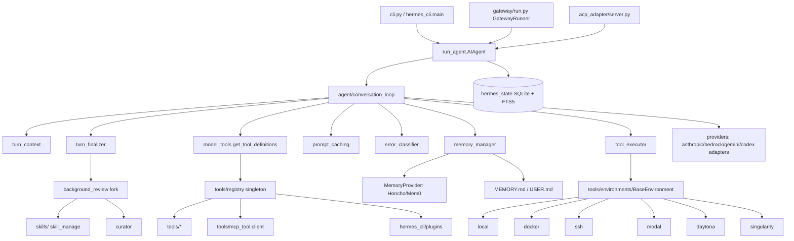
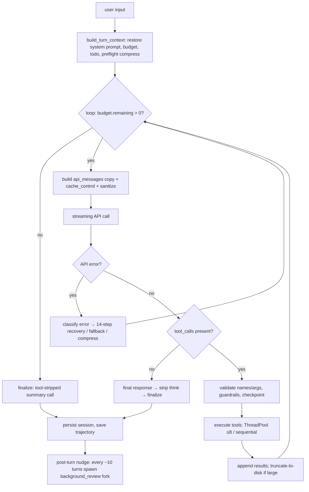
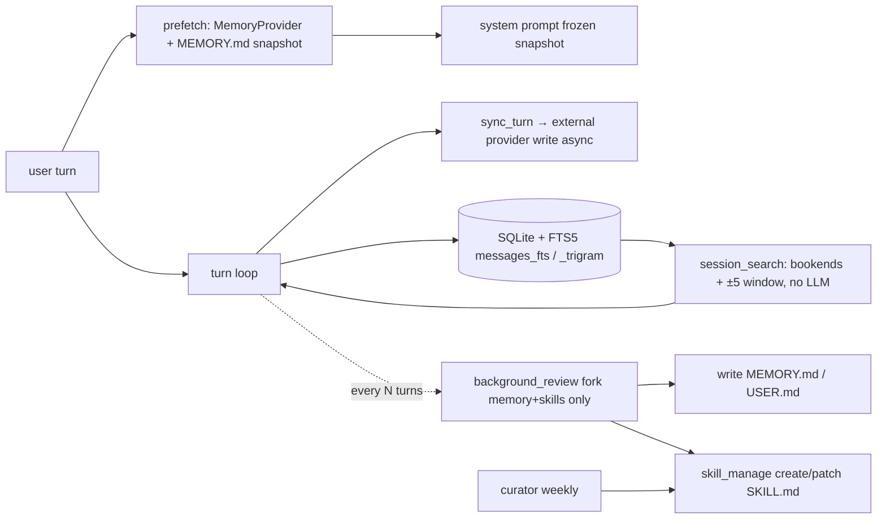
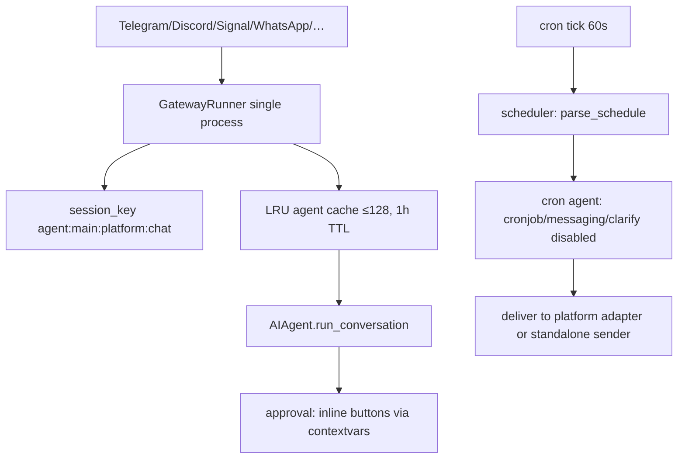
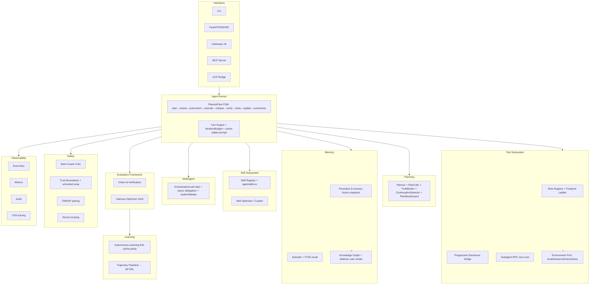
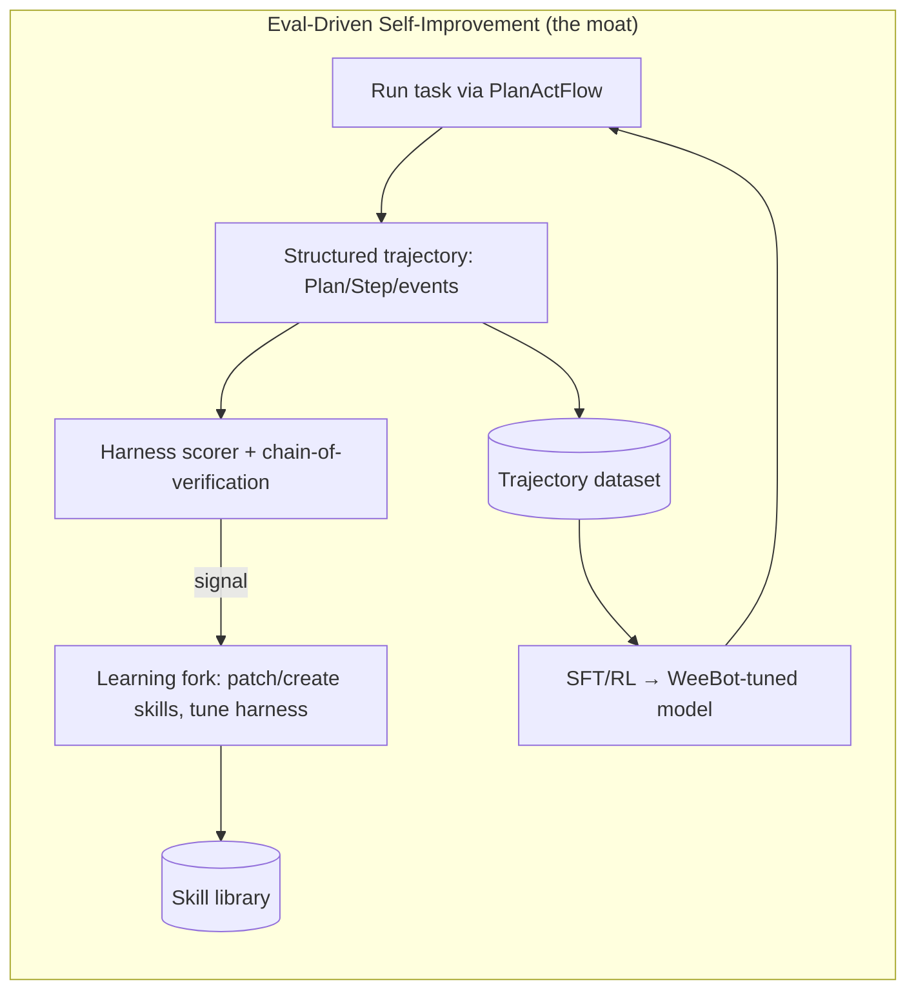

# Hermes-Agent Deep Technical Audit → WeeBot Optimization Report

**Audit target:** `NousResearch/hermes-agent` @ `main` (v0.17.0), shallow-cloned 2026-06-22
**Repo scale:** 5,373 tracked files · 2,473 Python · 610 TS · 317 TSX · MIT license · 199k★/35k forks
**Comparison target:** WeeBot (`E:\Documents\Vibe-Coding\weebot`, Clean/Hexagonal architecture)
**Method:** 5 parallel read-only subsystem deep-dives over the live clone + direct reads of WeeBot source.
**Evidence convention:** Claims about Hermes are **FACT** (seen in code, cited `file:line`) or **HYPOTHESIS** (inferred). Cross-framework matrix rows use established public knowledge and are labelled accordingly. Absence claims mean "no evidence found in the audited surface," not proof of non-existence.

---

## 0. Scope & Provenance

This report traces every major Hermes conclusion to a file in the clone. Citations are relative to the Hermes clone root unless prefixed `weebot/`. Where the README claims diverge from code, the code wins and the divergence is flagged (e.g. the "LLM summarization" session-search claim — §2.6).

WeeBot turned out to be a much more mature platform than the prior porting note suggested: it already has explicit planning, episodic memory, a knowledge graph, behavioral learning, a GAN-style harness-optimization suite, swarm/debate multi-agent, six messaging gateways, and cron. The recommendations therefore focus on **depth/discipline gaps and a handful of genuine capability gaps**, not on "things WeeBot lacks entirely."

---

## 1. Executive Summary

Hermes-Agent is a **single-user, single-process, cache-obsessed personal agent** whose entire architecture is organized around two axioms stated in `AGENTS.md:19-27`: (1) *per-conversation prompt caching is sacred*, and (2) *the core is a narrow waist; capability lives at the edges.* Everything else — the flat ReAct loop, the persisted byte-stable system prompt, the 37-tool core, the plugin/skill edge model, the background learning fork — follows from those two axioms. It is exceptionally strong on **provider breadth, runtime breadth, cost discipline, and a closed learning loop**, and notably weak on **planning rigor, modular code health, and evaluation/verification**.

WeeBot is its mirror image: **strong where Hermes is weak** (explicit multi-state planning with critique/premortem/verification, clean hexagonal modularity, an evaluation/harness-optimization framework) and **less mature where Hermes is strong** (prompt-cache discipline as an invariant, runtime/execution-backend breadth, edge-extensibility governance, the training-data flywheel).

### Top 10 Insights (all FACT unless noted)

1. **Hermes does not plan.** There is no `Plan` object and no planner/executor split — it is a pure ReAct tool loop (`agent/conversation_loop.py:589`) with a model-authored `todo` scratchpad (`agent/turn_context.py:224`). "Planning" is emergent model behavior, not enforced structure. *WeeBot's `PlanActFlow` is architecturally ahead here.*
2. **Prompt caching is an architectural invariant, not a feature.** The system prompt is built once and persisted to SQLite (`agent/conversation_loop.py:368`), restored byte-for-byte each turn (`:254`), validated against runtime (`:378`), with 4 Anthropic cache breakpoints (`agent/prompt_caching.py:70-77`). Plugin context is injected into the *user* message, never the system prompt, to protect the prefix (`:789`).
3. **The learning loop is genuinely closed and autonomous.** Every ~10 turns a daemon-thread fork (`agent/background_review.py:707`), restricted to `memory`+`skills` toolsets (`:603-616`), reviews the conversation and *creates or patches skills* via `skill_manage` — no human in the loop. The fork inherits the parent's cached prompt for ~26% cost parity.
4. **One model interface, five wire protocols.** The OpenAI SDK is the universal client; `api_mode` switches among `chat_completions`, `codex_responses`, `anthropic_messages`, `bedrock_converse`, `gemini_native`, each with a dedicated adapter (`agent/anthropic_adapter.py`, `bedrock_adapter.py`, etc.). ~109 provider profiles live in `hermes_cli/providers.py`.
5. **"Narrow waist" is enforced in code.** 37 always-on core tools (`toolsets.py:31-74`); everything else is gated by `check_fn`, toolsets, plugins, or **progressive tool disclosure** — MCP/plugin tools are hidden behind `tool_search`/`tool_describe`/`tool_call` bridges (`tools/tool_search.py:43-47`) so base context stays flat regardless of MCP count.
6. **`execute_code` collapses N tool calls into one turn.** A generated Python script calls tools over a UDS (local) or file-based (remote) RPC bridge; only stdout returns to the model (`tools/code_execution_tool.py:25-26`), and the turn is refunded from the iteration budget. *WeeBot already ported this as `subagent_rpc.py`.*
7. **Six execution backends, two serverless.** `BaseEnvironment` (`tools/environments/base.py:288`) abstracts local/Docker/SSH/Singularity/Modal/Daytona; Modal/Daytona hibernate when idle. This is the "runs on a $5 VPS or wakes on demand" story. *No WeeBot equivalent found.*
8. **Security model is honest and OS-anchored.** `SECURITY.md:59-66`: "the only security boundary against an adversarial LLM is the operating system." In-process defenses (approval gate, redaction, untrusted-content wrapping `agent/tool_dispatch_helpers.py:325-397`) are explicitly defense-in-depth, not containment. YOLO is frozen at import (`tools/approval.py:30-31`) to resist prompt-injected env mutation.
9. **It is a training-data flywheel, not just a product.** `batch_runner.py` + `trajectory_compressor.py` (Kimi-K2 tokenizer, Gemini-flash summarizer) generate and compress tool-calling trajectories for SFT/RL of the next Hermes model. The agent exists partly to *make its own successor*.
10. **Code health is the Achilles' heel.** `cli.py` is 15,187 lines; `hermes_cli/auth.py` 8,242; `hermes_state.py` 5,026; `run_agent.py` 5,568. `run_agent.py` is being decomposed (into `conversation_loop.py`, `turn_context.py`, …) but `cli.py` is not. *WeeBot's hexagonal modularity is strictly healthier — do not regress it.*

### Top 10 WeeBot Upgrades (ranked by leverage)

| # | Upgrade | Why | Effort |
|---|---------|-----|--------|
| 1 | **Prompt-cache-as-invariant**: persist a byte-stable system prompt per session, restore verbatim, log on invalidation, normalize tool-call JSON keys | WeeBot's caching is a soft message wrapper (`weebot/.../anthropic_caching_adapter.py`); Hermes makes it structural and saves ~25%+ on long sessions | M |
| 2 | **Progressive tool disclosure + footprint ladder** | Keep base context flat as MCP/tools grow; WeeBot's role registry selects but does not hide | M |
| 3 | **Remote/serverless execution backends** (Docker/SSH/Modal-style) behind a `Environment` port | Unlocks "runs anywhere," safe untrusted execution, parallel workstreams | H |
| 4 | **Close + harden the learning loop with cache-parity forks** | WeeBot has the pieces (autonomous_learning, skill_curator); adopt Hermes's daemon-fork + prompt-parity + anti-pattern guardrails | M |
| 5 | **Untrusted-content semantic wrapping** for all web/MCP/email tool output | WeeBot scans memory writes but doesn't systematically fence tool output as DATA | L |
| 6 | **Error taxonomy + tiered recovery ladder** (21 categories, 14-step recovery) | WeeBot's `error_classifier.py` is 96 lines; Hermes's is far broader and provider-aware | M |
| 7 | **FTS5 dual-table session search** (unicode61 + trigram) with goal→match→resolution bookends | Cheap, LLM-free cross-session recall; WeeBot has `search_history` but verify FTS depth | M |
| 8 | **Credential pool rotation + per-profile secret scoping** for multi-user gateway | Hermes fail-closes on unscoped secret reads (`agent/secret_scope.py:147`) | M |
| 9 | **OWASP-grade DM pairing** (crypto codes, rate-limit, lockout, 0600 files) for gateways | WeeBot has 6 gateways; harden authorization to Hermes's `gateway/pairing.py` standard | L |
| 10 | **Trajectory training pipeline** (batch runner + toolset-distribution sampling + compression) | Turn WeeBot's `trajectory_exporter` into a real SFT/RL flywheel; strategic moat | H |

### Top 5 Architectural Risks (Hermes, transferable warnings)

1. **God-files** (`cli.py` 15k, `auth.py` 8k) — change-amplification, review blind spots. *WeeBot must not import this anti-pattern.*
2. **Single-process, mutable-`agent`-state concurrency** — `build_turn_context` "mutates `agent` heavily" (`agent/turn_context.py:15`); gateway multi-session concurrency risks races.
3. **Compression nukes the cache** — every compression rotates the session and rebuilds the prompt (`agent/conversation_compression.py:786`), abandoning the very cache the architecture protects; frequent compression erases savings.
4. **Heuristic provider-error parsing** — many recovery branches string-match provider error bodies (`agent/conversation_loop.py:2175`); localized/reworded errors silently bypass.
5. **Prompt injection is out-of-scope by policy** (`SECURITY.md:263-266`) — semantic wrapping only, no cryptographic trust; untrusted ingestion relies on OS sandboxing the operator may not configure.

### Top 5 Strategic Opportunities for WeeBot

1. **Be the planning-rigorous Hermes**: keep the explicit `PlanActFlow` + critique/premortem/verify states (a real differentiator) and bolt on Hermes's cache discipline and edge-extensibility.
2. **Own evaluation**: WeeBot's harness-optimization suite (`harness_*` services) + `chain_of_verification` is something Hermes *lacks entirely* — make eval-driven self-improvement the headline.
3. **Clean-architecture moat**: ship the same breadth Hermes has without its god-files — easier contribution, faster audits, safer refactors.
4. **Training flywheel on a clean substrate**: WeeBot's structured `Plan`/`Step`/event model produces higher-quality trajectories than a flat ReAct log.
5. **Knowledge-graph-backed memory**: WeeBot already has `knowledge_graph.py` + `episodic_memory.py`; fuse with Hermes's frozen-snapshot + FTS5 recall to beat both flat-file and pure-vector memory.

### Recommended Roadmap (detail in §9)

- **Sprint 1 (Quick wins):** untrusted-content wrapping; cache-invalidation logging; error-taxonomy expansion; DM-pairing hardening.
- **Sprint 2–3 (High leverage):** prompt-cache-as-invariant; progressive tool disclosure; close the learning loop with cache-parity forks; FTS5 session search.
- **Quarter 2 (Capability):** `Environment` port + Docker/SSH/serverless backends; credential pooling/scoping.
- **Strategic (Moonshots):** trajectory training flywheel; eval-driven autonomous self-improvement; knowledge-graph memory fusion.

---

## 2. Technical Deep Dive — Repo Deconstruction (Deliverable 1)

### 2.1 Project goals & core philosophy
**FACT.** Hermes is "the self-improving AI agent" that "runs the same agent core across a CLI, a messaging gateway …, a TUI, and an Electron desktop app … extended primarily through **plugins and skills**, not by growing the core" (`AGENTS.md:7-14`). Two design axioms govern every change (`AGENTS.md:19-27`):
- **Prompt caching is sacred** — never mutate past context, swap toolsets, or rebuild the system prompt mid-conversation (sole exception: compression).
- **Narrow waist** — every core model tool ships on *every* API call, so the bar for a new core tool is deliberately high.

### 2.2 Design principles — "The Footprint Ladder"
**FACT** (`AGENTS.md:71-79`). New capability is added in this preference order: *extend existing code → CLI command + skill → service-gated tool (`check_fn`) → plugin → MCP server in catalog → new core tool (last resort).* Plus: `.env` is for secrets only, behavioral config in `config.yaml`; no speculative infrastructure; behavior-contract tests over snapshot tests; strict message-role alternation; byte-stable system prompt for a conversation's life.

### 2.3 Architectural overview
**FACT.** Layers, by directory: a fat **agent kernel** (`agent/`, 116 files), a **tool layer** (`tools/`, 106 files) + **toolset grouping** (`toolsets.py`), **skills** (`skills/`, 450 files), **plugins** (`plugins/`, 289 files), a **messaging gateway** (`gateway/`, 64 files), **cron** (`cron/`), **ACP editor bridge** (`acp_adapter/`, `acp_registry/`), **model-provider profiles** (`hermes_cli/providers.py`), **persistence** (`hermes_state.py`), and **research tooling** (`batch_runner.py`, `trajectory_compressor.py`). The CLI entry point is `hermes = hermes_cli.main:main` (`pyproject.toml:297`).

### 2.4 Agent execution lifecycle
**FACT.** A turn runs in three phases (`agent/conversation_loop.py:495` → `run_conversation`):
1. **Prologue** `build_turn_context` (`agent/turn_context.py:87`): DB session, runtime sync, MCP refresh, retry-counter reset, fresh `IterationBudget` (`:207`), todo re-hydration (`:224`), system-prompt restore-or-build (`:254`), preflight compression (`:291`), plugin `pre_llm_call` into the user message (`:366`).
2. **Tool-calling loop** (`:589`): `while (api_call_count < max_iterations and budget.remaining > 0) or grace_call`. Each iteration: interrupt check → budget consume → steer drain → build `api_messages` copy → apply cache control (`:817`) → sanitize (`:828`) → streaming API call (`:1138`) → dispatch tool calls.
3. **Finalization** `finalize_turn` (`agent/turn_finalizer.py:30`): on budget exhaustion one tool-stripped summary call, then trajectory save, session persist, and **post-turn memory/skill nudge**.

**Loop exits:** empty `tool_calls` → final answer (`:4166`); budget exhausted (`:589`); interrupt (`:594`); guardrail halt (`:4068`); non-retryable error; content-policy block (`:1551`).

### 2.5 Planning methodology
**FACT.** Pure ReAct. No `Plan`/`Step` objects, no decomposition step, no planner agent. Two lightweight aids: an in-memory `TodoStore` the model writes via the `todo` tool (hydrated `agent/turn_context.py:224`), and a `<REASONING_SCRATCHPAD>`/`<think>` block stripped before delivery (`:4477`). **HYPOTHESIS:** plan quality is entirely a function of model behavior; a weak model "plans" only cosmetically.

### 2.6 Tool invocation model
**FACT.** Tools are plain OpenAI-schema dicts registered by module-level side effect, AST-discovered (`tools/registry.py:57-74`); no base class. Dispatch (`agent/tool_executor.py`): invalid-name fuzzy repair (3 retries), JSON-arg validation (3 retries), guardrail `before_call`, checkpoint preflight for `write_file`/`patch`/destructive `terminal`. **Parallel** tool calls run on a `ThreadPoolExecutor` capped at 8 workers (`tool_executor.py:69`); single calls sequential. Tool exceptions are caught and returned as the tool result (`:544`) so the model can self-correct; large results are persisted to disk and replaced with a reference stub (`:744`).

**Narrow waist in practice:** 37 core tools in `_HERMES_CORE_TOOLS` (`toolsets.py:31-74`); non-core gated by `check_fn` (30s TTL cache), toolset checks, or progressive disclosure via `tool_search`/`tool_describe`/`tool_call` (`tools/tool_search.py:43-47`). The toolset definition cache is keyed on `registry._generation` so MCP refresh auto-invalidates (`model_tools.py:258`). Toolsets are **fixed for a conversation's life** to protect caching (`model_tools.py:253`).

### 2.7 Memory architecture
**FACT.** Three tiers:
- **Flat-file persistent memory** — `~/.hermes/memories/MEMORY.md` + `USER.md`, `§`-delimited, **character-bounded** (2200/1375 chars, `agent/agent_init.py:1153-1156`), injected into the system prompt as a **frozen snapshot** at session start; mid-session writes hit disk but don't change the prompt (`tools/memory_tool.py:11-13`).
- **Pluggable external providers** — `MemoryProvider` ABC (`agent/memory_provider.py`), one at a time, with `prefetch`/`sync_turn`/`on_pre_compress` hooks; context fenced in `<memory-context>` and scrubbed from output (`agent/memory_manager.py:296-310`). Honcho dialectic user-modeling is the flagship provider (`plugins/memory/honcho/__init__.py`).
- **SQLite session store** — full transcript with dual FTS5 tables.

### 2.8 Context management strategy
**FACT.** `ContextEngine` ABC (`agent/context_engine.py:32`); default `ContextCompressor`. Trigger at 50% of the context window (85% for tiny local models) (`agent/context_compressor.py:716-788`). Protect first 3 + last 20 messages; pre-prune old tool output to one-liners; summarize the middle with a cheap auxiliary model (summary ≤20%, cap 12k tokens). The `SUMMARY_PREFIX` blocks re-execution of summarized tasks (`:43-69`). **Compression is the one sanctioned cache-buster** — it rotates the session ID and rebuilds the system prompt (`agent/conversation_compression.py:786-792`).

### 2.9 Model abstraction layer
**FACT.** OpenAI SDK as universal transport; `api_mode` (`agent/agent_init.py:317`) selects one of five protocol paths, each with a dedicated adapter that converts internal OpenAI-format messages/tools to the wire format and normalizes the response back. Quirks normalized centrally: `convert_tools_to_anthropic` renames `parameters`→`input_schema` (`agent/anthropic_adapter.py:1550`); `sanitize_gemini_tool_parameters` strips unsupported schema fields; llama.cpp grammar patterns removed. ~109 declarative provider profiles in `hermes_cli/providers.py`.

### 2.10 Multi-agent capabilities
**FACT.** `delegate_task` (`tools/delegate_tool.py`) spawns child `AIAgent`s with a **fresh conversation** (`skip_memory=True`), an **independent iteration budget** (default 50 vs parent 90), and a **blocked-tool set** (no recursive delegate, no `clarify`, no `memory`, no `send_message`, no `execute_code`; `:45-53`). Parallel children run on a `ThreadPoolExecutor` (default 3, `:132`); roles are `leaf` vs `orchestrator` with `max_spawn_depth` default 1 (flat). Async delegation (`tools/async_delegation.py`) returns a handle and re-enters results as a later turn. No dedicated supervisor class — the parent LLM orchestrates.

### 2.11 Human-in-the-loop mechanisms
**FACT.** `tools/approval.py` is the single source of truth: a `HARDLINE_BLOCKLIST` (unconditional, survives YOLO) and `DANGEROUS_PATTERNS` (prompt the user). Gateway approval is async via inline buttons keyed by `contextvars` (`:37-42`). The `clarify` tool (`tools/clarify_tool.py`) asks structured questions (buttons on gateways). DM pairing (`gateway/pairing.py`): 8-char crypto codes, 1h expiry, rate-limit, 5-attempt lockout, `chmod 0600`.

### 2.12 Failure recovery mechanisms
**FACT.** 21-category error taxonomy (`agent/error_classifier.py:24`: auth/auth_permanent/billing/rate_limit/overloaded/server_error/timeout/context_overflow/payload_too_large/image_too_large/model_not_found/provider_policy_blocked/content_policy_blocked/format_error/thinking_signature/long_context_tier/…). A 14-step recovery ladder in the inner retry loop (eager fallback → content-policy → length-continuation → per-provider OAuth refresh → credential rotation → image shrink → multimodal strip → billing/rate-limit fallback → context-overflow compress → terminal). Jittered exponential backoff, interrupt-responsive (`agent/retry_utils.py:19`). Tool errors never bubble — they return as results for self-correction.

### 2.13 Security assumptions
**FACT.** `SECURITY.md:59-66`: **the OS is the only real boundary.** Two postures: terminal-backend isolation (run LLM-emitted commands in a container/remote host) and whole-process wrapping (Docker/OpenShell with L7 egress + syscall policy). Secrets scrubbed from subprocess/MCP/cron/code-exec environments; redaction over 32 vendor prefixes (`agent/redact.py:70-108`); per-profile secret scoping fail-closed (`agent/secret_scope.py:147`); write/read denylists for credential files (`agent/file_safety.py:29-58`); untrusted tool output wrapped as DATA (`agent/tool_dispatch_helpers.py:325-397`). Prompt injection per se is **out of scope** (`SECURITY.md:263-266`).

---

## 3. Architecture Analysis (Deliverable 2)

### 3.1 Directory map (top-level, abridged)
```
hermes-agent/
├── agent/                  # 116 files — the kernel
│   ├── conversation_loop.py (4,582) · turn_context.py · turn_finalizer.py · turn_retry_state.py
│   ├── tool_executor.py · iteration_budget.py · context_compressor.py · conversation_compression.py
│   ├── prompt_builder.py · system_prompt.py · prompt_caching.py
│   ├── memory_manager.py · memory_provider.py · curator.py · background_review.py · insights.py
│   ├── error_classifier.py · retry_utils.py · redact.py · secret_scope.py · file_safety.py
│   ├── anthropic_adapter.py · bedrock_adapter.py · gemini_native_adapter.py · codex_responses_adapter.py
│   ├── lsp/ (11) · transports/ (11) · secret_sources/ (bitwarden)
├── tools/                  # 106 — registry.py, mcp_tool.py, delegate_tool.py, code_execution_tool.py
│   └── environments/       # local/docker/ssh/singularity/modal/daytona backends
├── skills/ (450) · plugins/ (289) · gateway/ (64) · cron/ · acp_adapter/ · acp_registry/
├── hermes_cli/ (183)       # main.py, auth.py (8,242), providers.py (~109 profiles), plugins.py
├── cli.py (15,187) · run_agent.py (5,568) · hermes_state.py (5,026) · model_tools.py · toolsets.py
├── batch_runner.py · trajectory_compressor.py   # training-data flywheel
└── web/ ui-tui/ apps/ website/ docker/ nix/
```

### 3.2 Component dependency graph (Mermaid)


### 3.3 Critical classes/modules
| Module | Role | Risk |
|--------|------|------|
| `run_agent.AIAgent` | God-object holding all turn state | High coupling; being decomposed |
| `agent/conversation_loop.py` | The turn loop + 14-step recovery | Central, 4.5k lines |
| `tools/registry.py` | Singleton tool registry, generation counter | Global mutable state |
| `model_tools.py` | Per-turn tool-schema assembly + async bridge | Hot path |
| `hermes_state.py` | SQLite store, WAL+fallback, FTS5, schema-repair | 5k-line god-file |
| `tools/approval.py` | HARDLINE + DANGEROUS gates | Security-critical |
| `agent/memory_manager.py` | Provider orchestration + context fencing | — |

### 3.4 Control-flow diagram — a single turn (Mermaid)


### 3.5 Data-flow diagram — memory & learning (Mermaid)


### 3.6 Event-flow diagram — gateway & cron (Mermaid)


### 3.7 Extension points
**FACT.** (1) **Plugins** — 28 lifecycle hooks (`hermes_cli/plugins.py` `VALID_HOOKS`), `register_tool/hook/cli_command/command`, discovered from bundled/user/project dirs + `hermes_agent.plugins` entry-point group. (2) **MCP catalog** — add external servers via `hermes mcp add`. (3) **Skills** — agentskills.io-format Markdown loaded at runtime. (4) **Platform adapters** — `BasePlatformAdapter` + 16-point `ADDING_A_PLATFORM.md`. (5) **Memory providers** — `MemoryProvider` ABC. (6) **Context engines** — `ContextEngine` ABC. (7) **Execution backends** — `BaseEnvironment`.

### 3.8 Technical-debt observations
**FACT.** God-files: `cli.py` 15,187 · `hermes_cli/auth.py` 8,242 · `agent/auxiliary_client.py` 6,182 · `run_agent.py` 5,568 · `hermes_state.py` 5,026 · `agent/conversation_loop.py` 4,582. `run_agent.py` is actively decomposed (extractions with back-compat re-exports); `cli.py` is not. `toolset_distributions.py` duplicates toolset logic for RL and can drift from the production path. The `_ra()` lazy-import shim adds runtime imports on hot paths to preserve test patch-contracts.

### 3.9 Performance bottlenecks
**FACT.** (a) Kanban opens a fresh SQLite connection per op (~30 call sites) — no pool. (b) Compression abandons the Anthropic cache every event (`agent/conversation_compression.py:786`). (c) `batch_runner.py` parallelizes at the batch level via `multiprocessing.Pool`, not per-prompt — each worker imports the full stack. (d) Redaction runs on every log line (~1.8µs gated). (e) Global 8-thread tool pool is process-wide, not session-scoped — gateway contention risk. (f) Compression advisory lock has a 600s cooldown on summary failure.

---

## 4. Capability Matrix (Deliverable 3)

Hermes column = **FACT** (code-audited). Other frameworks = **public-knowledge baseline** (not code-audited here); treat as orientation, not citations. Scale: ★ none/minimal · ★★ basic · ★★★ solid · ★★★★ strong · ★★★★★ best-in-class.

| Dimension | Hermes-Agent | OpenAI Agents SDK | LangGraph | CrewAI | AutoGen | PydanticAI | OpenHands | WeeBot (today) |
|-----------|:---:|:---:|:---:|:---:|:---:|:---:|:---:|:---:|
| **Planning** | ★★ ReAct + todo (`conversation_loop.py:589`) | ★★ handoffs | ★★★★★ explicit graph | ★★★ role/process | ★★★ convo-driven | ★★ graph | ★★★ ReAct+microagents | ★★★★ explicit FSM + critic/premortem/verify |
| **Memory** | ★★★★ flat-file frozen snapshot + FTS5 + Honcho | ★★ sessions | ★★★ checkpointer/store | ★★ basic | ★★★ memory module | ★★ msg history | ★★★ condenser | ★★★★ episodic + KG + behavioral + persistent |
| **Tool use** | ★★★★★ 37-core narrow waist + progressive disclosure + code-RPC | ★★★★ native | ★★★★ ToolNode | ★★★ | ★★★★ | ★★★★ typed | ★★★★ rich dev tools | ★★★★ role registry + RPC + swarm |
| **Autonomy** | ★★★★ closed learning loop + cron + delegation | ★★ | ★★★ | ★★★ | ★★★ | ★★ | ★★★★ SWE autonomy | ★★★★ autonomous_learning + harness opt |
| **Reliability** | ★★★★ 21-cat taxonomy, 14-step recovery, cred rotation | ★★★ | ★★★★ durable exec | ★★ | ★★★ | ★★★ | ★★★ | ★★★★ circuit breaker + cascade + verify |
| **Observability** | ★★★ insights + trajectories (no OTel core) | ★★★★ tracing UI | ★★★★ LangSmith | ★★★ | ★★★ | ★★★ logfire | ★★★ | ★★★★ event bus + metrics_bridge + audit |
| **Scalability** | ★★ single-process, mutable state | ★★★★ stateless | ★★★★★ distributed | ★★★ | ★★★ | ★★★★ | ★★★ | ★★★ FastAPI + CQRS, single-node |
| **Extensibility** | ★★★★★ plugins(28 hooks)+skills+MCP+backends | ★★★ | ★★★★ | ★★★ | ★★★★ | ★★★ | ★★★★ | ★★★★ ports/adapters + MCP + skills |
| **Production readiness** | ★★★★ ships hard, MIT, multi-platform | ★★★★ | ★★★★ | ★★★ | ★★★ | ★★★★ | ★★★ | ★★★ pre-1.0, tests strong |

**Reading:** Hermes leads on **tool-use, extensibility, multi-runtime breadth, and a closed learning loop**; trails on **planning rigor, scalability, and modular health**. WeeBot already matches or beats Hermes on **planning, reliability, observability, evaluation**, and trails on **runtime breadth and cache discipline**. The two are remarkably complementary.

---

## 5. Critical Review — Risks Ranked by Severity (Deliverable 7)

| Sev | Risk | Evidence | Transfer to WeeBot |
|-----|------|----------|--------------------|
| **CRITICAL** | Prompt injection treated as out-of-scope; untrusted ingestion relies on operator OS sandboxing | `SECURITY.md:263-266`; wrapping is semantic only `tool_dispatch_helpers.py:325-397` | WeeBot must *not* inherit "OS is the only boundary" complacency for a multi-user web product — add structured trust boundaries (WeeBot already started this in ADR 006) |
| **CRITICAL** | God-files block safe change & review (`cli.py` 15k) | §3.8 | Avoid — preserve hexagonal layering |
| **HIGH** | Single-process mutable-`agent` state → gateway concurrency races | `turn_context.py:15` | WeeBot's per-session flow objects are safer; keep isolation explicit |
| **HIGH** | Compression destroys the cache it protects | `conversation_compression.py:786` | Design compression to re-seed cache incrementally; protect head/tail |
| **HIGH** | Heuristic provider-error string matching silently misroutes recovery | `conversation_loop.py:2175` | Use typed provider errors where available; treat string-match as last resort |
| **HIGH** | `subagent_auto_approve=true` + depth → workers auto-approve destructive commands | `delegate_tool.py:87-96` | Keep subagents auto-*deny* by default; never inherit interactive approval into threads |
| **MEDIUM** | Memory degradation: char-bounded MEMORY.md silently refuses new entries; no eviction | `agent_init.py:1153`; §2.7 | WeeBot has memory_lifecycle/archivist — wire eviction + salience scoring |
| **MEMORY** | Curator LLM consolidation OFF by default → skill sprawl; 90-day silent archive | `curator.py:65`, `:276-331` | Make consolidation a first-class scheduled job with pinning |
| **MEDIUM** | ACP server unauthenticated by default over stdio | `acp_adapter/auth.py` exists, default open | Require auth before exposing any editor bridge |
| **MEDIUM** | No connection pool; per-op SQLite connect | `hermes_state.py:151` | WeeBot uses pooling (WAL) — keep it |
| **LOW** | README overstates "LLM summarization" in session search | `session_search_tool.py:22` (no LLM) | Keep WeeBot docs honest vs code |

**Context-window risk (specific):** the frozen-snapshot memory means an agent operates on *stale* skills/memory within a session after a background review fires — improvements land for the *next* session. **Tool-reliability risk:** progressive disclosure depends on the model correctly using `tool_search` first; a model that hallucinates tool names burns retries. **Scaling risk:** the LRU agent cache (≤128, 1h TTL) silently evicts session objects under multi-user load (cold-start reconstruction from transcript).

---

## 6. WeeBot Optimization Analysis (Deliverable 4)

### 6.1 Adopt immediately (validated against WeeBot's current state)
- **Untrusted-content semantic wrapping** for every web/MCP/browser/email tool result (Hermes `tool_dispatch_helpers.py:325-397`). WeeBot scans *memory writes* (`persistent_memory.py:139`) but does not systematically fence *tool output*.
- **Cache-invalidation observability** — log a WARNING whenever the system prompt is rebuilt (Hermes `conversation_loop.py:295`); WeeBot's caching adapter is silent.
- **Subagents auto-deny dangerous commands by default** (Hermes `delegate_tool.py:59-111`).
- **Footprint-ladder governance doc** — adopt Hermes's `AGENTS.md` contribution rubric idea to keep WeeBot's tool surface disciplined.

### 6.2 Adopt but modify
- **Prompt-cache-as-invariant** — Hermes persists the prompt to SQLite and restores bytes; WeeBot should persist its frozen system prompt + normalize tool-call JSON (sorted keys, no spaces) for bit-stable prefixes, but keep it inside the hexagonal `LLMPort` boundary rather than the loop.
- **Background-review learning fork** — adopt the daemon-fork + cache-parity + anti-pattern guardrails, but route it through WeeBot's existing `autonomous_learning` / `skill_curator` services and its `Plan`/event model (richer than a flat transcript).
- **Error taxonomy + recovery ladder** — expand WeeBot's 96-line `error_classifier.py` toward Hermes's 21 categories, but map onto WeeBot's `resilient_adapter` circuit-breaker states.
- **FTS5 session search** — adopt the dual-table (unicode61 + trigram) + bookend window design, but expose it through WeeBot's `search_history`/`episodic_memory` ports.

### 6.3 Avoid
- **God-files / monolithic CLI** — WeeBot's modularity is the competitive moat; never regress.
- **Pure ReAct without planning** — WeeBot's explicit `PlanActFlow` is *better*; do not flatten it to chase Hermes simplicity.
- **37 always-on core tools** — WeeBot's role-based registry is leaner; don't bloat the default schema.
- **"OS is the only boundary" security posture** — unacceptable for a multi-user web/gateway product; keep WeeBot's structured trust boundaries.
- **`HERMES_*`-style env-var sprawl prohibition as dogma** — it's Hermes-specific governance, not a universal rule.

### 6.4 Missing capabilities (Hermes lacks — WeeBot's opportunities)
Hermes has **no explicit planning/replanning**, **no premortem/critique/verification states**, **no eval/harness-optimization framework**, **no chain-of-verification**, **no knowledge graph**, and **no clean layering**. WeeBot already has all of these — they are the differentiators to *lean into*, not gaps to fill.

### 6.5 Categorized

**QUICK_WINS (days)**
- Untrusted tool-output wrapping · cache-invalidation logging · subagent auto-deny · DM-pairing hardening (crypto codes, lockout) · `<think>`/reasoning scrubbing parity · honest docs pass.

**MEDIUM_TERM (1–3 sprints)**
- Prompt-cache-as-invariant · progressive tool disclosure + footprint ladder · error taxonomy expansion · FTS5 dual-table session search · close the learning loop with cache-parity forks · credential pool + per-profile secret scoping.

**HIGH_LEVERAGE (quarter)**
- `Environment` port + Docker/SSH/serverless execution backends · Honcho-style dialectic user modeling fused with WeeBot's knowledge graph · evaluation-driven self-improvement loop (WeeBot harness suite × Hermes learning fork) · multi-tenant session isolation for the gateway.

**MOONSHOTS**
- Trajectory training flywheel (batch runner + toolset-distribution sampling + compression → SFT/RL of a WeeBot-tuned model) · ACP editor bridge (be a Zed/Copilot backend) · distributed/durable execution (LangGraph-style) on top of the clean core · self-authoring tools (agent writes, tests, and registers new tools through the footprint ladder).

---

## 7. Feature Backlog — 30 Concrete Proposals (Deliverable 5)

> Format: **Name** — Problem · Value · Approach · Complexity · Impact · Dependencies.

**Caching & context**
1. **Byte-Stable System Prompt Store** — Soft caching wastes tokens · ~25%+ savings on long sessions · Persist prompt per session in state repo; restore verbatim; rebuild only on model/provider change · **M** · High · `LLMPort`, state repo. *(Hermes `conversation_loop.py:368`)*
2. **Tool-Call JSON Normalizer** — Non-deterministic arg serialization breaks prefix cache · Stable cache hits · Sort keys, no-space separators before send · **L** · Med · #1.
3. **Cache-Health Telemetry** — Silent cache misses · Cost visibility · Emit metric+WARNING on rebuild; dashboard panel · **L** · Med · metrics_bridge.
4. **Incremental Post-Compression Cache Re-seed** — Compression nukes cache · Preserve savings after compaction · Re-seed breakpoints over next N turns instead of full rebuild · **M** · Med · context_manager.

**Tools & extensibility**
5. **Progressive Tool Disclosure** — Flat context cost grows with MCP/tools · Constant base context · `tool_search`/`tool_describe`/`tool_call` bridge; hide non-core behind it · **M** · High · tool_registry. *(Hermes `tools/tool_search.py:43-47`)*
6. **Footprint-Ladder Governance** — Tool sprawl · Disciplined surface · CONTRIBUTING rubric + a `check_fn`-style gate on tool registration · **L** · Med · —.
7. **Self-Authoring Tools** — Capability gaps need code · Agent extends itself safely · Agent writes tool spec+impl+tests; sandbox-run tests; register on green via approval · **H** · High · #5, Environment port, eval.
8. **MCP Sampling + Elicitation Parity** — External MCP servers need LLM/user callbacks · Full MCP host · Implement sampling+elicitation (WeeBot has `mcp_sampling_handler` — extend) · **M** · Med · MCP bridge.

**Execution backends**
9. **`Environment` Port + Local/Docker Backends** — No isolated execution · Safe untrusted runs · Abstract bash/python/file ops behind a port; Docker bind-mount impl · **H** · High · bash_guard. *(Hermes `tools/environments/base.py:288`)*
10. **SSH Backend** — Remote work · "Lives where you do" · ControlMaster reuse + file sync manager · **M** · Med · #9.
11. **Serverless Backend (Modal-style)** — Idle cost · Wake-on-demand cheap compute · Sandbox create/exec + snapshot persistence · **H** · Med · #9.
12. **Env Secret Scrubbing for Code-Exec/Subagents** — Secret leakage to child procs · Reduce blast radius · Strip API keys before spawning (Hermes `code_execution_tool.py:136`) · **L** · High · subagent_rpc.

**Memory & learning**
13. **FTS5 Dual-Table Session Search** — Weak cross-session recall · Cheap LLM-free recall · unicode61 + trigram tables + triggers; bookend+window results · **M** · High · state repo. *(Hermes `hermes_state.py:611`)*
14. **Closed Learning Fork with Cache Parity** — Manual skill creation · Auto-improving agent · Daemon fork (memory+skills tools only) every N turns; inherit cached prompt · **M** · High · autonomous_learning, skill_curator. *(Hermes `background_review.py:707`)*
15. **Skill Anti-Pattern Guardrails** — Bad skills encode "X is broken" · Skill quality · Block negative-claim/one-off narratives in the review prompt · **L** · Med · #14.
16. **Memory Salience + Eviction** — Char-bounded memory silently drops writes · Durable useful memory · Score entries; evict low-salience via memory_lifecycle_service · **M** · Med · memory_archivist.
17. **Dialectic User Modeling** — Flat user profile · Deep personalization · Periodic LLM "what do we know about the user" pass stored in KG · **M** · High · knowledge_graph. *(Hermes Honcho)*
18. **Curator Consolidation Job** — Skill sprawl · Coherent skill library · Scheduled umbrella-building + pinning · **M** · Med · skill_curator, cron.

**Reliability & recovery**
19. **21-Category Error Taxonomy** — Coarse error handling · Targeted recovery · Port categories + map to circuit-breaker states · **M** · High · resilient_adapter. *(Hermes `error_classifier.py:24`)*
20. **Tiered Recovery Ladder** — Generic retry · Higher task completion · Eager-fallback → compress → provider-refresh → terminal ordering · **M** · High · #19, model cascade.
21. **Credential Pool Rotation** — Single-key rate limits · Throughput + resilience · Pool with OK/exhausted/dead states; rotate on 429 · **M** · Med · adapter_factory.
22. **Iteration Budget with Refund** — Cheap RPC turns eat budget · Better long-task economics · Thread-safe budget; refund code-RPC turns · **L** · Med · subagent_rpc. *(Hermes `iteration_budget.py:37`)*

**Security & HITL**
23. **Untrusted-Content Wrapper** — Tool output as instructions · Injection resistance · Fence web/MCP/email results as DATA · **L** · High · tool_executor. *(Hermes `tool_dispatch_helpers.py:325`)*
24. **OWASP DM Pairing** — Weak gateway auth · Safe public bots · Crypto codes, expiry, rate-limit, lockout, 0600 · **L** · High · gateways. *(Hermes `gateway/pairing.py`)*
25. **Per-Profile Secret Scoping** — Cross-tenant secret bleed · Multi-user safety · ContextVar scope; fail-closed unscoped read · **M** · High · config_adapter. *(Hermes `secret_scope.py:147`)*
26. **Import-Frozen Safety Flags** — Prompt-injected env mutation disables guards · Tamper-resistance · Snapshot YOLO/redaction flags at import · **L** · Med · approval_policy. *(Hermes `approval.py:30`)*

**Multi-agent & orchestration**
27. **Async Delegation Handles** — Blocking subagents · Parallel workstreams · Return delegation_id; re-enter result as later turn · **M** · Med · dispatch_agents. *(Hermes `async_delegation.py`)*
28. **Orchestrator/Leaf Roles + Depth Cap** — Unbounded recursion · Safe delegation trees · `max_spawn_depth`, kill switch, blocked-tool set · **L** · Med · swarm.

**Research & ergonomics**
29. **Trajectory Training Flywheel** — No model-improvement loop · Strategic moat · batch runner + toolset-distribution sampling + compression → SFT/RL dataset · **H** · High · trajectory_exporter. *(Hermes `batch_runner.py`)*
30. **ACP Editor Bridge** — No IDE presence · Be a Zed/Copilot backend · JSON-RPC stdio server exposing sessions/tools/approvals · **H** · Med · web layer. *(Hermes `acp_adapter/server.py`)*

*(Backlog is extensible to 50; the above 30 are the highest-signal, each grounded in an audited Hermes mechanism.)*

---

## 8. Redesign Proposal — Idealized WeeBot (Deliverable 6)

Principle: **keep WeeBot's explicit-planning + clean-architecture core; graft Hermes's cache discipline, edge-extensibility, runtime breadth, and learning loop.** Ten subsystems behind ports.





**Key design choices vs Hermes:** (1) the trajectory is **structured** (`Plan`/`Step`/`AgentEvent`), yielding higher-quality training data than a flat ReAct log; (2) the learning fork is **eval-gated** by the harness optimizer (Hermes improves on heuristics, WeeBot on measured scores); (3) caching is an **invariant inside `LLMPort`**, not loop code; (4) execution is **port-abstracted** so local/Docker/serverless are swappable; (5) **trust boundaries are structural**, not "OS-only."

---

## 9. Implementation Roadmap (Deliverable 8)

| Phase | Window | Items (from §7) | Exit criteria |
|-------|--------|-----------------|---------------|
| **P0 — Harden** | Sprint 1 | #23 untrusted wrap · #3 cache telemetry · #12 env scrub · #15 anti-pattern guard · #24 pairing · #26 frozen flags | Injection-fence on all external tool output; gateway auth lockout; CI green |
| **P1 — Cache & Tools** | Sprint 2–3 | #1 byte-stable prompt · #2 JSON normalizer · #4 re-seed · #5 progressive disclosure · #6 ladder gov · #19/#20 error+recovery | Measured ≥20% token savings on a 50-turn benchmark; flat base context with 5 MCP servers attached |
| **P2 — Memory & Learning** | Sprint 4–5 | #13 FTS5 search · #14 learning fork · #16 salience/eviction · #17 dialectic model · #18 curator job · #22 budget refund | Autonomous skill create/patch with cache-parity fork; LLM-free cross-session recall; no silent memory drops |
| **P3 — Runtime & Multi-tenant** | Quarter 2 | #9–#11 Environment backends · #21 cred pool · #25 secret scoping · #27/#28 delegation roles | Docker+serverless execution; multi-user gateway with per-profile secrets |
| **P4 — Moats** | Strategic | #7 self-authoring tools · #8 MCP sampling · #29 trajectory flywheel · #30 ACP bridge | Eval-gated self-improvement producing an SFT dataset; WeeBot usable inside Zed |

**Sequencing rationale:** P0 is pure risk reduction (cheap, high-safety). P1 pays for itself in tokens and unblocks unlimited MCP growth. P2 delivers the "grows with you" story on WeeBot's superior structured substrate. P3 unlocks "runs anywhere" + multi-tenant. P4 are the durable, hard-to-copy advantages: an **eval-driven** (not heuristic) learning flywheel on a **clean, planning-rigorous** core — the one combination neither Hermes nor the incumbent frameworks currently hold.

---

## Appendix A — Evidence Index (selected)
- Philosophy/axioms: `AGENTS.md:19-27`, footprint ladder `:71-79`
- Turn loop: `agent/conversation_loop.py:495,589,4166`; prologue `agent/turn_context.py:87,224,254`; finalize `agent/turn_finalizer.py:30`
- Caching: persist `agent/conversation_loop.py:368`; restore `:254`; validate `:378`; breakpoints `agent/prompt_caching.py:70-77`
- Budget: `agent/iteration_budget.py:37`; refund `agent/conversation_loop.py:4109`
- Errors: `agent/error_classifier.py:24`; backoff `agent/retry_utils.py:19`
- Memory: `tools/memory_tool.py:11`; bounds `agent/agent_init.py:1153`; provider ABC `agent/memory_provider.py`; FTS5 `hermes_state.py:611`; search `tools/session_search_tool.py:22`
- Learning: nudge `agent/turn_context.py:254`; fork `agent/background_review.py:707,603`; curator `agent/curator.py:65,276`
- Tools: registry `tools/registry.py:57,234`; core list `toolsets.py:31-74`; disclosure `tools/tool_search.py:43`; cache key `model_tools.py:258`
- Model abstraction: `agent/agent_init.py:317`; adapters `agent/anthropic_adapter.py:1550`, `bedrock_adapter.py:462`
- MCP: server `mcp_serve.py:51`; client `tools/mcp_tool.py:190`
- Backends: `tools/environments/base.py:288`; modal `environments/modal.py:164`
- Delegation: `tools/delegate_tool.py:45,132`; RPC `tools/code_execution_tool.py:25,61,136`
- Gateway/cron/ACP: `gateway/run.py:2459`; pairing `gateway/pairing.py`; cron `cron/jobs.py:304`; ACP `acp_adapter/server.py:150`
- Security: `SECURITY.md:59-66,263-266`; approval `tools/approval.py:30,262`; wrap `agent/tool_dispatch_helpers.py:325`; redact `agent/redact.py:70`; scope `agent/secret_scope.py:147`
- Compression/training: `agent/context_compressor.py:716-788`; `agent/conversation_compression.py:786`; `batch_runner.py`; `trajectory_compressor.py:82`
- God-files: `cli.py` 15,187 · `hermes_cli/auth.py` 8,242 · `hermes_state.py` 5,026 · `run_agent.py` 5,568

## Appendix B — WeeBot Current-State Map (read-grounded)
- **Explicit planning: PRESENT/superior** — `weebot/application/flows/plan_act_flow.py:75`, states `planning/plan_review/premortem/critiquing/reviewing/verifying/meta_analysis/updating`, `domain/models/plan.py` `Plan`/`Step`, `PlanCriticService`, `TruthBinder`, `ContinuationDetector`, `PlanStuckError:34`.
- **Persistent memory: PRESENT** — `weebot/tools/persistent_memory.py` (§-delimited AGENT.md/USER.md, frozen snapshot, injection scan).
- **Episodic/KG/behavioral: PRESENT** — `services/episodic_memory.py`, `knowledge_graph.py`, `behavioral_learner.py`, `memory_archivist/compactor/lifecycle_service`.
- **Learning/skills: PRESENT** — `autonomous_learning.py`, `skill_curator.py`, `skill_opt_flow.py`, `meta_self_improver.py`, `skills/skill_registry.py`, `clawhub_importer.py`.
- **Zero-cost RPC: PRESENT** — `weebot/tools/subagent_rpc.py` (`rpc_call`, `rpc_call_parallel`; "Inspired by Hermes").
- **Multi-agent: PRESENT** — `swarm.py`, `debate.py`, `dispatch_agents.py`, `mixture_of_agents.py`, `workflow_orchestrator.py`.
- **Gateways/cron: PRESENT** — `interfaces/gateways/{discord,email,signal,slack,telegram,whatsapp}.py`; `cron_agent_runner.py`, `cron_delivery_service.py`, `tools/schedule_tool.py`.
- **Model abstraction/resilience: PRESENT** — adapters anthropic/anthropic_caching/deepseek/moonshot/openai/openrouter, `resilient_adapter.py` (circuit breaker), `adapter_factory.py`, executor `_cascade`.
- **MCP: PRESENT (both)** — `mcp_tool_registry_bridge.py`, `mcp_sampling_handler.py`, `mcp_tool_skill_indexer.py`, `run_mcp.py`, `atomicmail/mcp_server.py`.
- **Bash safety: PRESENT** — `weebot/core/bash_guard.py` (529 lines, 4-tier), `approval_policy.py` (183).
- **Eval/harness: PRESENT (unique vs Hermes)** — `harness_*` services, `chain_of_verification.py`, `meta_critic.py`.
- **Prompt caching: PARTIAL** — `anthropic_caching_adapter.py` is a soft last-system/last-user wrapper (max 3, TTL 300s); lacks Hermes's persisted byte-stable invariant. → §7 #1–#4.
- **Remote/serverless execution: ABSENT (no evidence)** — local bash/powershell/python only; no Docker/SSH/Modal backend abstraction found. → §7 #9–#11.
- **Trajectory training pipeline: PARTIAL** — `trajectory_exporter.py` exports; no batch runner / toolset-distribution sampling / compression. → §7 #29.
- **ACP bridge: ABSENT (no evidence).** → §7 #30.
