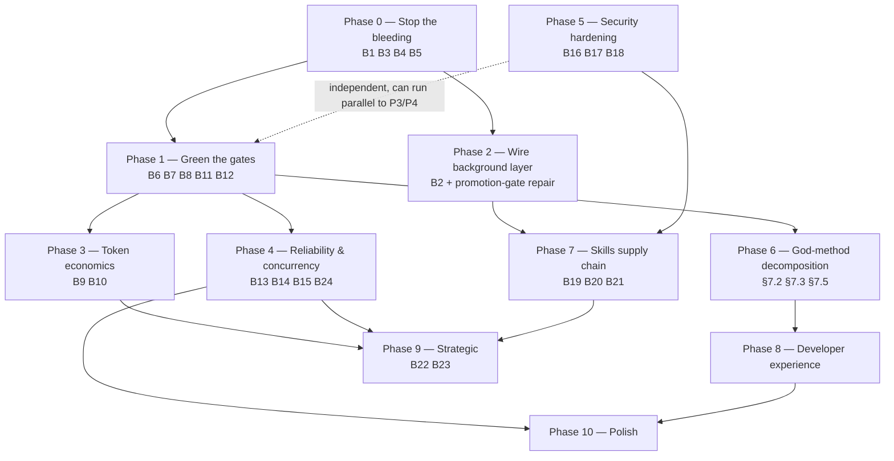

# Hermes-Agent v0.19.0 → WeeBot — Architecture & Design Study

**Study date:** 2026-07-22
**Source A:** `NousResearch/Hermes-Agent` v0.19.0 — local export at `E:\Downloads\hermes-agent-main\hermes-agent-main`. 3,220 Python files · 1,517,939 LOC · 2,244 test files · no `.git` (zip export, so "new since 0.17" is inferred from content, not history).
**Source B:** WeeBot — `E:\Documents\Vibe-Coding\weebot` @ `8553cb5`. 781 production Python files (excl. vendored/tests) · ~147k LOC · 63 ports · 14-state flow machine.
**Method:** four parallel read-only deep-dives (two per repo) + direct reads by the lead reviewer. Every substantive claim carries a `file:line` citation from a file actually opened or a command actually run.
**Evidence convention:** **FACT** = read in code / observed command output. **HYPOTHESIS** = inferred, labelled as such. Absence is always stated as "no evidence found in the searched surface", never as proof of non-existence.

### Relationship to prior work — read this first

Two prior documents constrain this one, and this study is written to *reconcile* with them rather than fork from them:

1. **`tasks/specs/hermes_agent_deep_audit_report.md`** (2026-06-22) audited Hermes **v0.17.0** and produced 30 proposals. That report is now partly stale and, in one place, **wrong**: its Appendix B declared WeeBot's remote/sandboxed execution "ABSENT (no evidence)". `SandboxPort` + three backends + a factory were already present and injected into the bash/powershell tools at the time. That error came from a filename-level check rather than a file read — the exact failure this study's method rule was written to prevent.
2. **`docs/arch_audit_v3.md`** (2026-07-21, internal, score 6.5/10) and **`docs/architecture_score_improvement_plan_v3.md`**. WeeBot's own team already has a live 3-phase remediation plan. Most of its Phase 1 and Phase 2 items have since landed (`2030ac4` StateGraph, `e2fc983` CheckpointScheduler, `a04bfd7` CQRS collapse, `1c93935` Valkey bus, `cc8fccd` DatabaseRouter, plus four port-consolidation commits). **Nothing in this study asks to undo that plan.** Where the two overlap, this study defers to the internal plan and adds only what an external comparison surfaces.

---

## 1. Executive Summary

### 1.1 The finding that reframes everything

The question posed was "what should WeeBot take from Hermes." The evidence answers a different and more useful question first.

**WeeBot's binding constraint is not missing capability. It is that a large fraction of what WeeBot has already built does not execute.** This is not a stylistic complaint; it is a set of verified, individually-citable facts:

| Verified dead-on-arrival finding | Citation |
|---|---|
| `Container.configure_agentwasp_capabilities()` and `register_agentwasp_jobs()` have **zero callers repo-wide** | `weebot/application/di/_capabilities.py:13,43`; `grep -rn "agentwasp"` returns only the definitions |
| ⇒ `weebot/config/jobs.yaml` (8 jobs) is **never loaded** — salience eviction, KG consolidation, commitment heartbeat, user-model consolidation, skill promotion, self-harness weekly all never run | `_capabilities.py:257` holds the only `load_from_config()` |
| ⇒ `knowledge_graph`, `behavioral_learner`, `opportunity_engine` are **never registered**, so `PlanActFlow._knowledge_graph` is always `None` and the KG extraction hook never fires | `di/__init__.py:215-225`; `plan_act_flow.py:157`; `flows/states/executing.py:531-533` |
| `async def _create_if_absent` called **without `await`** ×3 → the three jobs that *are* registered are never created | `weebot/scheduling/default_jobs.py:164,169,174` vs `:180` |
| `_maybe_get("state_repo_port")` uses a string key that is **never registered** (registration is by type) → every sub-agent `PlanActFlow` gets `state_repo=None` and **silently persists nothing** | `weebot/application/di/__init__.py:384` vs `:110` |
| Tool-call JSON normalizer is correct and well-tested, but `LLM_ENABLE_CACHING` defaults **False**, *and* the model gate `("claude-3-5","claude-3-opus","claude-4")` cannot substring-match `claude-sonnet-4-5` / `claude-opus-4-8` → caching is off twice over on current models | `adapter_factory.py:104-106`; `caching_llm_adapter.py:27-31` |
| `ErrorClassifier.should_compact()` / `should_fallback_model()` have **zero callers** → a context-overflow error is retried byte-identically six times | `weebot/core/error_classifier.py:121-133` |
| `ChainOfVerificationService` has **no production caller** (CoVe survives only as an inline re-implementation in `verifying.py`) | `weebot/application/services/chain_of_verification.py:142` |
| `MCPSamplingHandler` has **zero non-test references**; elicitation returns 0 hits | `weebot/application/services/mcp_sampling_handler.py` |
| `weebot/infrastructure/interface_customization.py` — 1,209 lines, **zero importers** | only "reference" is a string constant at `domain/models/user_profile.py:45` |
| `interfaces/factories.py::_cached` returns `None` on **any** container failure — a second, undetected composition root | `weebot/interfaces/factories.py:33,56-57,64-65` |
| The architecture CI job is **red on `main`**: 6 fitness tests failing, 3 of 6 import-linter contracts BROKEN | `pytest tests/unit/test_architecture_fitness.py -q`; `lint-imports` |
| `test_di_single_composition_root` **asserts nothing** — body is `assert di_init.exists()` plus a comment | `tests/unit/test_architecture_fitness.py:224-232` |
| Bare `pytest` runs the **wrong tree** and dies: `pytest.ini:2 testpaths = weebot/tests` beats `pyproject.toml`, and that tree has a collection error | `weebot/tests/unit/test_gitnexus_integration.py:11-14` |

Hermes, for all its god-files, has the opposite property: **its subsystems run.** The single most valuable thing to import from Hermes is therefore not a feature. It is a *discipline* — the practice of treating a small number of properties as architectural invariants and enforcing them in code, in tests, and in the contribution rubric, so that a capability cannot be "half-shipped" and still look shipped.

### 1.2 The two systems in one line each

**Hermes** is a single-user, single-process, cache-obsessed personal agent organized around two axioms stated at `AGENTS.md:19-27` — *per-conversation prompt caching is sacred*, and *the core is a narrow waist; capability lives at the edges*. Everything else follows: the flat ReAct loop, the persisted byte-stable system prompt, the 52 `check_fn`-gated core tools, the plugin/skill edge model, the background learning fork with byte-identical `tools[]`. It has **no DI container, no structured logging, no OpenTelemetry, no `Plan` object**, and `gateway/run.py` is 23,279 lines. It ships anyway, hard and often.

**WeeBot** is a hexagonally-layered, planning-rigorous, evaluation-capable agent platform with a genuinely pure domain layer (0 violations across 78 files, verified two independent ways) and an unusually sophisticated enforcement apparatus (6 import-linter contracts, 52 fitness tests, a real AST async-I/O linter, 11 ADRs). Its problem is drift against its own rules and a wiring layer that quietly drops half the system on the floor.

They are close to mirror images. The complementarity is real, but the *ordering* matters: WeeBot should not add Hermes capabilities on top of a runtime where a third of the existing capabilities never execute.

### 1.3 Top 10 transferable insights from Hermes v0.19.0

All **FACT** unless marked.

1. **Cache-as-invariant, with observability.** The system prompt is built once, persisted to SQLite, restored byte-for-byte, and validated against the runtime — now extracted into a named function with a **four-state cache-miss log** (`missing`/`null`/`empty`/`present`, plus `stale_runtime`), each at WARNING (`agent/conversation_loop.py:305,313-330,346-378,419,428`). The invariant is *observable*, so a regression is visible in `agent.log` on the next turn rather than in a monthly bill.
2. **The Footprint Ladder as a merge criterion, not advice.** `AGENTS.md:182-206`: extend existing code → CLI command + skill → `check_fn`-gated tool → plugin → MCP server in catalog → new core tool (last resort). Plus an explicit rule: when 3+ PRs integrate the same *category*, design one ABC + orchestrator and turn the competitors into plugins.
3. **"Expansive at the edges, conservative at the waist"** (`AGENTS.md:47-49`). The product grows aggressively — 20 platform adapters, 109 providers — while the always-on model-tool schema is defended per-tool. This resolves the false choice between "feature-rich" and "disciplined".
4. **Opt-in-by-default for the edge catalog.** `optional-skills/` ships **104** skills that are *not* installed by default, against **78** bundled — the opt-in catalog is deliberately larger than the default one. Discovery via a hub, not via context.
5. **Capability restriction by runtime whitelist, not by config swap.** The background learning fork now matches the parent's toolset config so `tools[]` is **byte-identical** (cache parity) and enforces the memory/skills restriction with a thread-local whitelist instead (`agent/background_review.py:690,724-725,829-835`). Restriction and cache-stability stopped being in tension.
6. **Generation-counter cache invalidation.** Tool definitions are LRU-cached on `(frozenset(enabled), frozenset(disabled), registry._generation)` (`model_tools.py:319-322`); any MCP refresh bumps `_generation` and invalidates correctly by construction rather than by remembering to clear.
7. **Progressive disclosure with a *threshold*.** `tool_search`/`tool_describe`/`tool_call` only engage when deferrable tools would consume ≥10% of the context window; the catalog is rebuilt statelessly every assembly, explicitly because a session-keyed catalog previously drifted and silently dropped tools (`tools/tool_search.py:10-25`).
8. **Supply-chain governance for agent-authored content.** The Skills Hub (`tools/skills_hub.py` 159 KB + `skills_guard.py` 45 KB) applies trust tiers (`builtin`/`trusted`/`community`/`agent-created`), static scanning before install, quarantine, a lockfile with provenance, an audit log, and 6 CI workflows. Skills are treated as a dependency supply chain, because they are.
9. **Hermetic, per-file-isolated tests with a live-system guard.** An autouse `conftest.py` (849 lines) unsets every credential-shaped env var, redirects `HERMES_HOME` to a tempdir, pins `TZ`/`LANG`/`PYTHONHASHSEED`, and wraps `subprocess`/`os.kill` so a test cannot kill the developer's running agent. `scripts/run_tests.sh` spawns one process per test file — no xdist, no cross-file module leakage.
10. **Behavior contracts over snapshots**, stated as merge policy (`AGENTS.md:80-83`): assert how two pieces of data must *relate*, never freeze a current value (model lists, counts, config literals). This is why counts in the 0.17 report drifted — deliberately not test-frozen.

### 1.4 Top 5 things WeeBot must NOT import from Hermes

1. **God-files.** `gateway/run.py` 23,279 · `cli.py` 16,250 · `tui_gateway/server.py` 16,418 · `hermes_state.py` 7,964. Every file cited in the 0.17 report **grew**. Decomposition is now explicit merge policy there and still losing.
2. **No dependency injection.** Hermes wires by module singletons, a 2,499-line procedural attribute-assignment builder (`agent/agent_init.py`), and a mutable `agent` god-object threaded as the first positional argument through the loop. WeeBot's container has real bugs, but the *concept* is a moat.
3. **"The OS is the only security boundary."** `SECURITY.md:60-61`, verbatim, with prompt injection explicitly out of scope (`:261-265`). Defensible for a single-user CLI. Unacceptable for WeeBot's multi-user web + 6 gateways.
4. **Pure ReAct with no plan object.** Confirmed again at 0.19: zero `class Plan`/`Step` anywhere; `.plans/` is two markdown design docs with no code references. WeeBot's explicit FSM is ahead and should not be flattened.
5. **printf logging and no tracing.** `hermes_logging.py` is unstructured; repo-wide grep for `opentelemetry|prometheus` in production code returns **zero** matches. WeeBot already has structured logging, Prometheus, and an OTel sink — it just doesn't turn them on outside the CLI.

### 1.5 Recommended posture

Three sequential commitments, in this order and not in parallel:

- **Make it run** (Phase 0–1). Wire or delete the dead DI layer; fix the four silent-`None` defects; turn the architecture job green. No new capability until `main`'s own gates pass.
- **Make the invariants enforceable** (Phase 2–3). Adopt cache-as-invariant, a footprint ladder, and gates that actually assert. Enforcement is the thing WeeBot has the apparatus for and Hermes has the culture for.
- **Then extend at the edges** (Phase 4+). Skills supply chain, execution-backend breadth, delegation depth control, trajectory flywheel — all cheap once the two above hold.

---

## 2. Hermes-Agent v0.19.0 — Architecture Analysis

### 2.1 Philosophy and how it is enforced

**FACT.** Two axioms (`AGENTS.md:19-27`) govern review of every change, and they are *operationalized*:

- Caching sacred → byte-stable system prompt for a conversation's life is a stated merge criterion (`AGENTS.md:88-91`); plugin context is injected into the **user** message so the system prefix never moves (`agent/turn_context.py:726,775`); gateway "must-deliver" notes ride the same channel for the same reason (`:781-786`).
- Narrow waist → the Footprint Ladder (`AGENTS.md:182-206`), plus `check_fn` gating so a "core" tool is not necessarily on the wire.

The rubric explicitly separates *product growth* (encouraged, including large PRs) from *core-schema growth* (defended per-tool) — `AGENTS.md:44-49`.

### 2.2 Runtime lifecycle

**FACT.** A turn is three phases, all synchronous:

1. **Prologue** (`agent/turn_context.py:87…`): DB session, runtime sync, MCP refresh, fresh `IterationBudget`, todo re-hydration (`:473-475`), system-prompt restore-or-build (`:544-547`, session row created *after* the prompt is populated at `:549-557`), preflight compression, plugin `pre_llm_call` into the user message (`:726-786`).
2. **Loop** (`agent/conversation_loop.py:724`): a single flat `while (api_call_count < max_iterations and budget.remaining > 0) or grace_call`. Per iteration: interrupt check → budget consume → build `api_messages` copy → cache-control markers → sanitize → streaming call → dispatch tools.
3. **Finalization** (`agent/turn_finalizer.py`): on budget exhaustion, one tool-stripped summary call; trajectory save; session persist; post-turn memory/skill nudge (`:577-578,595`).

### 2.3 Model abstraction

**FACT — changed since 0.17.** Six wire protocols, not five: `chat_completions`, `codex_responses`, `anthropic_messages`, `bedrock_converse`, **`codex_app_server`** (new — short-circuits the whole loop into a separate runtime at `agent/conversation_loop.py:715-716`), plus native Gemini demoted from an `api_mode` to a **base-URL-detected client path** (`agent/gemini_native_adapter.is_native_gemini_base_url`, consumed from 5 call sites).

**FACT — provider profiles are no longer a table.** `hermes_cli/providers.py` (836 lines) is a merge engine: models.dev catalog (109+ providers / 4,000+ models, offline-first — bundled snapshot → disk cache → network → 60-min background refresh, `agent/models_dev.py:11-15`) + **36 Hermes overlays** (transport, auth pattern, aggregator flags) + user config. Host-mandated `api_mode` correction at `:552-583` fixes a stale mode after a `/model` switch.

*This is a design pattern WeeBot needs and does not have — see §4.4 and §7.4.*

### 2.4 Tool system

**FACT.** Plain OpenAI-schema dicts registered by module-level side effect, AST-prefiltered before import (`tools/registry.py:30,49-60,80`). No base class. Core list is now **52** entries (`toolsets.py:31`), up from 37 — but the growth is almost entirely `check_fn`-gated (kanban ×12, Home Assistant ×4, `computer_use`, terminal-read ×2), with a 30 s TTL cache plus a new "recent success" grace window (`tools/registry.py:143,184-201`). Toolsets are fixed for a conversation's life to protect caching.

Parallel tool calls run on a **`DaemonThreadPoolExecutor`** (`tools/daemon_pool.py:37`) capped at 8 (`agent/tool_executor.py:95,700`) — a stdlib reimplementation that skips `_threads_queues` registration because the atexit hook otherwise joins workers even after `shutdown(wait=False)`, causing multi-minute CLI exits. ContextVars are propagated into workers explicitly (`:716`).

### 2.5 Memory

**FACT.** Three tiers, unchanged in shape, hardened in detail:
- Flat-file `MEMORY.md` + `USER.md`, §-delimited, char-bounded **2200/1375** (`agent/agent_init.py:1573-1574`), injected as a **frozen snapshot** at session start.
- **New: snapshot-time injection sanitization** — every entry is scanned for promptware at snapshot-build time; a hit is replaced with a placeholder *in the snapshot only*, deterministically from disk bytes so byte-stability holds (`tools/memory_tool.py:181-192,205-225`). Plus drift detection with `.bak.<ts>` recovery (`:736-758`).
- `MemoryProvider` ABC expanded to **20 hooks** (`agent/memory_provider.py:43,94-299`).
- SQLite session store with **dual FTS5 tables**: `messages_fts` (unicode61) and `messages_fts_trigram`, each with its own triggers, added as schema v10 with backfill; trigram availability probed and degraded independently; CJK queries with 3+ chars route to trigram (`hermes_state.py:1009-1058,1715-1738,5655-5662`).

### 2.6 Context management — the biggest 0.17→0.19 delta

**FACT.** Trigger is still 50% of the window, but models under 512 K now trigger at **75%** (`_SMALL_CTX_THRESHOLD_PERCENT = 0.75`, `agent/context_compressor.py:317,1249-1263`) because "the incompressible floor makes 50%-triggered compaction thrash on 128K-262K models". Tail protection moved from a fixed message count to a **token budget** (`:1375-1376`) after the old char-based estimator was found to undercount a 4-tool-call turn at ~73 vs ~1,090 real tokens (`:420-434`).

**PARTIALLY REFUTES the 0.17 claim that compression always busts the cache.** Two mitigations now exist: `compression.in_place` keeps the same `session_id` — no rotation, no renumber, no context-engine session switch (`agent/conversation_compression.py:796-803,1217-1246`), default **False** during rollout; and when there is no external memory provider and the cached prompt still reflects built-in memory, the compaction **reuses the exact cached prompt** (`:1186-1207`). Plus a state.db-backed advisory lock per session so the parent turn and the background fork cannot double-rotate (`:815-822`).

### 2.7 Reliability

**FACT.** **23** error categories (`agent/error_classifier.py:24`, file now 1,699 lines), up from 21 — new: `upstream_rate_limit` (aggregator 429 → fall back to a *different model*, not credential rotation), `ssl_cert_verification`, `invalid_encrypted_content`, `multimodal_tool_content_unsupported`, `oauth_long_context_beta_forbidden`, `llama_cpp_grammar_pattern`. The recovery ladder is **≥21 ordered stages** across 25 branch sites in `conversation_loop.py` (image shrink → multimodal strip → thinking-signature strip → grammar strip → long-context tier gate → upstream-rate-limit model fallback → credential rotation → provider failover → adaptive backoff → payload_too_large → context-overflow compress → terminal).

**Transferable warning:** much of this classification is still string-matching provider error bodies. Localized or reworded errors bypass silently.

### 2.8 Extension edge

**FACT.** **23 plugin hooks** (`hermes_cli/plugins.py:135-215`) — the 0.17 report's "28" does not match the current set. New: `pre_verify`, `pre_gateway_dispatch`, `pre_approval_request`/`post_approval_response` (explicitly **observers only** — "plugins cannot veto or pre-answer an approval", `:177-179`), three `kanban_task_*`, `on_session_finalize`, `on_session_reset`.

**Platform adapters are themselves plugins** — 20 under `plugins/platforms/`, registered through `gateway/platform_registry.py` with deferred registration and `check_fn` gating.

**Blueprints** are the cleanest expression of the ladder: an automation schedule declared in a normal `SKILL.md` frontmatter (`tools/blueprints.py:1-18`), so it inherits search, quarantine, security scan, lockfile provenance, audit log and taps **for free** — zero new object type, zero model-tool footprint.

**Shell hooks** (`agent/shell_hooks.py`) accept the Claude-Code `{"decision":"block"}` wire shape and register onto the *existing* hook manager, so every `invoke_hook()` site dispatches to shell scripts with zero call-site changes; `shell=False` + `shlex.split`, per-`(event, command)` first-use consent.

### 2.9 Security

**FACT.** Verbatim at `SECURITY.md:60-61`: *"The only security boundary against an adversarial LLM is the operating system."* Prompt injection per se is out of scope (`:261-265`), and 0.19 **adds** Skills Guard pattern bypasses to the out-of-scope list.

In-process defenses are broad but explicitly labelled defense-in-depth: untrusted tool-output wrapping with a **delimiter-defang** so attacker content cannot close the fence early (`agent/tool_dispatch_helpers.py:469-483,523,571-580`); YOLO frozen at import (`tools/approval.py:32-35`); `HARDLINE_BLOCKLIST` unbypassable even under YOLO; 70 `DANGEROUS_PATTERNS`; 41 vendor redaction prefixes; fail-closed per-profile secret scoping (`agent/secret_scope.py:123`).

Gateway pairing (`gateway/pairing.py`, 661 lines) is genuinely OWASP-shaped: `secrets.choice()` codes, 1 h expiry, `RATE_LIMIT_SECONDS=600` per user, `MAX_FAILED_ATTEMPTS=5` → `LOCKOUT_SECONDS=3600`, `chmod 0o600` (no-op on Windows).

Supply chain is now first-class: every direct dependency exact-pinned in response to a real PyPI worm (`pyproject.toml:24-44`), `[all]` deliberately excludes lazily-installable packages so one quarantined release cannot break every fresh install (`:277-298`), plus `tirith` — an external pre-exec threat scanner installed with **mandatory SHA-256 and optional cosign provenance pinned to the release workflow identity** (`tools/tirith_security.py:41-45`).

### 2.10 Weaknesses (transferable warnings)

| Weakness | Evidence |
|---|---|
| God-files, worsening | `gateway/run.py` 23,279 · `cli.py` 16,250 · `hermes_state.py` +2,938 since 0.17 |
| No DI; god-object mutated by loop functions | `agent/agent_init.py` 2,499-line attribute builder; `conversation_loop.py:8-9` |
| Global 8-thread tool pool is **process-wide**, not session-scoped | `agent/tool_executor.py:95` — gateway contention risk stands |
| Kanban still opens a connection per operation (~30 sites) | `hermes_cli/kanban_db.py:2016,2123` |
| ACP server still unauthenticated over stdio | `acp_adapter/entry.py:119`; `auth.py` only *advertises* methods |
| Curator LLM consolidation still **OFF by default** | `agent/curator.py:78` `DEFAULT_CONSOLIDATE = False` |
| Doc/code divergence | `tools/code_execution_tool.py:27` still says "Disabled on Windows"; `SANDBOX_AVAILABLE = True` at `:58` |

---

## 3. WeeBot — Architecture Analysis

### 3.1 What is genuinely excellent

**FACT, and it should be said plainly because the rest of this section is critical.**

- **The domain layer is pure.** Zero imports of `application`/`infrastructure`/`interfaces`; zero third-party beyond `pydantic`; verified two independent ways (grep + `test_domain_has_no_outer_imports` at `tests/unit/test_architecture_fitness.py:94`, which correctly also inspects `TYPE_CHECKING`). Import-linter contract `domain-purity` **KEPT**. The hard part of hexagonal architecture was actually done.
- **The LLM adapter stack is the cleanest subsystem in either repo.** 11 modules / 2,227 lines; retry, circuit breaker, timeout and cache live in exactly one place (`resilient_adapter.py:56`, delegating to `utils/backoff.RetryWithBackoff` and `core/circuit_breaker.CircuitBreaker`); providers inherit (`DeepSeekAdapter(OpenAIAdapter)`, `MoonshotAdapter(OpenAIAdapter)`). No duplication finding.
- **Events are durable by design.** `DurableEventBus` journals **before** fan-out via `EventStorePort.log_event`, and a journal failure is logged with `exc_info=True` rather than swallowed (`weebot/infrastructure/event_bus.py:166,216-234`).
- **Explicit planning with real critique states.** 14 state modules including `plan_review`, `premortem`, `critiquing`, `verifying`, `meta_analysis`, `product_gate`. Hermes has no equivalent at any version.
- **The enforcement apparatus is more sophisticated than most production codebases**: 6 import-linter contracts with individually-justified ignores (173 lines), 52 fitness tests, a real AST async-I/O linter, a layer classifier, 11 ADRs.
- **Execution backends exist and are wired** — the prior audit was wrong about this. `SandboxPort` (`weebot/application/ports/sandbox_port.py`), `native_windows.py` / `wsl2.py` / `docker_linux.py` (a real `docker run` builder with `-m`, `--network none`, bind mounts and image fallback at `docker_linux.py:122-182`), a priority-detect factory with `WEEBOT_SANDBOX_MODE` override and a `FallbackSandboxChain` (`factory.py:37-355`), injected into `bash_tool.py:409` / `powershell_tool.py:209` via `tool_registry.py:520`.

### 3.2 The wiring layer is the weak point

Covered in §1.1 and not repeated. The structural cause is worth naming: **`Container` is a service locator, not a container.** `register(port_type: type, factory)` is annotated for types but receives ~25 string keys (`di/__init__.py:111-200`); two identical-bodied lookup helpers exist to paper over it (`_maybe_get` at `:311`, `_maybe_get_str` at `:318`); `get()` returns `Any`; there are no lifetime scopes, no disposal, no constructor introspection. The `state_repo_port` defect (§1.1) is the predictable consequence of a key space that mixes types and strings with a failure mode of "return `None`".

Compounding it: **four `SQLiteStateRepository()` constructions inside the DI module itself** (`_capabilities.py:66,79,97,133`), one of which hardcodes `./weebot_sessions.db` and ignores the threaded `db_path` argument.

### 3.3 Structural inventory

| Dimension | Value | Note |
|---|---|---|
| Production Python files | 781 | excl. vendored + tests |
| Files > 800 lines | **9 / 781 (1.2%)** | file-level decomposition is genuinely good |
| Largest | `model_registry/_catalog.py` 3,792 | generated data — acceptable in kind |
| God-**methods** | `executor/_base.py::execute_step` **518 lines** (`:376-894`); `plan_act_flow.py::run` **309 lines** (`:531-840`), `__init__` **190 lines** (`:76-268`) | the real complexity debt |
| Ports | 63 | 58 ABC, 4 Protocol, 2 both — plus a **fourth** dead mechanism at `weebot/domain/ports.py` |
| CQRS handlers | 18 files | 7 collapsed with deprecation warnings, still re-exported so every consumer eats a `DeprecationWarning` (`cqrs/handlers/__init__.py:15-48`) |
| `global` statements | **51** | the gate scans only `weebot/core/` with a 6-file allowlist → 45 invisible |
| `os.getenv`/`os.environ` outside config | **~99 call sites** | `make lint-env-access` exists, is not in CI, and its regex whitelists `os.environ.get(` and `os.environ[` |
| Blocking calls in `async def` | **94** (`scripts/lint_async_io.py`) | gate exists, not in CI; the in-CI substitute is a substring scan with a filename allowlist |
| `except: pass` (multiline) | 197 / 118 files | `make lint-bare-except-pass` requires `pass` on the *same line* — a false gate |
| `print()` in library code | 145 / 30 files | worst in `application/services/` |
| Tests collected (`tests/`) | 3,209 in 394.93 s | 97.5% unit, 2.1% integration, **0.4% e2e (13 tests)** |
| Vendored dead weight | `weebot/GitNexus-main/` **31 MB, 318 tracked files** | `.gitignore:59` has the rule; files predate it. Live adapter shells out to `npx -y gitnexus@latest` instead |

### 3.4 Import cost is a real constraint

**FACT.** `python -X importtime -c "import weebot.application.flows.plan_act_flow"` → **6.14 s cumulative**, dominated by Pydantic model construction in `weebot/domain/models/plan.py` (1.12 s self / 3.46 s cumulative). This is why test collection alone takes 394 s. It also means every CLI invocation pays multiple seconds before doing anything.

Import-time side effects worth naming: `observability/metrics.py` constructs `Counter`/`Histogram`/`Gauge` at module scope, **mutating the global `prometheus_client.REGISTRY` on import** (the codebase already works around this with `metrics_bridge.py` and a lazy cache in `event_bus.py:19-25`); three modules still create `asyncio.Lock()` at module scope (`browser/session_pool.py:417`, `core/memory_monitor.py:379`, `web/routers/behavior_router.py:204`) even though `connection_pool.py:339-347` already learned to make it lazy and `pytest.ini` carries the scar tissue explaining why.

### 3.5 Configuration and secrets

**FACT.** `WeebotSettings(BaseSettings)` with a customised source order whose docstring states *".env file > system environment > defaults"* (`weebot/config/settings.py:29`) — this **inverts** the pydantic-settings default, so a stale `.env` silently overrides a deliberately-set environment variable. `SecretAccessor` is well-built (redacts by key suffix, logs `len()` only) but ~99 call sites bypass it.

The sharpest secrets finding: `weebot/infrastructure/mcp/mcp_client_manager.py:118` passes `env={**os.environ, **env}` to every stdio MCP server — handing the full keyring to third-party binaries selected by config. WeeBot's own sandbox backends already model the correct pattern (allowlist merge from `self._config.env_vars`, `sandbox/wsl2.py:145-147`). Hermes scrubs secrets before spawning subprocess/MCP/cron/code-exec environments.

---

## 4. Architectural Comparison

Scale: ★ none/minimal · ★★ basic · ★★★ solid · ★★★★ strong · ★★★★★ best-in-class. Hermes and WeeBot columns are code-audited **FACT**.

| Dimension | Hermes v0.19.0 | WeeBot (today) | Reading |
|---|:--:|:--:|---|
| **Layering / modularity** | ★★ god-files worsening, no DI | ★★★★ pure domain, 1.2% files >800L | WeeBot decisively ahead |
| **Dependency injection** | ★ none | ★★★ container exists, service-locator flaws, real key-type bug | WeeBot ahead in kind, buggy in fact |
| **Planning** | ★★ ReAct + todo, no Plan object | ★★★★★ 14-state FSM + critic/premortem/verify | WeeBot's clearest moat |
| **Prompt caching** | ★★★★★ invariant + 4-state observability | ★★ correct normalizer, **off by default and model-gate cannot match current ids** | Largest single economic gap |
| **Context management** | ★★★★ token-budget tail, in-place compaction, advisory lock | ★★★ compressor + quarantine-on-failure | Hermes ahead on rigor |
| **Memory** | ★★★★ frozen snapshot + dual FTS5 + snapshot-time injection scrub + provider ABC (20 hooks) | ★★★ persistent memory good; **KG built but never constructed**; `episodic_memory.py` deleted | Hermes ahead in practice |
| **Tool system** | ★★★★★ 52 `check_fn`-gated core + threshold-gated disclosure + code-RPC | ★★★★ role registry + ADR-008 semantic scoping + composite tools | Near parity, different routes |
| **Model providers** | ★★★★★ 6 protocols, models.dev merge engine, offline-first | ★★★ 4 sources of truth, **44/63 cascade models absent from catalog** | Hermes ahead structurally |
| **Reliability** | ★★★★ 23 categories, ≥21 recovery stages | ★★ 11 categories, **ladder declared and never called** | Hermes ahead |
| **Error recovery** | ★★★★ tiered, provider-aware | ★★ backoff + circuit + cascade on 2 of 11 categories | Hermes ahead |
| **Observability** | ★★ printf logs, no OTel, plugin-shaped telemetry | ★★★★ structlog + Prometheus + OTel sink — **but `configure_logging()` called only from `cli/main.py:124`** | WeeBot ahead in kit, tied in practice |
| **Evaluation** | ★ none found | ★★★★ harness suite, eval runner, judges, regression gate, benchmark harness | WeeBot's second moat |
| **Extensibility** | ★★★★★ 23 hooks, plugins, skills hub, MCP catalog, 7 backends | ★★★★ 63 ports, MCP both directions, sandbox backends | Hermes ahead on *governed* extensibility |
| **Supply-chain security** | ★★★★★ trust tiers, quarantine, lockfile provenance, cosign, 6 CI workflows | ★★ pinned reqs + `check_deps.sh` | Largest security gap |
| **Gateway authorization** | ★★★★ OWASP pairing | ★ plaintext JSON allowlist; **docstring claims pairing it does not have** | Hermes ahead |
| **Secrets to subprocesses** | ★★★★ scrubbed | ★ `env={**os.environ}` to every MCP server | Hermes ahead |
| **Testing** | ★★★★ 2,244 files, hermetic autouse conftest, per-file process isolation, behavior-contract policy | ★★★ 3,209 tests but 97.5% unit, 13 e2e, **wrong default testpath, 5× ad-hoc mocks vs shared fixtures** | Hermes ahead on method |
| **CI enforcement** | ★★★★ 21 workflows incl. supply chain | ★★ good gates, **3 not invoked, 1 asserts nothing, job red on main** | WeeBot has the tools, not the green |
| **Concurrency model** | ★★★ threads-first, explicit ContextVar propagation, daemon pool | ★★★ asyncio-first (no `nest_asyncio`, no `get_event_loop()` — good), **94 blocking calls in async**, unscoped global pool registry | Tie, different failure modes |
| **Scalability** | ★★ single process, mutable state | ★★★ Valkey bus wired, stateless-ish web, sticky sessions still required | WeeBot ahead |
| **Learning loop** | ★★★★ closed, autonomous, cache-parity fork | ★★ distiller real but **flag off and promotion path structurally broken** | Hermes ahead |

**Summary reading.** WeeBot leads on *structure* (layering, DI-in-kind, planning, evaluation, observability kit, scalability path). Hermes leads on *operation* (cache economics, recovery depth, provider breadth, governed extensibility, supply-chain security, test method, and — decisively — the fact that its subsystems execute). The complementarity is genuine; the sequencing is not symmetric.

---

## 5. Capability Gap Analysis

For each gap: why Hermes' solution is superior, whether it fits WeeBot, benefits, drawbacks, complexity, architectural impact.

### G1 — Prompt caching is economically inert in WeeBot
**Gap.** Hermes persists a byte-stable system prompt and restores it verbatim with four-state miss logging. WeeBot's normalizer is correct (`anthropic_caching_adapter.py:24-90`, `sort_keys=True`, `separators=(",",":")`, `ast.literal_eval` for the SDK's Python-repr form, `allow_nan=False` guard, 20+ tests) but **never runs**: `LLM_ENABLE_CACHING` defaults False *and* `_CACHING_MODEL_MARKERS = ("claude-3-5","claude-3-opus","claude-4")` cannot substring-match `claude-sonnet-4-5`.
**Deeper problem.** Even switched on, a byte-stable prefix is currently impossible: `executor/_prompt_builder.py:79-90` injects **per-step BM25-retrieved skill text into the system prompt**, and `_base.py:427` rebuilds it every step. The prompt provably mutates every step by design.
**Fits WeeBot?** Yes, but as a *port-level invariant*, not loop code — see §8.1.
**Benefits.** Hermes attributes ~25%+ token savings on long sessions to this. WeeBot currently captures none of it.
**Drawbacks.** Requires moving retrieved skill text out of the system prompt into a user-message block — a behavioral change to prompt assembly that must be A/B'd.
**Complexity.** M (mechanism) + M (prompt-assembly redesign). **Impact:** touches `LLMPort`, the caching adapters, `_prompt_builder`, and state persistence.

### G2 — Declared recovery ladders that no one calls
**Gap.** `should_compact()` / `should_fallback_model()` have zero callers; `resilient_adapter` implements exactly three behaviours (jittered backoff, fail-fast on auth/bad-request, circuit record) and collapses COMPRESS and FALLBACK_MODEL into `is_retryable()`. A context-overflow error is retried byte-identically six times and overflows again.
**Why Hermes is superior.** 23 categories mapped to ≥21 *ordered, distinct* stages, each of which changes the request rather than repeating it.
**Fits WeeBot?** Yes — map onto `ModelCascadeTracker` circuit states rather than importing Hermes' branch soup.
**Drawbacks.** Hermes' classification is string-matching; WeeBot should prefer typed provider errors where the SDK exposes them and treat strings as last resort.
**Complexity.** M. **Impact:** confined to `resilient_adapter` + `_cascade` + `error_classifier`.

### G3 — No supply-chain governance for agent-authored skills
**Gap.** WeeBot has `clawhub_importer.py` and an autonomous distiller that stamps `trust="quarantined"` — but the promotion gate is constructed with `chain_of_verification=None, harness_scorer=None`, so it raises and returns `passed=False` every time, and its harness call signature does not match `HarnessMetricScorer.score`. There is no scanner, no lockfile, no provenance, no trust tiers.
**Why Hermes is superior.** Trust tiers with an explicit install policy matrix, static scanning pre-install, quarantine dir, lockfile provenance, audit log, and CI enforcement — treating skills as a dependency supply chain.
**Fits WeeBot?** Strongly. WeeBot *imports third-party skills* and *writes its own*; both are untrusted code paths into the prompt.
**Complexity.** M–H. **Impact:** new bounded subsystem behind existing skill ports; low coupling.

### G4 — Model configuration has four sources and is measurably drifting
**Gap.** `_catalog.py` (generated, 343 models) vs `config/model_registry.py` (hand-maintained, own pricing + provider enum) vs `config/model_refs.py` (hand-maintained cascade constants, **45 consumers**) vs `core/model_cascade_config.py`. Measured: **44 of 63** model ids referenced in `model_refs.py` are absent from `_catalog.py`. The last five commits touched only `model_refs.py`. The catalog's generator script is referenced nowhere, so "regenerate" is not an operation anyone can perform.
**Detection exists and is deliberately blind:** `_catalog_validator.py` is fail-open by design *and* its call site is wrapped in `except Exception: logger.warning("Catalog validation skipped")` (`di/__init__.py:171-180`).
**Why Hermes is superior.** One merge engine, offline-first, with an upstream community catalog as the source of truth and thin local overlays.
**Fits WeeBot?** Yes, directly. **Complexity.** L. **Impact:** high value — wrong pricing/context/tier produce cost and truncation bugs, not crashes, so they are invisible.

### G5 — Gateway authorization
**Gap.** `weebot/core/gateway_auth.py` is a plaintext JSON allowlist with a bare `write_text()` — no pairing, no expiry, no rate limit, no lockout, no `0600`. Its module docstring claims *"Supports DM-pairing"*. Documentation ahead of code, in a security component, on a surface exposed to six public messaging platforms.
**Complexity.** L (Hermes' design is 661 readable lines). **Impact:** contained.

### G6 — Secrets handed to every MCP subprocess
**Gap.** `env={**os.environ, **env}` (`mcp_client_manager.py:118`). Inconsistent with WeeBot's own ADR 006 trust posture. WeeBot already implements the right pattern in its sandbox backends. **Complexity.** S. **Impact:** one-line class of fix, meaningful blast-radius reduction.

### G7 — Delegation has no depth cap and one tool lies
**Gap.** No `max_spawn_depth`, no blocked-tool set — a dispatched child can dispatch again (`dispatch_agents.py`). Worse: `weebot/tools/delegate_task.py:78-86` returns `f"Delegated '{task[:80]}' to {agent.name}"` **without executing anything**. A tool that reports success for work never done is worse than a missing tool, because the model will build on the lie.
**Complexity.** S (cap + blocked set) / S (delete or implement the stub). **Impact:** correctness and safety.

### G8 — Test method
**Gap.** 97.5% unit / 0.4% e2e; 84 files use ad-hoc `AsyncMock` vs 16 using the shared `mock_llm` fixture, so an `LLMResponse` field change breaks 84 files instead of one; no hermetic-env autouse guard equivalent to Hermes' credential-stripping conftest; bare `pytest` runs the wrong tree and errors.
**Why Hermes is superior.** Autouse hermetic environment, per-file process isolation, a live-system guard, and behavior-contract-over-snapshot as stated policy.
**Complexity.** M. **Impact:** raises the trustworthiness of every other change in this document.

### G9 — Enforcement that does not enforce
Not a Hermes gap — a WeeBot self-inflicted one, but it is the reason all the others persisted. See §11.

### Gaps where WeeBot is **ahead** and should not chase Hermes
Explicit planning/replanning; premortem/critique/verification states; the evaluation harness; chain-of-verification as a behaviour; clean layering; DI as a concept; structured logging + Prometheus + OTel; a horizontal-scaling path via Valkey; ADR discipline. Hermes has none of these at any version searched.

---

## 6. Missing Features Ranked by Value

Value = (expected benefit) × (probability it actually runs once built) ÷ effort. The second factor is why the top of this list is unglamorous.

| # | Feature | Value | Effort | Why here |
|---|---|:--:|:--:|---|
| 1 | Wire-or-delete the dead DI capability layer | **Critical** | S–M | Unlocks 8 already-built jobs, KG, behavioral learner |
| 2 | Fix the four silent-`None` defects (`state_repo_port`, `_create_if_absent`, `_cached`, `build_mediator` tools) | **Critical** | S | Active data loss and silent degradation |
| 3 | Turn the architecture job green + make gates assert | **Critical** | M | Without this, every item below can regress unnoticed |
| 4 | Cache-as-invariant (incl. moving retrieved skills out of the system prompt) | High | M–L | Only item with a direct, measurable cost return |
| 5 | Single model-catalog source of truth + fail-loud validator | High | L | 44/63 drift is producing wrong routing decisions today |
| 6 | Tiered recovery ladder actually invoked | High | M | Turns 11 dead categories into behaviour |
| 7 | Skills supply-chain governance (tiers, scan, quarantine, provenance) | High | M–H | Gates the autonomous learning loop safely |
| 8 | MCP subprocess env allowlist | High | S | One-line class, real blast-radius cut |
| 9 | OWASP gateway pairing | High | L | 6 public surfaces, currently a JSON file |
| 10 | Delegation depth cap + blocked-tool set; delete/implement `delegate_task` stub | High | S | Safety + a tool that currently lies |
| 11 | Structured logging in web + MCP entry points | Med-High | S | Production runs the two paths without it |
| 12 | Hermetic autouse test env + shared LLM fake adoption | Med-High | M | Compounding leverage on everything else |
| 13 | Footprint-ladder governance doc + tool-registration gate | Med | L | Prevents re-accumulation |
| 14 | Dual-tokenizer FTS5 + route the agent-facing tool through `SessionSearchService` | Med | M | Bookends exist; the agent bypasses them |
| 15 | Close the learning loop (fix promotion gate collaborators + signature) | Med | M | Half-built; currently structurally incapable of promoting |
| 16 | Elicitation support + wire the orphan sampling handler | Med | M | Completes MCP host parity |
| 17 | Async-I/O violations (94) — `strategy_store` first | Med | M | Loop stalls under exactly the concurrency e2e tests target |
| 18 | Trajectory flywheel (batch runner + sampling) | Med | H | Strategic, but only on a runtime that runs |
| 19 | SSH / serverless execution backends | Low-Med | M–H | Ports exist; Modal backend is a docker-shelling stub |
| 20 | ACP editor bridge | Low | H | Real strategic value, wrong time |

---

## 7. Refactoring Opportunities

### 7.1 Delete before you build — ~32 MB and ~1,400 lines, single commits

| Target | Evidence | Action |
|---|---|---|
| `weebot/GitNexus-main/` | 31 MB, **318 tracked files**; zero imports; live adapter uses `npx -y gitnexus@latest` (`gitnexus_provider.py:24,37`); `.gitignore:59` rule already present but post-dates the commit | `git rm -r --cached` |
| `weebot/Output/thessaloniki-constructions/` | Generated demo site inside the package; **sole cause** of `test_no_flat_files_at_root` failing | remove |
| `weebot/infrastructure/interface_customization.py` | 1,209 lines, zero importers, 11 `print()`, ends in `asyncio.run(example())`; also holds an `.importlinter` ignore entry | delete |
| `_catalog.py.bak` | 129 KB tracked backup | remove |
| `cli/_extracted_blocks.txt` | 13.9 KB scratch file inside the CLI package | remove |
| `weebot/domain/ports.py` — `IModelProvider`/`IRepository`/`INotifier`/`ITool` | Superseded by `application/ports/`; kept alive only by a test that asserts they are Protocols | delete 4 of 5 (keep `EventPublisher`, which has 4 real consumers) |
| `weebot/tests/` (28 files) | Shadows the real suite, has a collection error, no conftest | delete or merge, then drop the duplicate `testpaths` and dead `[coverage:*]` block from `pytest.ini` |

### 7.2 The two god-methods (not god-files)

WeeBot's file-level decomposition is good (1.2% over 800 lines). The debt is method-level and both instances sit on the critical path:

- `executor/_base.py::execute_step` — **518 lines** (`:376-894`). Collaborator extraction genuinely happened (`_cascade`, `_context_compressor`, `_tool_executor`, `_error_handler`, `_prompt_builder`, `_iteration_guard` all exist and are guarded by 6 fitness tests) — the *method* was never split. Also `def __getattr__` at `:341` defeats static analysis for every collaborator access.
- `plan_act_flow.py::run` — **309 lines** (`:531-840`); `__init__` **190 lines** (`:76-268`) with a dual config/legacy-kwargs path. It sits at **34 of 35** allowed imports (`test_plan_act_flow_imports_under_limit:1141`) — one import from tripping its own gate.

This is already Phase 1 of the internal plan v3. This study adds one recommendation: **split by state-machine phase, not by line count** — the FSM already names the seams (`prepare → call → dispatch → evaluate → advance`).

### 7.3 Consolidate the JSON parsers

Seven independent LLM-JSON extractors with **three different failure contracts** (`goal_agent.py:110` raises `JSONDecodeError`; `layer_editor_agent.py:127` lets `json.loads` raise, with fence-check in the opposite order; `debate.py:200` catches bare `Exception`), while `weebot/models/structured_output.py` (542 lines) exists and CLAUDE.md rule 2 mandates it. Also three byte-identical `_truncate` methods across the sandbox backends (`wsl2.py:247`, `native_windows.py:309`, `docker_linux.py:328`) with no shared base.

### 7.4 Collapse the model-config quadruplication

Target end-state (mirroring Hermes' merge engine, adapted): one generated catalog + thin declarative overlays + a **fail-loud** validator invoked by `doctor` and CI. Retire `config/model_registry.py`'s parallel `ModelProvider`/`ModelInfo`. Restore and commit the catalog generator so regeneration is an operation that exists.

### 7.5 Fix the abstraction-mechanism split

63 ports: 58 ABC, 4 Protocol, 2 both. ABCs force `issubclass` (and a fitness test asserts exactly that at `:1113`); Protocols allow structural typing. Adapters cannot be written uniformly. Pick one — **Protocol + `@runtime_checkable` for ports consumed across layers, ABC only where shared behaviour genuinely exists** — and record it as an ADR.

Note the tension with internal plan v3, which targets **reducing** port count (63 → ~45) on the "premature abstraction" finding. Both are right: delete single-implementation ports that will never gain a second impl, and *keep* the ones where a second implementation is imminent (`SandboxPort` has 3 today; `LLMPort` has 6; `EventBusPort` has 2). The test is "does a second implementation exist or is one scheduled," not "is it a port."

---

## 8. New Modules to Introduce

Each is bounded, sits behind an existing or new port, and does not perturb the FSM.

### 8.1 `PromptPrefixStore` — cache-as-invariant inside the port boundary
**Where:** `application/ports/prompt_prefix_port.py` + `infrastructure/persistence/prompt_prefix_store.py`, consumed by the caching adapter.
**Responsibility:** persist the assembled system prefix per session; restore verbatim; validate against `(model, provider, tool-schema hash)`; emit a typed `CacheInvalidated` event with a reason enum (`missing|null|empty|stale_runtime|tool_schema_changed`).
**Prerequisite refactor:** move BM25-retrieved skill text out of the system prompt into a user-message block (Hermes' exact move for plugin context, and for the same reason).
**Patterns:** Repository (persistence), Strategy (per-provider marker placement), Observer (invalidation events onto the existing bus).
**Why it fits:** keeps caching a property of the LLM boundary, not of `plan_act_flow`. Reduces coupling; the FSM never learns about cache control.

### 8.2 `RecoveryLadder` — Chain of Responsibility over the existing classifier
**Where:** `application/services/recovery/` with handler classes; invoked from `resilient_adapter`.
**Responsibility:** ordered, *distinct* recovery stages, each mutating the request (shrink image → strip multimodal → compress context → downgrade model → rotate credential → fail). Each stage declares which `ErrorCategory` values it claims.
**Patterns:** Chain of Responsibility (ordering), Strategy (per-stage mutation), Circuit Breaker (existing, as the terminal stage).
**Why it fits:** turns 11 already-defined categories into behaviour without touching the flow; the existing `RecoveryAction` enum becomes the handler key.

### 8.3 `SkillSupplyChain` — trust tiers, scanning, quarantine, provenance
**Where:** `application/services/skills/supply_chain/` behind `SkillStorePort`; scanner in `infrastructure/security/`.
**Responsibility:** classify every skill by origin (`builtin`/`trusted-registry`/`community`/`agent-created`); static-scan before install; quarantine dir; lockfile with source + hash + install time; append-only audit log; an install-policy matrix mapping (tier × capability surface) → allow/ask/block.
**Also fixes:** `SkillPromotionGate` currently receives `None` collaborators and a mismatched harness signature — the gate becomes the promotion step of this pipeline, with the evaluation harness as its scorer. That is the eval-gated variant of Hermes' heuristic loop, and it is WeeBot's actual differentiator.
**Patterns:** Chain of Responsibility (scan → quarantine → gate → promote), Specification (policy matrix), Repository (lockfile).

### 8.4 `ModelCatalogService` — one source of truth
**Where:** collapse into `application/services/model_registry/`.
**Responsibility:** generated catalog + declarative overlays + resolution with explicit precedence; a **fail-loud** validator surfaced in `doctor` and CI; a committed regeneration script.
**Patterns:** Registry, Adapter (upstream catalog shape → internal `ModelConfig`), Specification (overlay match rules).

### 8.5 `SubprocessEnvPolicy` — allowlist for every spawned process
**Where:** `weebot/core/` (cross-cutting), consumed by `mcp_client_manager`, `subagent_rpc`, sandbox backends.
**Responsibility:** one function that builds a child environment from an explicit allowlist plus caller-supplied vars. Never `os.environ`.
**Patterns:** Policy object / Specification. Trivially testable, single obvious call shape.

### 8.6 `GatewayPairingService`
**Where:** `application/services/gateway/pairing.py` + `infrastructure/persistence/pairing_store.py` behind a new `PairingPort`.
**Responsibility:** `secrets`-generated codes, TTL, per-user rate limit, failed-attempt lockout, restrictive file permissions where the OS supports it, audit events.
**Patterns:** State (unpaired → pending → paired → locked), Repository, Observer (audit events).

### 8.7 `DelegationPolicy`
**Where:** `application/services/delegation_policy.py`, consumed by `dispatch_agents`/`swarm`/`debate`.
**Responsibility:** `max_spawn_depth`, blocked-tool set for children, per-branch budget, kill switch. Children auto-**deny** dangerous operations by default (Hermes' default; its opt-in `auto_approve` is a documented risk).
**Patterns:** Specification + Decorator over the child tool collection.

---

## 9. Architectural Improvements

Every proposal below is checked against WeeBot's stated architecture (CLAUDE.md) and the internal plan v3.

### 9.1 Make the DI container a container
**Change.** Split the key space: `register(port: type, factory)` and `register_named(key: str, factory)`; make `get()` raise on unknown keys and add an explicit `try_get()` for genuinely optional collaborators; delete the duplicate `_maybe_get`/`_maybe_get_str` pair; type `get()` with a `TypeVar` so call sites get real types instead of `Any`.
**Principles.** DIP (the point of the container), ISP (two narrow registration APIs beat one overloaded one), fail-fast over fail-silent.
**Coupling.** Reduced — call sites stop guessing key shapes. **Cohesion.** Raised. **Extensibility.** A new port becomes a compile-time-visible addition.
**Matches WeeBot because** it repairs the composition root the architecture already assumes exists, rather than introducing a new mechanism.

### 9.2 One composition root, enforced by a gate that asserts
**Change.** Delete `interfaces/factories.py::_shared_container` or make it a thin accessor to the single container; **rewrite `test_di_single_composition_root`** to actually scan for adapter construction outside `di/` (it currently asserts only that a file exists). Widen `test_core_no_global_singletons_outside_di` from `weebot/core/` to the whole package with an explicit *shrinking* allowlist.
**Principles.** Single composition root; tests as executable architecture.

### 9.3 Promote enforcement from advisory to blocking
**Change.** Add `lint-async-io`, `lint-env-access` and a *fixed* `lint-bare-except-pass` (its regex currently requires `pass` on the same line as `except`, so it can never fire) to `make check-arch`, which is what CI actually invokes. Run the `ruff` that CI already installs at `architecture.yml:28` and never executes. Replace substring-based fitness tests (`test_no_blocking_calls_in_async:578`, `test_global_exception_handlers_registered:699`) with AST checks — the real AST linter already exists at `scripts/lint_async_io.py`.
**Sequencing note.** Do this *after* the current 6 failures and 3 broken contracts are fixed, otherwise the job stays red and stays ignored.

### 9.4 Fail-loud where silence causes data loss
**Change.** The ten worst silent-failure sites (§11) are not equivalent; three of them destroy data or capability with no signal. Rule to adopt: **a swallowed exception must either carry a comment justifying why the failure is safe, or log at WARNING with `exc_info`.** WeeBot already does this correctly in `DurableEventBus` (`event_bus.py:229-234`) — generalize that instance.

### 9.5 Observability at every entry point
**Change.** Call `configure_logging()` from the FastAPI and MCP bootstraps, not only `cli/main.py:124`. Convert `application/services/*` `print()` calls to `logger`. Make the Prometheus metric objects lazily constructed so importing `weebot.*` stops mutating the global registry.
**Principles.** Cross-cutting concerns belong at the composition root, once per process.

### 9.6 Concurrency hygiene
**Change.** Key `_pool_registry` by `(path, id(running_loop))` or move it into the container (the module already had to make `_pool_lock` lazy for exactly this reason, and `pytest.ini` documents the hang). Route `strategy_store.py` and `scheduling/scheduler.py` through the async pool instead of raw `sqlite3.connect()` inside `async def`. Give the three remaining module-scope `asyncio.Lock()` sites the treatment `connection_pool.py:339-347` already received.

### 9.7 Adopt the Footprint Ladder, adapted
WeeBot's rungs, from least to most permanent footprint:
1. Extend an existing service.
2. Skill (Markdown) — zero tool-schema footprint.
3. Composite tool via the existing `CompositeToolBuilder` — zero *new* primitive.
4. Capability-gated tool in the role registry (the `check_fn` analogue).
5. MCP server in the catalog — reaches the agent through ADR-008 semantic scoping.
6. New always-available primitive tool — last resort, requires a written justification.

**Why this fits WeeBot specifically:** ADR-008 semantic scoping already keeps per-turn tool count bounded (`MCP_DEFAULT_SCOPE_K = 8`, target ≤12/turn), so WeeBot's ladder can be *less* restrictive than Hermes' at rungs 4–5 while still bounding context. Record as an ADR and enforce with a registration-time gate.

### 9.8 What to explicitly reject
God-files; removing DI; "OS is the only boundary"; flattening the FSM to ReAct; unstructured logging; a 52-tool always-on core; and Hermes' `HERMES_*` env-var prohibition as dogma (that is Hermes-specific governance, and WeeBot's `SecretAccessor` already solves the underlying problem better).

---

## 10. Engineering Best Practices Worth Importing

| Practice | Hermes evidence | Adapted form for WeeBot |
|---|---|---|
| **Invariants, not preferences** | Two axioms as the lens for every review (`AGENTS.md:19-27`) | Pick 3: domain purity (already true), single composition root, cache-stable prefix. Each with a gate that asserts. |
| **Behavior contracts over snapshots** | `AGENTS.md:80-83` | Stop asserting counts; assert relationships. This is why Hermes' counts drifted from the 0.17 report — deliberately. |
| **E2E over green unit mocks** | `AGENTS.md:84-87` — real path, real imports, temp home, for anything touching resolution chains, config propagation, security boundaries, remote backends, or I/O | WeeBot has 13 e2e tests for a 147k-LOC runtime. Every item in §12 that touches DI wiring needs one. |
| **Hermetic test environment, autouse** | `tests/conftest.py` (849 lines): strips every credential-shaped env var, redirects home, pins TZ/LANG/PYTHONHASHSEED, guards `subprocess`/`os.kill` | WeeBot has `clean_env` but 84 files still hand-roll mocks. Make the fixtures the path of least resistance. |
| **Per-file process isolation** | `scripts/run_tests.sh` — one `python -m pytest <file>` per file, no xdist, no module leakage | Directly addresses WeeBot's 394 s import-bound collection and cross-test singleton bleed. |
| **Deterministic invalidation** | Generation counter on the tool registry (`model_tools.py:319-322`) | Apply to WeeBot's tool/MCP scoping caches so invalidation is structural, not remembered. |
| **Doc/code divergence is a bug** | Hermes has instances too (`code_execution_tool.py:27`) — but its rubric names them | WeeBot's `gateway_auth.py:4` claims DM-pairing it does not implement. A docstring making a security claim is worse than none. |
| **Supply chain as a first-class concern** | Exact-pinned deps after a real PyPI worm; `[all]` excludes lazily-installable packages; cosign-verified external binary | WeeBot pins and has `check_deps.sh`; extend the same thinking to *skills*, which are executable content. |

---

## 11. Technical Debt Analysis

Ranked by blast radius × likelihood of producing a real defect. Items 1–5 are active defects, not smells.

| # | Debt | Where | Consequence | Size |
|---|---|---|---|:--:|
| 1 | `_maybe_get("state_repo_port")` — key never registered | `di/__init__.py:384` vs `:110` | **Every sub-agent flow gets `state_repo=None` and silently persists nothing.** Root cause is `type`-vs-`str` dual keying | S / M |
| 2 | Dead `agentwasp` capability + job registration | `di/_capabilities.py:13,43` | `jobs.yaml` (8 jobs) never loads; KG/behavioral/opportunity never registered | S–M |
| 3 | `_create_if_absent` called without `await` ×3 | `scheduling/default_jobs.py:164,169,174` | The 3 registered jobs are never created | S |
| 4 | `interfaces/factories.py::_cached` swallows total DI failure | `:56-57`, `:64-65` | Container construction failure → `None` collaborators everywhere, failing far from the cause. Also the second composition root | S |
| 5 | Architecture CI red on `main` | 6 fitness failures; 3/6 contracts BROKEN | A chronically-red gate stops gating. Two broken contracts route through **one** node (`metrics_bridge.py:31`) | M |
| 6 | `test_di_single_composition_root` asserts nothing | `test_architecture_fitness.py:224-232` | Manufactures confidence while #4 exists. Same class: `:578`, `:699` | M |
| 7 | Bare `pytest` runs the wrong, broken tree | `pytest.ini:2` vs `pyproject.toml:48` | Developer default command errors on a stale file; real 3,209-test suite untouched | S |
| 8 | Model config drift, 44/63 | §4.1 | Wrong pricing/context/tier → cost and truncation bugs, invisible | L |
| 9 | 94 blocking calls in `async def`; gate not in CI | `strategy_store.py:56,87,114,128` worst | Loop stalls under exactly the load `TestConcurrentFlows` targets | M |
| 10 | Full env to MCP subprocesses | `mcp_client_manager.py:118` | Every stdio MCP binary inherits the keyring | S |
| 11 | 31 MB dead vendored `GitNexus-main/` (318 tracked files) | — | Dominates clone/CI; forces exclusion entries in 4 config files | S |
| 12 | `interface_customization.py` — 1,209 dead lines | — | Also holds an `.importlinter` ignore | S |
| 13 | Two god-methods (518 / 309 lines) on the critical path | `_base.py:376-894`, `plan_act_flow.py:531-840` | Untestable in isolation; `plan_act_flow` is 1 import from tripping its own gate | L |
| 14 | 7 divergent JSON parsers, 3 failure contracts | §7.3 | Structured-output module exists and is mandated by CLAUDE.md rule 2 | M |
| 15 | 51 module-level `global` singletons; gate covers `core/` only | incl. `domain/services/human_interaction.py:50` — **in the domain layer** | Undermines the container; test isolation depends on reset fixtures | L |
| 16 | Observability entry-point-dependent; 145 `print()` in library code | `configure_logging()` only at `cli/main.py:124` | **Production runs the two paths without structured logging** | S–M |
| 17 | 7 `DeprecationWarning`s on every import | `cqrs/handlers/__init__.py:15-48` | Collapsed handlers still re-exported | S |
| 18 | Three coverage thresholds, none meaningfully enforced | `.coveragerc:16` (60) vs CI `--cov-fail-under=48` with `-x` | With `-x` the first failure aborts before the gate evaluates. Per-layer thresholds documented as "enforced via CI" appear in no workflow | S |
| 19 | 6.14 s import cost for one flow module | `-X importtime` | 394 s test collection; multi-second CLI startup | M |
| 20 | Stale tracking doc contradicts shipped code | `tasks/specs/weebot_unified_implementation_plan.md:42,48-50,67` | Marks as pending what `7df7e08` shipped. Trust code, not this doc | S |

---

## 12. Prioritized Improvement Backlog

Format: **Title** — Current limitation · Recommended solution · Benefits · Dependencies · Effort · Risk · Priority.

### Category: Correctness (do these first — they are bugs)

**B1. Restore sub-agent persistence** — `_maybe_get("state_repo_port")` resolves nothing, so sub-agent flows persist no sessions or events · Fix the call to use the registered type; then split the key space (§9.1) · Ends silent data loss · none · **S** · Low · **P0**

**B2. Wire or delete the agentwasp capability layer** — 8 jobs, KG, behavioral learner, opportunity engine all unreachable · Decide per capability; wiring changes startup I/O so each needs a deliberate call, not a blanket enable · Unlocks already-paid-for work · B1 · **M** · Med (startup blast radius — grep all callers first) · **P0**

**B3. Await the scheduler job creation** — 3 registered jobs never created · Add `await` ×3; add a regression test asserting the job ids exist after bootstrap · Background layer starts working · B2 · **S** · Low · **P0**

**B4. Make DI failures loud** — `factories.py` returns `None` on any container error; `build_mediator` sets `tools = None` on failure · Raise, or log at ERROR with `exc_info` and fail the request · Failures surface at the cause · B1 · **S** · Low · **P0**

**B5. Delete or implement `delegate_task`** — returns a success string without executing anything · Delete it; `dispatch_agents` is the real path · Removes a tool that lies to the model · none · **S** · Low · **P0**

### Category: Enforcement

**B6. Green the architecture job** — 6 fitness failures, 3 broken contracts · Fix `metrics_bridge.py:31` (closes two contracts), delete `Output/` and `interface_customization.py`, split `_catalog.py` or raise its documented ceiling deliberately, resolve the `AuditPort` orphan · A gate that can gate · B11 (deletions) · **M** · Low · **P0**

**B7. Make gates assert** — `test_di_single_composition_root` asserts nothing; two others are substring scans; `lint-bare-except-pass` regex can never fire · Rewrite as AST checks; wire `lint-async-io`/`lint-env-access` into `check-arch`; run the installed `ruff` · Regressions get caught · B6 · **M** · Low · **P1**

**B8. Fix the default test path** — `pytest.ini` points at a broken tree · Delete `weebot/tests/` or merge into `tests/`; remove duplicate `testpaths` and the dead `[coverage:*]` block · `pytest` works · none · **S** · Low · **P1**

### Category: Economics

**B9. Cache-as-invariant** — normalizer never runs (flag off + unmatchable model markers); prompt rebuilt per step with retrieved skill text · Fix the model gate to a prefix/regex match; default caching on; introduce `PromptPrefixStore` (§8.1); move retrieved skills to a user-message block · Direct token savings; observable invalidation · B1 · **M–L** · Med (prompt-assembly behavior change — A/B it) · **P1**

**B10. One model catalog** — 44/63 drift, fail-open validator inside a `try/except` · Collapse to catalog + overlays; commit the generator; make the validator fail loud in `doctor` and CI · Correct routing, pricing, context · none · **L** · Med · **P1**

### Category: Hygiene

**B11. Delete dead weight** — 31 MB vendored, 1,209 dead lines, `.bak`, scratch files, 4 dead Protocols · Remove; the `.gitignore` rules mostly exist already · Faster clone/CI; one fitness failure resolved; one ignore-import removed · none · **S** · Low · **P1**

**B12. Structured logging everywhere** — only the CLI configures it · Call `configure_logging()` from web + MCP bootstraps; convert `application/services/*` prints · Production becomes observable · none · **S** · Low · **P1**

### Category: Reliability

**B13. Invoke the recovery ladder** — `should_compact`/`should_fallback_model` have no callers · `RecoveryLadder` (§8.2) mapped onto cascade/circuit states; prefer typed provider errors over string matching · Context overflow stops being retried unchanged · none · **M** · Med · **P2**

**B14. Async-I/O remediation** — 94 violations · `strategy_store` and `scheduling/scheduler` first (raw `sqlite3` in `async def`, bypassing the WAL pool) · No loop stalls under concurrency · B7 · **M** · Med · **P2**

**B15. Scope the connection-pool registry** — process-global, loop-unaware, 61 `asyncio.run` sites · Key by `(path, loop id)` or move into the container · Removes a class of cross-loop hangs · B1 · **M** · Med · **P2**

### Category: Security

**B16. Subprocess env allowlist** — `env={**os.environ}` to every MCP server · `SubprocessEnvPolicy` (§8.5); apply to MCP, `subagent_rpc`, code-exec · Blast-radius cut · none · **S** · Low · **P1**

**B17. Gateway pairing** — plaintext allowlist; docstring claims pairing · `GatewayPairingService` (§8.6) · 6 public surfaces properly authorized; docstring becomes true · none · **L** · Low · **P2**

**B18. Delegation policy** — no depth cap, no blocked-tool set · `DelegationPolicy` (§8.7), children auto-deny by default · Bounded delegation trees · B5 · **S** · Low · **P2**

### Category: Learning & knowledge

**B19. Skills supply chain** — no scanner, quarantine, provenance, or trust tiers; promotion gate structurally cannot pass · `SkillSupplyChain` (§8.3), with the eval harness as the promotion scorer · Safe autonomous skill creation — the eval-gated variant Hermes lacks · B2, B6 · **M–H** · Med · **P3**

**B20. Complete session search** — single-tokenizer FTS5; the *agent-facing* tool bypasses the bookend service · Add a trigram companion table; route `tools/search_history.py:49` through `SessionSearchService` · Cheap LLM-free recall the agent can actually use · none · **M** · Low · **P3**

**B21. MCP host parity** — sampling handler orphaned, elicitation absent · Wire the handler; implement `elicitation/create` through the approval surface (Hermes' route) · Full MCP host · none · **M** · Low · **P3**

### Category: Strategic

**B22. Trajectory flywheel** — export + compression exist; no batch runner, sampling, or SFT consumption · Batch runner over the structured `Plan`/`Step`/`AgentEvent` trajectory · Higher-quality training data than a flat ReAct log · B2, B19 · **H** · Med · **P4**

**B23. Execution-backend breadth** — Modal backend is a docker-shelling stub reporting `DOCKER_LINUX`; no SSH · Implement or delete the Modal stub; add SSH behind `SandboxPort` · "Runs anywhere" · none · **M–H** · Med · **P4**

**B24. Test-pyramid correction** — 13 e2e for 147k LOC; 84 ad-hoc mock files vs 16 using shared fixtures · Hermetic autouse env; per-file process isolation; e2e for each DI-wiring fix · Every other item becomes verifiable · B8 · **M** · Low · **P2**

---

## 13. Implementation Roadmap

Each phase states objectives, modules, refactoring, breaking changes, migration, validation, testing, and exit criteria.

### Phase 0 — Stop the bleeding (≈1 week)
**Objectives.** Eliminate active data loss and silent capability loss. No new features.
**Items.** B1, B3, B4, B5.
**Modules.** `application/di/`, `scheduling/default_jobs.py`, `interfaces/factories.py`, `tools/delegate_task.py`.
**Refactoring.** None structural — targeted fixes only.
**Breaking changes.** `delegate_task` disappears from the tool surface. DI errors now raise where they previously returned `None`; some paths that "worked" will now fail loudly — that is the point, but it will surface latent misconfiguration.
**Migration.** None for users. Announce the `delegate_task` removal.
**Validation.** New e2e: sub-agent run → assert persisted session and events exist. New test: scheduler bootstrap on a temp store → assert 3 job ids exist.
**Exit criteria.** Sub-agent persistence verified end-to-end; 3 jobs created; no `except Exception: return None` remaining in `factories.py`.

### Phase 1 — Green the gates (≈1 week)
**Objectives.** Make `main`'s own architecture job pass and make it mean something.
**Items.** B6, B7, B8, B11, B12.
**Modules.** `application/services/metrics_bridge.py`, `tests/unit/test_architecture_fitness.py`, `Makefile`, `.github/workflows/architecture.yml`, `pytest.ini`, deletions per §7.1.
**Refactoring.** Move `metrics_bridge`'s infra import behind `MetricsPort` — this alone closes 2 of 3 broken contracts.
**Breaking changes.** `weebot/tests/` disappears (if deleted). Newly-enforced linters will fail on existing code — land the fixes in the same PR series as the gate activation, never before.
**Migration.** Contributors run `make check-arch` locally; document it in CONTRIBUTING.
**Validation.** `lint-imports` → 6/6 kept. `pytest tests/unit/test_architecture_fitness.py` → 0 failed. Bare `pytest` collects cleanly.
**Exit criteria.** Architecture job green; `ignore_imports` ≤ 44 (the existing internal target); no gate whose body is a substring scan or a bare existence check.

### Phase 2 — Wire the background layer (≈1–2 weeks)
**Objectives.** Make the "grows with you" layer actually run.
**Items.** B2, plus fixing `SkillPromotionGate`'s `None` collaborators and the `HarnessMetricScorer.score` signature mismatch.
**Modules.** `application/di/_capabilities.py`, `config/jobs.yaml`, `application/services/skill_promotion_gate.py`, `services/user_model_consolidator.py`, `services/memory_lifecycle_service.py`.
**Refactoring.** Per-capability wire-or-delete decisions; move the four in-DI `SQLiteStateRepository()` constructions to injected instances; remove the hardcoded `./weebot_sessions.db`.
**Breaking changes.** Background jobs begin performing real work (memory eviction actually deletes). Ship each job **disabled by default with an explicit enable**, then enable one per release after observing a dry-run mode.
**Migration.** Dry-run flag on every destructive job for one release cycle; log intended actions without performing them.
**Validation.** Integration test per job: fixture state → run job → assert the state transition. Verify `PlanActFlow._knowledge_graph` is non-`None` in a wired run.
**Exit criteria.** All 8 `jobs.yaml` jobs reachable and individually toggleable; KG extraction hook observed firing; no dry-run job promoted to live without an observed dry-run.

### Phase 3 — Token economics (≈2 weeks)
**Objectives.** Capture the cache savings.
**Items.** B9, B10.
**Modules.** `infrastructure/adapters/llm/{caching_llm_adapter,anthropic_caching_adapter,adapter_factory}.py`, new `PromptPrefixStore`, `application/agents/executor/_prompt_builder.py`, `config/model_registry.py` → `application/services/model_registry/`.
**Refactoring.** Move BM25-retrieved skill text from the system prompt to a user-message block. This is the load-bearing change and the riskiest in the roadmap.
**Breaking changes.** Prompt structure changes → model behavior may shift.
**Migration.** Feature-flag the new assembly; A/B against the harness suite before defaulting on. Model-catalog collapse needs a deprecation window for `config/model_registry.py` consumers (5 modules).
**Validation.** A 50-turn benchmark measuring cached vs uncached input tokens — a *measured* percentage, not an assumed one. Harness scores must not regress. Catalog validator reports 0 unknown models.
**Exit criteria.** Measured token reduction on the benchmark; cache-invalidation events emitted with typed reasons; one model catalog; validator fails loudly on drift.

### Phase 4 — Reliability & concurrency (≈2 weeks)
**Objectives.** Make recovery real; stop stalling the loop.
**Items.** B13, B14, B15, B24.
**Modules.** `core/error_classifier.py`, `infrastructure/adapters/llm/resilient_adapter.py`, `application/agents/executor/_cascade.py`, `infrastructure/persistence/{strategy_store,connection_pool}.py`, `scheduling/scheduler.py`, `tests/`.
**Breaking changes.** Recovery behavior changes on error paths — different retry counts and different terminal outcomes.
**Migration.** Shadow-mode the ladder first: log the stage that *would* have been chosen while retaining current behavior; compare for one release.
**Validation.** Fault-injection tests per category. `scripts/lint_async_io.py` → 0 in `persistence/` and `scheduling/`. Concurrency e2e with ≥10 parallel sessions.
**Exit criteria.** Every `ErrorCategory` maps to a distinct, invoked stage; async-I/O violations eliminated in persistence and scheduling; e2e count materially up from 13.

### Phase 5 — Security hardening (≈1–2 weeks)
**Objectives.** Close the three concrete security gaps.
**Items.** B16, B17, B18.
**Modules.** new `SubprocessEnvPolicy`, `infrastructure/mcp/mcp_client_manager.py`, `tools/subagent_rpc.py`, new `GatewayPairingService` + `PairingPort`, `core/gateway_auth.py`, `tools/dispatch_agents.py`.
**Breaking changes.** MCP servers that silently relied on inherited env will break — this is the fix, but it needs a migration note listing required per-server `env` entries. Gateway users must pair.
**Migration.** MCP: one release logging which inherited vars each server reads, then enforce. Gateway: existing allowlist entries auto-migrate to paired state.
**Validation.** Assert the child env of a spawned MCP server contains no `*_API_KEY` not explicitly declared. Pairing tests for expiry, rate limit, lockout. Delegation depth test.
**Exit criteria.** No process spawned with `os.environ`; pairing enforced on all 6 gateways; `max_spawn_depth` enforced.

### Phase 6 — God-method decomposition (≈2 weeks)
**Objectives.** Complete internal plan v3 Phase 1 at the method level.
**Items.** B-refactor per §7.2, plus §7.3 (JSON parsers) and §7.5 (port mechanism ADR).
**Modules.** `application/agents/executor/_base.py`, `application/flows/plan_act_flow.py`, the 7 JSON-parsing sites, `weebot/models/structured_output.py`.
**Breaking changes.** None external if behavior is preserved.
**Migration.** Split by FSM phase, one seam per PR, executor tests after each.
**Validation.** Existing executor and flow tests must pass unchanged at every step — this is a pure refactor and any behavior delta is a bug. Compare state-transition sequences across ~20 recorded sessions before/after.
**Exit criteria.** `execute_step` ≤ 150 lines; `plan_act_flow.run` ≤ 120; `__init__` ≤ 60; one JSON parser; port mechanism recorded as an ADR.

### Phase 7 — Skills supply chain & learning loop (≈3 weeks)
**Objectives.** Make autonomous skill creation safe, then turn it on.
**Items.** B19, B20, B21.
**Modules.** new `application/services/skills/supply_chain/`, `infrastructure/security/skill_scanner.py`, `domain/models/skill.py`, `services/skill_promotion_gate.py`, `infrastructure/persistence/fts5_search.py`, `tools/search_history.py`, `services/mcp_sampling_handler.py`.
**Breaking changes.** Existing skills get classified; community-tier skills may be blocked from surfaces they previously reached.
**Migration.** Classify existing skills as `builtin`; report-only mode for one release before the policy matrix enforces.
**Validation.** Scanner catches known-bad fixtures. Promotion gate passes a genuine skill and rejects a synthetic bad one. FTS5 trigram returns CJK results the porter tokenizer misses.
**Exit criteria.** `LIVE_SKILL_DISTILLATION_ENABLED` can be defaulted on because the gate is real; every installed skill has provenance.

### Phase 8 — Developer experience (≈1 week)
**Objectives.** Lower the cost of every future change.
**Items.** Import-time cost (§3.4), footprint-ladder ADR (§9.7), doc reconciliation (§11 #20).
**Validation.** `import weebot.application.flows.plan_act_flow` measurably faster; collection time down from 394 s.
**Exit criteria.** Ladder is an ADR with a registration-time gate; stale tracking docs archived or corrected.

### Phase 9 — Strategic capability (open-ended)
**Items.** B22 (trajectory flywheel), B23 (execution backends). Gated on Phases 0–4 holding for two consecutive releases.

### Phase 10 — Polish
Coverage thresholds made real (remove `-x` from the coverage job or move coverage to a non-`-x` run); deprecation cleanup (`cqrs/handlers/__init__.py`); the remaining `global` singletons; `print()` elimination.

---

## 14. Roadmap Dependency Graph

**Critical path:** P0 → P1 → P3 → P9. **Parallelizable:** P5 needs only P0; P6 needs only P1; P2 needs only P0. With two engineers, P5 and P6 run alongside P3/P4.

**Hard ordering constraints, with reasons:**
- P1 before P3 — measuring cache savings requires a suite you trust.
- P0 before P2 — wiring jobs onto a container with a broken key space multiplies the failure surface.
- P5 before P7 — do not enable autonomous skill creation before subprocess env and delegation are bounded.
- P1 + P2 before P9 — a trajectory flywheel fed by a runtime where jobs silently don't run produces poisoned training data. This is the single most important ordering constraint in the document.

---

## 15. Risk Assessment

| Risk | Phase | Prob. | Impact | Mitigation |
|---|:--:|:--:|:--:|---|
| Making DI failures loud surfaces latent misconfiguration and looks like a regression | P0 | **High** | Med | Expected and desirable. Land with a triage window; each new failure is a pre-existing bug now visible |
| Wiring `agentwasp` jobs changes startup I/O with wide blast radius | P2 | Med | **High** | Grep every caller before touching import-time behavior. This repo has been bitten here before ([[verify-scope-lesson]]) — checking a subset gave false confidence. Wire one capability per PR |
| Memory-eviction job deletes real data on first live run | P2 | Med | **High** | Dry-run mode for one release; log intended deletions; require an observed dry-run before enabling |
| Moving skills out of the system prompt degrades model behavior | P3 | **High** | Med | Feature-flag; A/B against the harness suite; do not default on until scores hold |
| Model-catalog collapse breaks the 5 `config/model_registry.py` consumers | P3 | Med | Med | Deprecation shim for one release; the 44-model drift means some current behavior is *already* wrong — expect diffs |
| Recovery-ladder rollout changes error-path behavior unpredictably | P4 | Med | Med | Shadow mode first: log the stage that would fire, keep current behavior, compare for one release |
| Enforcing MCP env allowlist breaks servers relying on inherited keys | P5 | **High** | Med | One release logging which inherited vars each server reads, then enforce with a documented per-server `env` migration |
| God-method split changes execution semantics | P6 | Med | **High** | Pure refactor: existing tests must pass unchanged at every step; compare state-transition sequences across ~20 recorded sessions |
| Skills policy matrix blocks legitimate existing skills | P7 | Med | Low | Classify existing as `builtin`; report-only for one release |
| Turning three linters on at once floods CI with pre-existing violations | P1 | **High** | Low | Land fixes and gate activation in the same PR series; never activate a gate that is already red |
| Green-gate work competes with internal plan v3 Phases 1–3 | P1/P6 | Med | Med | They are the same work. Treat this document's P1/P6 as the external validation of plan v3, not a parallel track |

**Risks accepted, not mitigated:** the 6.14 s import cost is deferred to P8 (annoying, not defect-producing). The 51 `global` singletons are deferred to P10 (real debt, but reset fixtures currently contain the blast radius).

---

## 16. Migration Strategy

**Guiding rule — never activate a gate or a job that is already failing.** Every enforcement change in this roadmap lands *after* the violations it would report are fixed, in the same PR series. A gate that goes red on merge trains everyone to ignore it, which is precisely how WeeBot arrived at 6 failing fitness tests and 3 broken contracts on `main`.

**Per-change-class strategy:**

| Class | Strategy |
|---|---|
| Silent-`None` → raise | Land behind a one-release WARNING that logs what *would* have raised, then flip. Except B1 (data loss) — flip immediately |
| Dead code deletion | Single commits, no flag. `git rm -r --cached` for tracked-but-ignored trees |
| Background jobs | Disabled by default → dry-run mode → enable one per release, each with an observed dry-run |
| Prompt structure | Feature flag + harness A/B; default flips only on non-regressing scores |
| Recovery ladder | Shadow mode (log intended stage, keep current behavior) for one release |
| Security enforcement | One release of "log what would be blocked" + a migration note enumerating required per-server config, then enforce |
| Config consolidation | Deprecation shim on the retiring module for one release; `DeprecationWarning` at import; remove in the next |
| God-method refactor | Pure behavior preservation; one seam per PR; existing tests unchanged; session-trace diffing as the acceptance check |

**Rollback posture.** Phases 0, 1, 5, 6 are individually revertible commits. Phases 2, 3, 7 change persistent state or model behavior — each ships behind a flag whose default flip is a separate, revertible commit.

---

## 17. Long-Term Architecture Vision

The durable position is not "Hermes with clean layers." It is a combination neither Hermes nor the incumbent frameworks hold:

> **An eval-gated, planning-rigorous agent runtime whose self-improvement is measured rather than heuristic, on a substrate where every capability is either wired and observable or deleted.**

Three legs:

1. **Planning rigor as the substrate.** The explicit FSM with `plan_review`/`premortem`/`critiquing`/`verifying`/`meta_analysis` produces a structured `Plan`/`Step`/`AgentEvent` trajectory. That is strictly richer than a flat ReAct log — for debugging, for replay, and (decisively) as training data. Hermes' flywheel is fed by flat transcripts; WeeBot's would be fed by structured plans with per-step verification outcomes.
2. **Evaluation as the promotion gate.** Hermes improves skills on *heuristics* — a background fork decides a skill is worth writing. WeeBot has `harness_*`, an eval runner, judges, a regression gate, and chain-of-verification. Wire those as the promotion gate of the skill supply chain and the loop becomes eval-gated: a skill is promoted because it *measurably* improved outcomes. Hermes cannot do this at any version searched. This is the moat.
3. **Governed extensibility on a clean core.** Hermes proved the edge model works — plugins, skills, MCP catalog, 20 platform adapters, 7 execution backends — and paid for it with 23k-line files and no DI. WeeBot can ship the same breadth on ports and adapters. That is the "same capability, auditable and safely refactorable" story, and it is why the god-method work in Phase 6 is not cosmetic.

**What must remain true in 18 months, as executable invariants:**
- Domain purity — already true, already gated, never regress it.
- One composition root, with a gate that actually scans for violations.
- Every registered capability is reachable from a live entry point, or it is deleted. A capability that cannot be shown to run is debt regardless of quality.
- The system prefix is byte-stable for a session's life, and its invalidation is an observable event.
- Every skill and MCP server that reaches the prompt has recorded provenance and a trust tier.
- No process is spawned with the parent environment.

**Explicitly not pursued:** matching Hermes' provider count, platform count, or feature breadth for its own sake. WeeBot's 6 gateways that work beat 20 that are unaudited.

---

## 18. Final Recommendations

**1. Do not start with a Hermes feature.** The highest-value work in this document is items B1–B8: four correctness bugs, a red CI job, three gates that do not gate. They are almost all **S**, mostly single-commit, and until they are done every subsequent measurement is untrustworthy — including any measurement of whether a ported Hermes feature helped.

**2. Adopt one Hermes principle before any Hermes mechanism:** *a capability is not shipped until it is wired, observable, and gated.* WeeBot's distinctive failure mode is high-quality code that never executes — `interface_customization.py` (1,209 lines, zero importers), `chain_of_verification.py`, `MCPSamplingHandler`, `modal_backend.py`, `user_model_consolidator.py`, the entire `jobs.yaml` layer. Hermes' god-files are ugly and they run. Given the choice, running wins.

**3. Treat the internal plan v3 as the same programme, not a competitor.** Its Phases 1–3 and this document's P1/P6 are the same work seen from inside and outside. Where they differ: plan v3 targets reducing port count as "premature abstraction" — refine that to "delete ports with no second implementation scheduled," because `SandboxPort` (3 impls), `LLMPort` (6), and `EventBusPort` (2) are earning their keep.

**4. The three Hermes mechanisms genuinely worth porting, in order:** cache-as-invariant with typed invalidation events (only item with a direct measurable cost return); the trust-tiered skills supply chain (gates the autonomous loop safely, and is the prerequisite for turning distillation on); the tiered recovery ladder (turns 11 already-defined error categories into behavior). Everything else is second-order.

**5. The one governance artifact to copy verbatim in spirit:** the Footprint Ladder as a *merge criterion*. WeeBot has 63 ports, 18 CQRS handlers, 108 services of which a dead-code report already identifies 26 with zero callers. The ladder is the mechanism that prevents re-accumulation, and it costs one ADR plus a registration-time gate.

**6. Fix the two docstrings that make false claims.** `core/gateway_auth.py:4` claims DM-pairing support that does not exist; `tools/delegate_task.py` reports delegation that never happens. In a security component and a model-facing tool respectively, a false claim is worse than a missing feature — one misleads an auditor, the other misleads the agent.

**7. What to measure, so the next audit is cheap.** Three numbers, tracked per release: (a) count of registered capabilities with zero reachable call path — target 0; (b) measured cached-input-token ratio on the 50-turn benchmark; (c) architecture job status. If those three are healthy, the rest of this document is maintenance.

---

## Appendix A — Method & Provenance

Four parallel read-only deep-dives were run: Hermes v0.19.0 delta-verification against the 0.17.0 report; Hermes edge subsystems (**stalled after ~2 h; its scope was substantially covered by the delta dive, and the residual gaps — gateway pairing mechanics, MCP sampling/elicitation parity — were filled by direct reads recorded in §2.9 and §5**); WeeBot proposal-status verification; WeeBot structural health. The lead reviewer independently read `plan_act_flow.py`, `sandbox_port.py`, `state_graph.py`, `llm_port.py`, `default_jobs.py`, Hermes `AGENTS.md` §§1–206, and verified the two P0 defects (dead `agentwasp` wiring, un-awaited `_create_if_absent`) directly before they were reported.

**Known limitations.** Hermes was analyzed from a zip export with no `.git`, so 0.17→0.19 attributions are content-inferred, not commit-verified. Cross-framework comparisons in the 0.17 report's capability matrix were public-knowledge baselines and are not repeated here. No runtime profiling was performed on either system; all performance claims are static or from `-X importtime` / test-collection timings.

**Corrections issued against the prior report.** Its Appendix B claim that WeeBot's remote/serverless execution was "ABSENT (no evidence)" was wrong — `SandboxPort` and three wired backends existed at audit time. Its proposal #5 (progressive tool disclosure) is **superseded**, not outstanding: ADR-008 semantic scoping solves the same problem better for this codebase. Its counts for Hermes (37 core tools, 21 error categories, 5 protocols, 28 plugin hooks) are all superseded by §2.

**Two defects found during this study were filed as separate work items** rather than folded into the report: the un-awaited scheduler job creation, and the dead `agentwasp` DI capability layer.

## Appendix B — Evidence Index (selected)

**Hermes v0.19.0** — axioms `AGENTS.md:19-27`; ladder `:182-206`; edge/waist `:44-49`; test policy `:80-87`; prompt restore `agent/conversation_loop.py:305,313-330,346-378,419,428`; cache breakpoints `agent/prompt_caching.py:51-119`; loop `agent/conversation_loop.py:724`; prologue `agent/turn_context.py:473-475,544-557,726-786`; learning fork `agent/background_review.py:690,724-725,829-835`, cadence `agent/agent_init.py:1561,1654`; protocols `agent/agent_init.py:574`; providers `hermes_cli/providers.py:401-404,552-583`, models.dev `agent/models_dev.py:11-15`; core tools `toolsets.py:31`; disclosure `tools/tool_search.py:10-25,43-47`; tool-defs cache `model_tools.py:319-322`; check_fn `tools/registry.py:143,184-201`; code-exec `tools/code_execution_tool.py:24-25,58,60-70`; budget `agent/iteration_budget.py:5-6,45-49`; backends `tools/environments/base.py:390` + 7 impls; errors `agent/error_classifier.py:24`; recovery stages `agent/conversation_loop.py:2664-4147`; compression `agent/context_compressor.py:317,420-434,1249-1263,1375-1379`, in-place `agent/conversation_compression.py:796-803,1186-1207,1217-1246`; memory `tools/memory_tool.py:6-14,181-192,205-225`, bounds `agent/agent_init.py:1573-1574`; FTS5 `hermes_state.py:1009-1058,1715-1738,5655-5662`; connection `hermes_state.py:1144-1156`; hooks `hermes_cli/plugins.py:135-215`; blueprints `tools/blueprints.py:1-18`; shell hooks `agent/shell_hooks.py:1-45`; skills hub `tools/skills_hub.py:5-13`, guard `tools/skills_guard.py:44-60`; tirith `tools/tirith_security.py:41-45`; security `SECURITY.md:60-61,246,261-271`; wrapping `agent/tool_dispatch_helpers.py:469-483,523,571-580`; approval `tools/approval.py:32-35,506,606`; pairing `gateway/pairing.py:10-14,48-53,224,447`; MCP sampling/elicitation `tools/mcp_tool.py:1256,1653`, consent `tools/approval.py:3867`; tool pool `agent/tool_executor.py:95,700,716`, daemon pool `tools/daemon_pool.py:1-25,37`; delegation `tools/delegate_tool.py:46-55,70,2652`; logging `hermes_logging.py:6-27`, redaction `agent/redact.py:72,320-322`; conftest `tests/conftest.py:1-20`; runner `scripts/run_tests.sh:1-14`; deps `pyproject.toml:24-44,277-298`.

**WeeBot** — dead DI `application/di/_capabilities.py:13,43,66,79,97,133,257`; key defect `di/__init__.py:110,311,318,384`; second root `interfaces/factories.py:33,56-57,64-65`; un-awaited jobs `scheduling/default_jobs.py:164,169,174,180`; caching `infrastructure/adapters/llm/anthropic_caching_adapter.py:24-90,136`, gates `caching_llm_adapter.py:27-31,127-160`, `adapter_factory.py:104-106`; prompt rebuild `application/agents/executor/_prompt_builder.py:79-90`, `_base.py:427`; classifier `core/error_classifier.py:23-38,82-94,108-111,121-133`; resilient `resilient_adapter.py:107-114,237,251,260-271,303-311`; trust boundary `core/trust_boundary.py:23-27,35-60,63-78,87-97`, applied `executor/_base.py:847-854`; sandbox `application/ports/sandbox_port.py`, `infrastructure/sandbox/{docker_linux.py:62-95,122-182, factory.py:37-355,390-415, modal_backend.py:130-139}`, wiring `tools/bash_tool.py:409`, `tools/powershell_tool.py:209`, `tools/tool_registry.py:520`; FTS5 `infrastructure/persistence/fts5_search.py:15-23`, KG `sqlite_knowledge_graph.py:114-117,446-477`; session search `application/services/session_search_service.py:30-99`, bypass `tools/search_history.py:49`; distiller `application/services/autonomous_learning.py:108-163`, flag `config/feature_flags.py:42-44`; promotion gate `application/services/skill_promotion_gate.py:63-85`; MCP scoping ADR-008, `application/flows/mcp_scope.py:23-103`, `plan_act_flow.py:574`; MCP env `infrastructure/mcp/mcp_client_manager.py:118`; gateway auth `core/gateway_auth.py:4,40-54`; delegate stub `tools/delegate_task.py:78-86`; god-methods `application/agents/executor/_base.py:341,376-894`, `application/flows/plan_act_flow.py:76-268,531-840`; FSM `application/flows/states/base.py:13-22`, `flow_state_machine.py:23-35`, `state_graph.py:87-149`; ports `application/ports/` (63), dead `domain/ports.py`; fitness `tests/unit/test_architecture_fitness.py:94,119,126,224-232,355,578,626,686,699,830,859,875,890,1113,1141,1237,1332`; contracts `.importlinter`; settings `config/settings.py:8-13,27,29`; secrets `config/secret_accessor.py:26-30`; metrics import side effect `infrastructure/observability/metrics.py:8+`; logging `infrastructure/observability/logging_config.py:30`, sole call `cli/main.py:124`, rival `interfaces/web/main.py:520`; durable bus `infrastructure/event_bus.py:166,216-234`; pool `infrastructure/persistence/connection_pool.py:82-83,92-93,118-135,167-179,278-293,338-347`; catalog `application/services/model_registry/_catalog.py:1-5`, validator `config/_catalog_validator.py:1-10`, call `di/__init__.py:171-180`; internal audit `docs/arch_audit_v3.md`, plan `docs/architecture_score_improvement_plan_v3.md`.
