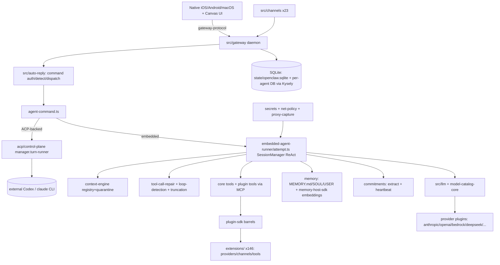
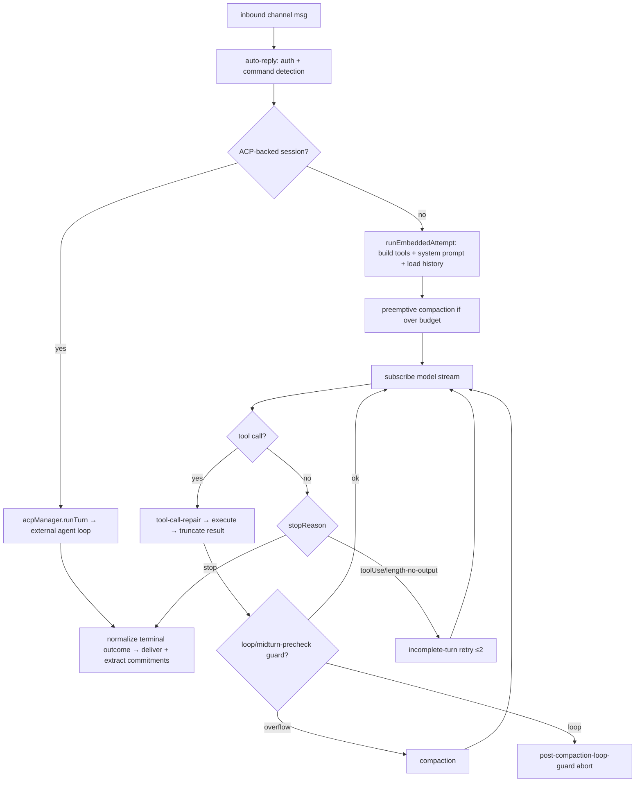
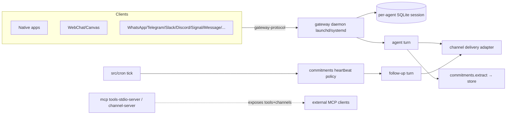
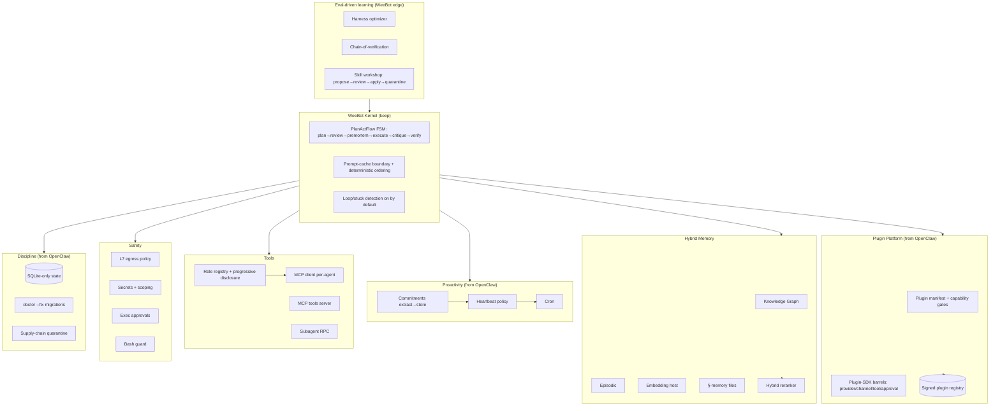
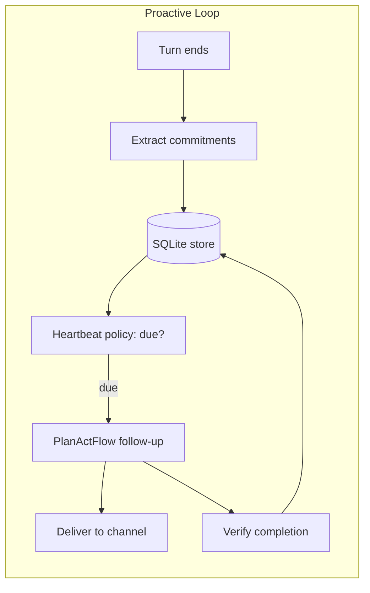

# OpenClaw Deep Technical Audit → WeeBot Optimization Report

**Audit target:** `openclaw/openclaw` @ `main`, shallow-cloned 2026-06-22
**Repo scale:** 20,481 tracked files · 16,555 TS · 692 Swift (iOS/macOS) · 188 Kotlin (Android) · 28 Go · MIT license · pnpm monorepo
**Comparison targets:** WeeBot (`E:\Documents\Vibe-Coding\weebot`) and — for context — `NousResearch/hermes-agent` (separately audited in `hermes_agent_deep_audit_report.md`)
**Method:** 1 parallel read-only kernel deep-dive (code-explorer) + direct reads/greps of every other subsystem over the live clone.
**Evidence convention:** Claims about OpenClaw are **FACT** (seen in code, cited `file:line`) or **HYPOTHESIS** (inferred). Absence claims mean "no evidence found in the audited surface." Cross-framework rows use established public knowledge, labelled as such.

> **Crucial framing:** OpenClaw is the **predecessor that Hermes forks from** — Hermes ships `hermes claw migrate` to import `~/.openclaw` SOUL.md/MEMORY.md/skills. They share DNA (personal single-user assistant, gateway + channels, skills, ACP, SOUL/MEMORY/USER files, "caching is sacred"). The defining difference: **OpenClaw is a TypeScript/Node monorepo with a plugin-agnostic core, SQLite-only storage, native mobile/desktop apps, and ~23 channels; Hermes is a leaner Python reimplementation of the same philosophy.** WeeBot is the third sibling — Python, but with *explicit planning* neither of them has.

---

## 1. Executive Summary

OpenClaw is a **local-first personal AI assistant** whose organizing principle (stated in `AGENTS.md`) is **"the core stays plugin-agnostic; capability lives in plugins."** Almost everything user-facing — every model provider, every one of ~23 channels, every tool bundle, speech, media generation — is a **plugin/extension** crossing into core only through `plugin-sdk` barrels and a manifest contract (`AGENTS.md:56-64`). The runtime is **SQLite-only** (Kysely, no JSON/sidecar state) and **migration-first** (`openclaw doctor --fix` owns all compat; runtime reads only the canonical shape — `AGENTS.md:74-83`). The agent itself is a **pure ReAct turn-runner** built on the Claude Code SDK session manager, with **ACP as an internal runtime protocol** that can bridge to externally-running Codex/Claude agents. It ships **real native iOS/Android/macOS apps** over a versioned gateway protocol.

Versus WeeBot: OpenClaw is **far broader at the edges** (channels, providers, native apps, plugin ecosystem of 146 extensions, embedding-backed memory, a novel *commitments* follow-through system) and **less rigorous at the center** (no explicit planning, no verification states, god-files). WeeBot remains **structurally ahead on planning, verification, and clean layering**, and is **less mature on extensibility breadth, storage discipline, and proactive follow-through**.

### Top 10 Insights (FACT unless noted)

1. **Plugin-agnostic core is the whole architecture.** Core carries no bundled ids/defaults/policy when a manifest/registry/capability contract can do it; plugins enter only via `src/plugin-sdk/*` + `packages/plugin-sdk/*` barrels (`AGENTS.md:56-64`). There are **146 extensions** (`extensions/`), spanning providers (anthropic, amazon-bedrock, deepseek, cohere, cerebras…), channels (discord, feishu…), tools (browser, canvas, comfy, document-extract), and even `active-memory`.
2. **SQLite-only, migration-first storage.** "Do not add JSON/JSONL/TXT/sidecar files for OpenClaw-owned runtime state" (`AGENTS.md:76`). Shared `state/openclaw.sqlite` + per-agent `agents/<id>/agent/openclaw-agent.sqlite`, accessed via **Kysely** (typed query builder), not raw SQL (`AGENTS.md:77-78`). `state-migrations.ts` is 5,356 lines.
3. **Pure ReAct, no planner.** The kernel (`src/agents/embedded-agent-runner/run/attempt.ts:834`, a **5,769-line** file) drives turns via the Claude Code SDK `SessionManager`; it *subscribes* to a model/tool stream rather than owning a `while(toolUse)` loop. No `Plan` object, no TODO. *Same gap as Hermes; WeeBot's `PlanActFlow` is ahead.*
4. **ACP is an internal runtime protocol, not just an adapter.** When a session is ACP-backed, `agent-command.ts:1001` routes the whole turn through `acpManager.runTurn(...)` and the tool loop runs inside an external agent process (Codex CLI / claude CLI); the OpenClaw kernel becomes an event relay (`src/acp/control-plane/manager.turn-runner.ts`).
5. **Governed learning loop (Skill Workshop).** `src/agents/tools/skill-workshop-tool.ts` exposes `propose-create / propose-update / revise / review / apply / quarantine / reject` over a workshop service. The agent *proposes* skills; a review→apply→quarantine lifecycle gates them. This is **more governed than Hermes's autonomous background-review fork** (which directly creates/patches).
6. **Embedding-backed memory.** `packages/memory-host-sdk/` is a real memory engine (`engine-embeddings.ts`, `engine-storage.ts`, `engine-qmd.ts`) with a batch-embedding HTTP pipeline (`host/batch-*`). Memory ≠ just flat files: it's `MEMORY.md`/`SOUL.md`/`USER.md` bootstrap context **plus** a vector memory host **plus** SQLite sessions. *Richer than Hermes's flat MEMORY.md.*
7. **Commitments — a genuinely novel subsystem.** `src/commitments/` extracts promises the assistant made (`extraction.ts`), persists them (`store.ts`, SQLite), and drives **heartbeat follow-through** (`commitments-heartbeat-policy.e2e.test.ts`). Proactive reliability that **neither Hermes nor WeeBot has.**
8. **Best-in-class channel/gateway surface.** `src/gateway/` is 733 files, `src/channels/` 382; a versioned `packages/gateway-protocol/` (44 files) is the daemon↔client/app wire format powering **native iOS (244)/Android (256)/macOS (388, incl. MLX TTS)** apps. ~23 channels.
9. **Supply-chain & secrets maturity.** `pnpm-workspace.yaml:7` sets `minimumReleaseAge: 2880` (won't install npm deps younger than 2 days — a real supply-chain defense). `src/secrets/` is **127 files**; `packages/net-policy/` enforces network egress; `src/proxy-capture/` inspects outbound traffic.
10. **Same honest, narrow security model as Hermes.** `SECURITY.md`: "local-first agent infrastructure for trusted operators; not a shared multi-tenant boundary." Prompt-injection-only chains and env-mutation primitives are explicitly **not** vulnerabilities. A dedicated `openclaw/trust` repo holds the threat model.

### Top 10 WeeBot Upgrades (from OpenClaw specifically)

| # | Upgrade | Why (OpenClaw evidence) | Effort |
|---|---------|--------------------------|--------|
| 1 | **Commitments / promise-tracking subsystem** | Auto-extract assistant commitments + heartbeat follow-through (`src/commitments/`) — proactive reliability nothing in WeeBot does | M |
| 2 | **Plugin-agnostic core + manifest/SDK-barrel contract** | Providers/channels/tools as plugins, not core (`AGENTS.md:56-64`); WeeBot bakes providers/gateways into core | H |
| 3 | **Embedding-backed memory host** | `memory-host-sdk` vector engine + batch pipeline; fuse with WeeBot's `episodic_memory`/`knowledge_graph` | M |
| 4 | **SQLite-only + migration-first (`doctor --fix`) discipline** | Runtime reads only canonical shape; all compat in migrations (`AGENTS.md:74-83`) | M |
| 5 | **Supply-chain dependency quarantine** | `minimumReleaseAge` 2-day delay; WeeBot (PyPI) can pin+delay+hash-verify | L |
| 6 | **Network egress policy (L7) + proxy capture** | `packages/net-policy/`, `src/proxy-capture/` — allowlist agent outbound traffic | M |
| 7 | **Skill proposal→review→apply→quarantine workflow** | `skill-workshop-tool.ts` governs skill authoring safely vs blind autonomous writes | M |
| 8 | **Versioned gateway protocol → native clients** | `packages/gateway-protocol/` enables native apps; WeeBot's web-only UI could gain a stable client protocol | H |
| 9 | **Semantic tool-loop detection** | `tool-loop-detection.ts` (generic_repeat / ping_pong / no-progress / circuit-breaker); complements WeeBot's `PlanStuckError` | L |
| 10 | **Context-engine quarantine-on-failure** | A failing context engine is quarantined + downgraded to default for process life (`context-engine/registry.ts:849`) | L |

### Top 5 Architectural Risks (OpenClaw — transferable warnings)
1. **God-files in a 16.5k-file monorepo** — `attempt.ts` 5,769; `gateway/server-methods/chat.ts` 5,108; `state-migrations.ts` 5,356; `openai-transport-stream.ts` 4,427.
2. **No explicit step budget; loop detection defaults OFF** (`tool-loop-detection.ts:44`) — infinite tool loops caught only by a window-3 post-compaction guard + token-pressure compaction.
3. **Pure ReAct fragility** — multi-step coherence rests entirely on model behavior; no plan/verify scaffolding.
4. **Trusted-operator-only security** — unfit for multi-tenant; prompt injection out-of-scope by policy.
5. **Monorepo sprawl & config surface** — 110KB `package.json`, 634KB `taxonomy.yaml`, 2.5MB changelog; high coordination cost for a small team.

### Top 5 Strategic Opportunities for WeeBot
1. **Proactive agent**: ship commitments/follow-through on WeeBot's structured `Plan`/event model — a differentiator over both siblings.
2. **True plugin platform**: a manifest+SDK-barrel contract + a ClawHub-style registry turns WeeBot's ports/adapters into a real ecosystem.
3. **Memory that's both structured and semantic**: WeeBot already has KG + episodic; add OpenClaw's embedding host for hybrid recall.
4. **Operational discipline as a feature**: SQLite-only + migration-first + supply-chain quarantine = enterprise trust the incumbents lack.
5. **Planning-rigorous + broad**: be the agent that both *plans/verifies* (WeeBot) and *runs everywhere with plugins* (OpenClaw).

### Recommended Roadmap (detail §9)
- **Sprint 1:** supply-chain quarantine · tool-loop detection · context-engine quarantine · skill proposal/quarantine gate.
- **Sprint 2–3:** commitments subsystem · embedding memory host · net egress policy.
- **Quarter 2:** plugin-agnostic core + manifest/SDK contract + registry.
- **Strategic:** versioned client protocol + native clients; ACP runtime bridge.

---

## 2. Technical Deep Dive — Repo Deconstruction (Deliverable 1)

### 2.1 Goals & core philosophy
**FACT.** "OpenClaw is a personal AI assistant you run on your own devices … The Gateway is just the control plane — the product is the assistant" (`README.md:21-24`). Single-user, local-first, always-on, multi-channel. Philosophy (`AGENTS.md`): telegraph-style root rules; **skills own workflows, root owns hard policy/routing** (`:4`); **core stays plugin-agnostic** (`:56`); **SQLite-only** (`:76`); **one canonical path, delete the old** (`:73`); **high config/env bar** (`:67`); **deterministic prompt-cache ordering** (`:108`).

### 2.2 Design principles
**FACT.** (a) Plugins cross into core only via `plugin-sdk` barrels + manifest metadata (`:57-58`). (b) Runtime reads canonical config only; `openclaw doctor --fix` owns migrations (`:65,74`). (c) State/storage is database-first; legacy files are migration debt (`:75,79`). (d) Compatibility is opt-in and must name a shipped contract (`:84-86`). (e) Hot paths carry prepared facts forward; no request-time re-discovery or freshness polling (`:98-101`). (f) Codex is folded into the `openai` provider; no new `openai-codex` routes (`:66`).

### 2.3 Architectural overview
**FACT.** Monorepo: `src/` (8,994 files — gateway, agents, channels, llm, mcp, cron, secrets, security, …), `packages/` (428 — `acp-core`, `agent-core`, `llm-core`, `gateway-protocol`, `memory-host-sdk`, `plugin-sdk`, `tool-call-repair`, …), `extensions/` (6,712 — the 146 plugins), `ui/` (Canvas), `apps/` (native iOS/Android/macOS). Entry: `openclaw` CLI → gateway daemon (launchd/systemd).

### 2.4 Agent execution lifecycle
**FACT.** Core entry `runEmbeddedAttempt` (`src/agents/embedded-agent-runner/run/attempt.ts:834`): resolve workspace+sandbox → build tools (`createOpenClawCodingTools`) → create session (Claude Code SDK `SessionManager`) → assemble system prompt → load+sanitize history (`attempt.llm-boundary.ts:42`) → **preemptive compaction** if over budget → `subscribeEmbeddedAgentSession` streams the turn. Termination by SDK `stopReason`; `isIncompleteTerminalAssistantTurn` (`incomplete-turn.ts:98`) treats `toolUse` or `length`-without-output as incomplete. ACP-backed sessions instead route through `acpManager.runTurn` (`agent-command.ts:1001`).

### 2.5 Planning methodology
**FACT.** Pure ReAct; no planner/Plan/TODO. The only "planning-ish" surface is optional **tool-search / code-mode** progressive disclosure (`attempt.ts:1202-1247`), letting the model request tool defs on demand instead of receiving all up front. **HYPOTHESIS:** coherence depends entirely on the model.

### 2.6 Tool invocation model
**FACT.** Dispatch is owned by the SDK session manager, wrapped by OpenClaw hooks: **tool-call-repair** (`packages/tool-call-repair/`; `attempt.tool-call-argument-repair.ts` fixes malformed JSON, xAI decode, name trimming, standalone-text promotion), **result truncation** (`tool-result-truncation.ts`), **loop detection** (`tool-loop-detection.ts`), **mid-turn precheck** (`midturn-precheck.ts:28`). Tool calls are **sequential** within a turn (standard tool-use contract). ~core tool set built by `createOpenClawCodingTools`; most capability arrives as plugin tools served via MCP.

### 2.7 Memory architecture
**FACT.** Three strata: (1) **Workspace memory files** — `MEMORY.md` canonical, symlink-safe (`src/memory/root-memory-files.ts:6,41`), plus `SOUL.md`/`USER.md` bootstrap context fed into the system prompt (`src/agents/system-prompt.ts`). (2) **Embedding memory host** — `packages/memory-host-sdk/` (`engine-embeddings.ts`, `engine-storage.ts`, batch HTTP pipeline); the `active-memory` extension wires it in. (3) **SQLite session state** — per-agent DB. **HYPOTHESIS:** the embedding host gives semantic recall the flat-file Hermes design lacks.

### 2.8 Context management strategy
**FACT.** `ContextEngine` is a **plugin contract** (`src/context-engine/types.ts:298`: `ingest`/`assemble`/`compact` + optional `maintain`/`afterTurn`); engines register in a global registry (`registry.ts:404`) resolved from `config.plugins.slots.contextEngine`, defaulting to "legacy." A failing non-default engine is **quarantined for the process lifetime** and silently downgraded (`registry.ts:849-855`). Compaction (`agent-hooks/compaction-safeguard.ts`): preserve ~3 recent turns, summarize the rest, optional quality guard, cap **16,000 chars** (`:65`). A lighter `context-pruning` "microcompact" prunes only the in-memory prompt.

### 2.9 Model abstraction layer
**FACT.** `src/llm/` (83 files) + `packages/llm-core` + `packages/llm-runtime` + `packages/normalization-core`; **providers are plugins** (`extensions/anthropic`, `amazon-bedrock`, `deepseek`, `cohere`, `cerebras`, `chutes`, `byteplus`, `alibaba`…). `packages/model-catalog-core/` (15 files) provides dynamic model metadata. Provider auth/catalog/runtime hooks are owned by the provider plugin; core owns the generic loop (`AGENTS.md:93`). Codex folded into `openai` (`:66`).

### 2.10 Multi-agent capabilities
**FACT.** Subagents are **ACP-spawned sub-sessions** (`src/agents/acp-spawn.ts`, `accepted-session-spawn.ts`) with isolated workspaces, context engines, and sessions; parent streams child events (`acp-spawn-parent-stream.ts`). A `codex-supervisor` extension exists for orchestration. No flat in-process delegate pool like Hermes; isolation is process/session-level via ACP.

### 2.11 Human-in-the-loop mechanisms
**FACT.** Command system in `src/auto-reply/` (`command-auth.ts`, `command-detection.ts`, `commands-registry.ts`, `dispatch.ts`) parses inbound channel messages into authorized commands. **Exec approvals** are a plugin-sdk runtime (`packages/plugin-sdk/src/exec-approvals-runtime.ts`). **Pairing** (`src/pairing/`, 12 files) authorizes channel users. Owner-default command auth (`command-auth.owner-default.test.ts`).

### 2.12 Failure recovery mechanisms
**FACT.** Loop guards: `tool-loop-detection.ts` (thresholds 10/20/30, **default disabled** `:44`), `post-compaction-loop-guard.ts` (window 3), `midturn-precheck.ts`. Incomplete-turn retries: reasoning-only ×2, empty-response ×1 (`incomplete-turn.ts:133-134`). ACP turns: 2 attempts with backend failover (`manager.turn-runner.ts:156`) + turn timeout with graceful cancel/close (`manager.turn-timeout.ts`). Terminal outcomes normalized & sticky (`agent-run-terminal-outcome.ts:98`).

### 2.13 Security assumptions
**FACT.** `SECURITY.md`: trusted single operator, **not** multi-tenant; prompt-injection-only, env-mutation, and malicious-plugin-after-install are **not** vulnerabilities. Defenses: `src/secrets/` (127 files), `packages/net-policy/` (L7 egress), `src/proxy-capture/`, supply-chain `minimumReleaseAge` (`pnpm-workspace.yaml:7`), private GHSA disclosure, separate `openclaw/trust` repo. Maintainers include NVIDIA/Tencent engineers.

---

## 3. Architecture Analysis (Deliverable 2)

### 3.1 Directory map (abridged)
```
openclaw/
├── src/ (8,994)
│   ├── agents/                 # kernel: embedded-agent-runner/, acp-spawn, agent-hooks/, tool-loop-detection
│   │   └── tools/skill-workshop-tool.ts   # governed skill authoring
│   ├── acp/control-plane/      # turn-runner, turn-stream, turn-timeout, active-turns
│   ├── context-engine/         # pluggable ContextEngine registry + quarantine
│   ├── gateway/ (733)          # control plane (server-methods/chat.ts 5,108)
│   ├── channels/ (382)         # ~23 channel transports
│   ├── commitments/            # promise extraction + heartbeat follow-through
│   ├── llm/ (83) · model-catalog/ · provider-runtime/
│   ├── mcp/                    # MCP server: tools-stdio-server, channel-server, *-serve
│   ├── memory/                 # root-memory-files (MEMORY.md/SOUL.md/USER.md)
│   ├── secrets/ (127) · security/ (81) · proxy-capture/ · cron/ (214) · daemon/ · pairing/
│   └── plugin-sdk/ · plugins/  # plugin loader + barrels
├── packages/ (428)            # acp-core, agent-core, llm-core, gateway-protocol, memory-host-sdk,
│                              #   plugin-sdk, plugin-package-contract, tool-call-repair, model-catalog-core
├── extensions/ (6,712)        # 146 plugins: providers + channels + tools + speech + media
├── apps/                      # ios (244), android (256), macos (388, +MLX TTS), shared
├── ui/ (516)                  # Canvas
└── taxonomy.yaml (634KB) · CHANGELOG.md (2.5MB) · package.json (110KB)
```

### 3.2 Component dependency graph (Mermaid)


### 3.3 Critical modules
| Module | Role | Risk |
|--------|------|------|
| `src/agents/embedded-agent-runner/run/attempt.ts` | Core turn orchestrator | 5,769 lines |
| `src/acp/control-plane/manager.turn-runner.ts` | ACP turn exec + failover | Central |
| `src/context-engine/registry.ts` | Engine registry + quarantine | Resilience-critical |
| `src/gateway/server-methods/chat.ts` | Gateway chat surface | 5,108 lines |
| `src/infra/state-migrations.ts` | SQLite migrations | 5,356 lines |
| `packages/plugin-sdk/*` | Plugin contract barrels | Ecosystem contract |
| `src/secrets/*` | Secret management | Security-critical (127 files) |

### 3.4 Control-flow — a turn (Mermaid)


### 3.5 Event-flow — gateway, channels, commitments (Mermaid)


### 3.6 Extension points
**FACT.** (1) **Plugins/extensions** via `packages/plugin-package-contract/` manifest + `plugin-sdk` runtime barrels (config, exec-approvals, gateway-method, provider-auth, security, acp, agent-harness) — add tools, channels, providers, commands without touching core. (2) **MCP** — consume external servers (per-agent bundles `agent-bundle-mcp-*`) and **serve** OpenClaw tools/channels (`src/mcp/tools-stdio-server.ts`, `openclaw-tools-serve.ts`). (3) **Skills** — `skills/*/SKILL.md` + ClawHub registry. (4) **ContextEngine** plugin slot. (5) **Channels** under `src/channels/` + channel plugins.

### 3.7 Technical debt
**FACT.** God-files: `attempt.ts` 5,769 · `state-migrations.ts` 5,356 · `gateway/server-methods/chat.ts` 5,108 · `openai-transport-stream.ts` 4,427 · `embedded-agent-runner/run.ts` 4,188. Config surface: 110KB `package.json`, 634KB `taxonomy.yaml`. Mitigated by aggressive modularization into `packages/`+`extensions/` and the migration-first/one-canonical-path rules, but the kernel hot-path file is very large.

### 3.8 Performance bottlenecks
**HYPOTHESIS/FACT.** Loop detection default-off (`tool-loop-detection.ts:44`) shifts protection to token-pressure compaction (`FACT`). Context-engine quarantine proxy hides original errors after first failure (`FACT`, `registry.ts:785`). 16.5k-TS-file build/typecheck cost is significant for contributors (`HYPOTHESIS`). Per-agent SQLite is good for isolation but multiplies connections under many concurrent agents (`HYPOTHESIS`).

---

## 4. Capability Matrix (Deliverable 3)

OpenClaw column = **FACT** (code-audited). Other frameworks = **public-knowledge baseline** (not code-audited). Scale ★–★★★★★.

| Dimension | OpenClaw | Hermes | OpenAI Agents SDK | LangGraph | CrewAI | AutoGen | PydanticAI | OpenHands | WeeBot (today) |
|-----------|:---:|:---:|:---:|:---:|:---:|:---:|:---:|:---:|:---:|
| **Planning** | ★★ ReAct (SDK) | ★★ ReAct+todo | ★★ handoffs | ★★★★★ graph | ★★★ roles | ★★★ | ★★ | ★★★ | ★★★★ explicit FSM+critic |
| **Memory** | ★★★★ files+embeddings+SQLite | ★★★★ files+FTS5+Honcho | ★★ | ★★★ | ★★ | ★★★ | ★★ | ★★★ | ★★★★ KG+episodic+behavioral |
| **Tool use** | ★★★★★ plugin tools + MCP + repair | ★★★★★ narrow-waist+disclosure | ★★★★ | ★★★★ | ★★★ | ★★★★ | ★★★★ | ★★★★ | ★★★★ registry+RPC+swarm |
| **Autonomy** | ★★★★ commitments + cron + skills | ★★★★ learning loop+cron | ★★ | ★★★ | ★★★ | ★★★ | ★★ | ★★★★ | ★★★★ autonomous_learning+harness |
| **Reliability** | ★★★ loop guards (off by default) | ★★★★ 21-cat recovery | ★★★ | ★★★★ durable | ★★ | ★★★ | ★★★ | ★★★ | ★★★★ circuit breaker+verify |
| **Observability** | ★★★ otel/prometheus plugins + cache obs | ★★★ insights | ★★★★ tracing | ★★★★ LangSmith | ★★★ | ★★★ | ★★★ | ★★★ | ★★★★ event bus+metrics+audit |
| **Scalability** | ★★★ per-agent DB, daemon | ★★ single-process | ★★★★ | ★★★★★ | ★★★ | ★★★ | ★★★★ | ★★★ | ★★★ FastAPI+CQRS |
| **Extensibility** | ★★★★★ plugin-agnostic core + 146 ext + ClawHub | ★★★★★ plugins+skills+MCP | ★★★ | ★★★★ | ★★★ | ★★★★ | ★★★ | ★★★★ | ★★★★ ports/adapters+MCP |
| **Production readiness** | ★★★★ native apps, supply-chain, MIT | ★★★★ ships hard | ★★★★ | ★★★★ | ★★★ | ★★★ | ★★★★ | ★★★ | ★★★ pre-1.0 |

**Reading:** OpenClaw leads on **extensibility breadth, memory richness, channel/native-app surface, and operational discipline (storage, supply chain)**; trails on **planning rigor, default-on reliability, and modular kernel health**. WeeBot leads OpenClaw on **planning + verification** and trails on **extensibility breadth, embedding memory, proactive follow-through, and native-client reach.**

---

## 5. Critical Review — Risks Ranked (Deliverable 7)

| Sev | Risk | Evidence | Transfer to WeeBot |
|-----|------|----------|--------------------|
| **CRITICAL** | Trusted-operator-only model; prompt injection out-of-scope | `SECURITY.md` | WeeBot web/multi-user product must add real trust boundaries (started in ADR 006) |
| **CRITICAL** | God-files in hot path (`attempt.ts` 5.7k, `chat.ts` 5.1k) | §3.7 | Preserve WeeBot hexagonal layering — do not regress |
| **HIGH** | Loop detection default-OFF → weak infinite-loop protection | `tool-loop-detection.ts:44` | Enable loop/stuck detection by default (WeeBot `PlanStuckError` already exists) |
| **HIGH** | No explicit plan/verify → coherence rests on model | §2.5 | WeeBot's `PlanActFlow`+verify is the antidote; keep it |
| **HIGH** | Quarantine proxy hides original engine errors after first failure | `context-engine/registry.ts:785` | Log root cause loudly before downgrading |
| **MEDIUM** | Embedding-memory growth & retrieval quality unbounded | `packages/memory-host-sdk` | Add eviction/salience (WeeBot `memory_lifecycle_service`) |
| **MEDIUM** | Plugin trust: a malicious installed plugin = full access (by design) | `SECURITY.md` | Add plugin capability gating / signing for WeeBot's registry |
| **MEDIUM** | Per-agent SQLite connection multiplication at scale | §3.8 | Keep pooling; bound concurrent agents |
| **LOW** | Monorepo/config sprawl raises contributor cost | 110KB pkg.json, 634KB taxonomy | WeeBot: resist config-surface growth (mirror `AGENTS.md:67`) |

**Context-window risk:** preemptive + safeguard compaction with a 16k-char summary cap (`compaction-safeguard.ts:65`); preserve only ~3 recent turns — aggressive trimming can drop mid-task detail. **Tool-reliability risk:** progressive tool disclosure + tool-call-repair mitigate provider quirks well, but loop detection being off is a real gap. **Memory degradation:** embeddings help recall but there's no evident salience-decay; flat MEMORY.md still grows unbounded.

---

## 6. WeeBot Optimization Analysis (Deliverable 4)

### 6.1 Adopt immediately
- **Supply-chain dependency quarantine** — mirror `minimumReleaseAge`: in WeeBot, pin + hash-verify + delay-adopt new PyPI deps. (`pnpm-workspace.yaml:7`)
- **Enable semantic tool-loop / stuck detection by default** — WeeBot has `PlanStuckError`/`ContinuationDetector`; add per-tool-call loop signatures (`generic_repeat`/`ping_pong`/`no-progress`) from `tool-loop-detection.ts`.
- **Context-engine/compressor quarantine** — on compressor failure, downgrade to a safe default for the process and log loudly.
- **Skill proposal→review→apply→quarantine gate** — wrap WeeBot's `skill_opt_flow`/`autonomous_learning` writes in the `skill-workshop` lifecycle for safety.

### 6.2 Adopt but modify
- **Commitments subsystem** — extract assistant promises and follow through via WeeBot's existing cron, but anchor commitments to `Plan`/`Step`/`AgentEvent` for richer provenance than OpenClaw's flat extraction.
- **Embedding memory host** — add a vector engine alongside WeeBot's `knowledge_graph`/`episodic_memory` for hybrid (graph + semantic) recall; reuse a batch-embedding pipeline like `memory-host-sdk/host/batch-*`.
- **Plugin-agnostic core + manifest/SDK contract** — evolve WeeBot's ports/adapters into a published plugin contract (manifest + capability barrels) so providers/channels/tools become installable plugins, not core edits.
- **Network egress policy** — add an L7 allowlist (`net-policy`) and optional proxy capture for the agent's outbound calls.

### 6.3 Avoid
- **God-files / mega-modules** — keep WeeBot files small and layered.
- **Pure ReAct without planning** — WeeBot's explicit planning is the moat; don't flatten it.
- **Trusted-operator-only security posture** — wrong default for a multi-user web product.
- **Loop detection disabled by default** — fail safe, not open.
- **Unbounded config/taxonomy surface** — adopt the high-bar config rule instead.

### 6.4 Missing capabilities (OpenClaw lacks — WeeBot's edge)
OpenClaw has **no explicit planner, no premortem/critique/verify, no chain-of-verification, no harness/eval-optimization, no knowledge graph, no clean hexagonal layering.** WeeBot has all of these. Lean in.

### 6.5 Categorized
**QUICK_WINS:** supply-chain quarantine · default-on loop/stuck detection · context-engine quarantine · skill proposal gate · prompt-cache boundary marker discipline.
**MEDIUM_TERM:** commitments/follow-through · embedding memory host · L7 egress policy + proxy capture · SQLite-only + migration-first hardening (`doctor --fix`).
**HIGH_LEVERAGE:** plugin-agnostic core + manifest/SDK barrel contract + ClawHub-style registry · hybrid (graph+vector) memory · ACP runtime bridge (be a Codex/Claude backend or host).
**MOONSHOTS:** versioned gateway/client protocol + native mobile/desktop apps · marketplace of signed, capability-gated plugins · cross-channel proactive agent (commitments + cron + KG) on a planning-rigorous core.

---

## 7. Feature Backlog — 28 Proposals (Deliverable 5)

> **Name** — Problem · Value · Approach · Complexity · Impact · Dependencies.

**Proactivity & follow-through**
1. **Commitments Engine** — Agent forgets promises · Proactive reliability · Extract commitments per turn (`commitments/extraction.ts` pattern) → SQLite store → cron heartbeat follow-up · **M** · High · cron, Plan model.
2. **Heartbeat Policy** — Follow-ups spam or never fire · Right-timed nudges · Policy engine over commitment store (due/snooze/escalate) · **M** · Med · #1.
3. **Commitment Provenance** — Untraceable promises · Trust/audit · Link each commitment to `Step`/`AgentEvent` · **L** · Med · #1.

**Memory**
4. **Embedding Memory Host** — Keyword recall misses paraphrase · Semantic recall · Vector engine + batch-embed pipeline (`memory-host-sdk`) behind `MemoryPort` · **M** · High · embeddings provider.
5. **Hybrid Retrieval** — Graph vs vector siloed · Best-of-both recall · Fuse `knowledge_graph` + vectors + FTS with reranking · **M** · High · #4.
6. **Memory Salience & Decay** — Unbounded growth · Durable signal · Score+decay entries; evict via `memory_lifecycle_service` · **M** · Med · #4.
7. **Symlink-Safe Memory Files** — Symlink redirect attack · Integrity · Resolve `MEMORY.md` only when a real file (`root-memory-files.ts:41`) · **L** · Low · —.

**Extensibility platform**
8. **Plugin Manifest Contract** — Providers/channels baked into core · Ecosystem · `plugin-package-contract`-style manifest + capability declarations · **H** · High · —.
9. **Plugin-SDK Runtime Barrels** — Plugins reach into internals · Stable API · Typed barrels (config, approvals, provider-auth, security) like `packages/plugin-sdk/*` · **H** · High · #8.
10. **Capability-Gated Plugins** — Malicious plugin = full access · Safe marketplace · Per-plugin capability grants + prompts · **M** · High · #8.
11. **Plugin Registry (ClawHub-style)** — No discovery · Network effects · Signed registry + `weebot plugin add` · **H** · Med · #8, #10.
12. **Provider-as-Plugin** — New provider = core edit · Velocity · Move provider auth/catalog/runtime into plugins · **M** · Med · #9.

**Tools / MCP / kernel**
13. **MCP Tools Server** — WeeBot tools unreachable by other agents · Interop · stdio MCP server exposing tools+channels (`mcp/tools-stdio-server.ts`) · **M** · Med · tool registry.
14. **Per-Agent MCP Bundles** — Global MCP leaks across agents · Isolation · Materialize MCP per subagent (`agent-bundle-mcp-*`) · **M** · Med · #13.
15. **Tool-Call Repair** — Provider-malformed tool JSON fails turns · Robustness · Repair/sanitize/trim/decode before exec (`tool-call-repair`) · **M** · High · executor.
16. **Semantic Loop Detection (default on)** — Infinite tool loops · Safety/cost · Window history + repeat/ping-pong/no-progress signatures · **L** · High · executor.
17. **Context-Engine Quarantine** — One bad engine kills runs · Resilience · Quarantine+downgrade on failure (`registry.ts:849`) · **L** · Med · context_manager.
18. **Prompt-Cache Boundary Marker** — Cache breaks silently · Token savings · Inject a stable boundary; append dynamic context after it (`system-prompt-cache-boundary.ts`) · **L** · High · LLMPort. *(also in Hermes report #1)*

**Storage & ops discipline**
19. **SQLite-Only Runtime State** — Sidecar JSON drift · Integrity · Move runtime state to SQLite; files only as named artifacts (`AGENTS.md:76`) · **M** · Med · state repo.
20. **Migration-First (`doctor --fix`)** — Runtime compat shims rot · Lean runtime · All compat in migrations; runtime reads canonical only · **M** · Med · #19.
21. **Supply-Chain Quarantine** — Hijacked new deps · Security · Delay+pin+hash-verify new PyPI deps · **L** · High · CI.

**Security & networking**
22. **L7 Egress Policy** — Unbounded agent network calls · Containment · Allowlist outbound hosts (`net-policy`) · **M** · High · —.
23. **Proxy Capture / Inspection** — No outbound visibility · Audit · Capture+inspect tool HTTP (`proxy-capture`) · **M** · Med · #22.
24. **Secrets Subsystem Hardening** — Ad-hoc secret handling · Safety · Centralize secret sources/scoping (`src/secrets/`) · **M** · High · —.
25. **Exec-Approval Runtime** — Inconsistent approvals · Safe ops · Pluggable approval contract (`plugin-sdk/exec-approvals-runtime`) · **L** · Med · approval_policy.

**Reach & clients**
26. **Versioned Gateway/Client Protocol** — Web-only UI · Native clients · Stable RPC protocol (`gateway-protocol`) for future apps · **H** · Med · web layer.
27. **ACP Runtime Bridge** — No Codex/Claude-CLI backend · Interop + IDE reach · ACP control-plane to run external agents as backends · **H** · Med · #26.
28. **Channel Plugin Abstraction** — Channels coupled to core · Breadth · Transport-only channel plugins behind typed presentation actions (`AGENTS.md:93-96`) · **M** · Med · #9.

---

## 8. Redesign Proposal — WeeBot informed by OpenClaw + Hermes (Deliverable 6)

Principle: **WeeBot's planning-rigorous, clean core + OpenClaw's plugin-agnostic edge, embedding memory, and proactive follow-through + Hermes's cache discipline.**





**Design deltas vs OpenClaw:** (1) keep the **explicit FSM** — don't regress to pure ReAct; (2) commitments anchor to `Plan`/`Step` (provenance OpenClaw lacks); (3) **loop detection on by default**; (4) **capability-gated, signed plugins** (OpenClaw trusts installed plugins fully); (5) eval-gated skill workshop (combine OpenClaw's proposal/quarantine governance with WeeBot's harness scoring).

---

## 9. Implementation Roadmap (Deliverable 8)

| Phase | Window | Items (§7) | Exit criteria |
|-------|--------|------------|---------------|
| **P0 — Discipline & safety** | Sprint 1 | #16 loop detection · #17 engine quarantine · #21 supply-chain quarantine · #18 cache boundary · #7 symlink-safe memory | Default-on loop guard; reproducible dep-quarantine; measured cache stability |
| **P1 — Proactivity & memory** | Sprint 2–3 | #1–#3 commitments · #4–#6 embedding/hybrid/salience memory · #15 tool-call repair | Agent reliably follows up on promises; semantic recall benchmark beats keyword baseline |
| **P2 — Security & ops** | Sprint 3–4 | #19 SQLite-only · #20 migrations · #22–#25 egress/proxy/secrets/approvals | All runtime state in SQLite; outbound allowlist enforced; centralized secrets |
| **P3 — Plugin platform** | Quarter 2 | #8–#12 manifest/SDK/capability/registry/provider-as-plugin · #13–#14 MCP server/bundles · #28 channel plugins | A provider+channel ship as installable, capability-gated plugins; tools served over MCP |
| **P4 — Reach** | Strategic | #26 client protocol · #27 ACP bridge · #11 registry network | Versioned client protocol; WeeBot runs as/with an ACP backend |

**Sequencing rationale:** P0 closes OpenClaw's real weaknesses (open loops, blind deps) cheaply. P1 delivers OpenClaw's two best ideas WeeBot lacks — **proactive commitments** and **semantic memory** — on WeeBot's structured substrate. P2 adopts OpenClaw's operational discipline. P3 converts WeeBot's ports/adapters into a true **plugin platform** (its largest long-term lever). P4 extends reach to native clients and the ACP ecosystem. Throughout, WeeBot keeps its decisive advantage — **explicit planning + verification + eval-driven learning** — which neither OpenClaw nor Hermes has.

---

## Appendix A — Evidence Index (selected)
- Philosophy: `AGENTS.md:4,56-64,67,74-83,93-96,108`; README:21-26,32
- Kernel: `src/agents/embedded-agent-runner/run/attempt.ts:834` (5,769 lines); ACP route `src/agents/agent-command.ts:1001`; incomplete-turn `incomplete-turn.ts:98,133-134`; loop guards `tool-loop-detection.ts:41-44`, `post-compaction-loop-guard.ts:55`, `midturn-precheck.ts:28`
- Context/cache: `src/context-engine/types.ts:298`, `registry.ts:849`; `system-prompt-cache-boundary.ts:8`; `prompt-cache-retention.ts:20`; compaction `agent-hooks/compaction-safeguard.ts:65`
- Memory: `src/memory/root-memory-files.ts:6,41`; `packages/memory-host-sdk/src/engine-embeddings.ts`
- Skills: `src/agents/tools/skill-workshop-tool.ts`; `src/skills/discovery/skill-index.ts`; `skills/clawhub/SKILL.md`; `taxonomy.yaml`
- Commitments: `src/commitments/extraction.ts`, `runtime.ts`, `store.ts`, `commitments-heartbeat-policy.e2e.test.ts`
- Plugins/MCP: `packages/plugin-sdk/src/*-runtime.ts`; `packages/plugin-package-contract/`; `extensions/` (146); `src/mcp/tools-stdio-server.ts`, `openclaw-tools-serve.ts`, `channel-server.ts`
- Providers: `src/llm/` (83); `packages/model-catalog-core/`; provider plugins in `extensions/`
- Gateway/channels/apps: `src/gateway/` (733), `src/channels/` (382), `packages/gateway-protocol/` (44), `apps/{ios,android,macos}`
- Security/ops: `SECURITY.md`; `src/secrets/` (127); `packages/net-policy/`; `src/proxy-capture/`; `pnpm-workspace.yaml:7` (`minimumReleaseAge: 2880`)
- God-files: `attempt.ts` 5,769 · `state-migrations.ts` 5,356 · `gateway/server-methods/chat.ts` 5,108 · `openai-transport-stream.ts` 4,427

## Appendix B — WeeBot vs OpenClaw (read-grounded delta)
- **Explicit planning:** WeeBot PRESENT/superior (`weebot/application/flows/plan_act_flow.py:75`); OpenClaw ABSENT (pure ReAct).
- **Verification/eval:** WeeBot PRESENT (`chain_of_verification.py`, `harness_*`); OpenClaw ABSENT.
- **Persistent memory:** both PRESENT; OpenClaw adds embedding host (`memory-host-sdk`) WeeBot lacks as a first-class engine.
- **Knowledge graph:** WeeBot PRESENT (`knowledge_graph.py`); OpenClaw ABSENT.
- **Skills + creation:** both PRESENT; OpenClaw's is proposal/review/quarantine-gated (`skill-workshop-tool.ts`), WeeBot's is `skill_opt_flow`/`autonomous_learning`.
- **Commitments/proactive follow-through:** OpenClaw PRESENT (`src/commitments/`); WeeBot ABSENT → top adopt.
- **Plugin-agnostic core + registry:** OpenClaw PRESENT (146 ext + ClawHub); WeeBot PARTIAL (ports/adapters, no plugin contract/registry).
- **MCP:** both PRESENT (client+server).
- **Messaging gateways:** OpenClaw ~23 + native apps; WeeBot 6 (discord/email/signal/slack/telegram/whatsapp).
- **Supply-chain quarantine / L7 egress / large secrets subsystem:** OpenClaw PRESENT; WeeBot ABSENT → adopt.
- **SQLite-only + migration-first:** OpenClaw PRESENT/strict; WeeBot PARTIAL (SQLite state, less strict).
- **Prompt-cache discipline:** OpenClaw PRESENT (boundary marker + ordering); WeeBot PARTIAL (soft caching adapter).
- **Clean layering / small files:** WeeBot PRESENT/superior; OpenClaw has hot-path god-files.
