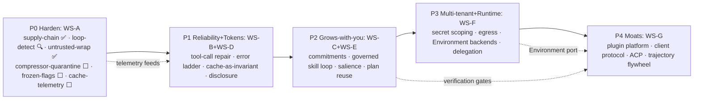

# WeeBot Unified Implementation Plan — Hermes + OpenClaw, De-conflicted

**Purpose:** A single, de-duplicated roadmap merging the two audit backlogs into one sequenced plan.
**Sources:** [hermes_agent_deep_audit_report.md](hermes_agent_deep_audit_report.md) (30 proposals) · [openclaw_deep_audit_report.md](openclaw_deep_audit_report.md) (28 proposals).
**Tags:** `[H]` Hermes-derived · `[O]` OpenClaw-derived · `[N]` net-new (WeeBot-strength). Complexity L/M/H.
**Status tags:** ✅ done · 🔍 already existed (verified in code) · ⬜ pending.
**Method:** Every item verified against WeeBot's *actual* code (not docs) and against the other plan. Overlapping items are **merged into one workstream**, not listed twice. Nothing here duplicates or contradicts a pattern already adopted.

---

## 0. Already present in WeeBot — explicitly OUT of scope (verified in code)

Do **not** re-propose these; they exist:
- **Vector/semantic memory + reranking** — `weebot/application/ports/vector_store_port.py`, `infrastructure/adapters/numpy_vector_store.py`, `services/semantic_skill_retriever.py`, `reranking_skill_retriever.py`, `rag_port.py`, `qmd_integration/embeddings.py`.
- **FTS5 + proactive opportunity discovery** — `services/opportunity_engine.py` (6-hourly KG+FTS5 scan → ranked `pending_opportunities`), `persistence/migrations/fts5_down.sql`.
- **MCP client + server** — `mcp_tool_registry_bridge.py`, `mcp_sampling_handler.py`, `mcp_tool_skill_indexer.py`, `atomicmail/mcp_server.py`.
- **Migrations + doctor** — `persistence/migrations/`, `cli.main doctor`.
- **Explicit planning + verification + harness eval** — `PlanActFlow`, `chain_of_verification.py`, `harness_*` (WeeBot's moat; **preserve**).
- **Already-ported Hermes patterns** — `error_classifier.py`, `conversation_compressor.py`, `step_budget.py`, `trajectory_exporter.py`, `skill_curator.py`, `persistent_memory.py`, `mixture_of_agents.py`, tool-output truncation. Items below **extend** these, never re-create them.
- **Semantic tool-loop detection** 🔍 — `TrajectoryMonitor` (`services/trajectory_monitor.py`) already implements `SEMANTIC_LOOP` / `REPEATING` / `STAGNATING` health states, wired into `executor/_base.py` with recovery injection and auto-abort. Dropped from WS-A backlog.

## 0a. Non-negotiable guardrails (preserve while building)
1. **Keep the explicit `PlanActFlow`** — never flatten to pure ReAct (both siblings lack planning; it's WeeBot's edge).
2. **Keep clean hexagonal layering / small files** — never create Hermes/OpenClaw-style god-files.
3. **Prompt-cache discipline is an invariant** — no mid-session system-prompt mutation (Phase 1 formalizes this).
4. **Do not adopt "trusted-operator-only / prompt-injection-is-not-a-vuln"** — WeeBot targets multi-user; keep structural trust boundaries (ADR 006).
5. **Loops stay bounded** — additive guards only; never remove `StepBudget`/`PlanStuckError`.

---

## 1. Unified backlog by workstream (merged, de-duplicated)

### WS-A · Safety & discipline

| Item | Src | Cx | Status | Notes / files |
|------|-----|----|--------|---------------|
| Supply-chain dependency quarantine | [O] | L | ✅ | `requirements.txt` key packages pinned to `==`; `scripts/check_deps.sh` wraps `pip-audit` + open-range check for critical packages |
| Semantic tool-loop detection | [O] | L | 🔍 | Already in `TrajectoryMonitor` — `SEMANTIC_LOOP`, `REPEATING`, `STAGNATING` wired into executor with auto-abort |
| Untrusted-content semantic wrapping for web/MCP/email tool output | [H] | L | ✅ | `core/trust_boundary.py` `wrap_untrusted()` now called in `executor/_base.py` at the conversation-buffer append point; 10 WeeBot tools added to `UNTRUSTED_OUTPUT_TOOLS` (6 gateways + atomic_mail + mcp_tool/mcp_call); 19 unit tests in `tests/unit/core/test_trust_boundary.py` |
| Compressor quarantine-on-failure (downgrade to safe default + loud log) | [O] | L | ⬜ | Resilience around existing `conversation_compressor` |
| Import-frozen safety flags (snapshot approval/redaction toggles at import) | [H] | L | ⬜ | Tamper-resistance for `approval_policy.py` |
| Cache-invalidation telemetry (WARN + metric on system-prompt rebuild) | [H] | L | ⬜ | Prereq for WS-D; deferred: `AnthropicCachingAdapter` not yet wired into adapter chain — instrument after P1 integration |

### WS-B · Resilience & recovery

| Item | Src | Cx | Status | Notes / files |
|------|-----|----|--------|---------------|
| Tool-call argument repair (fix malformed JSON, provider quirks, fuzzy names) | [O] | M | ⬜ | `validation.py` rejects; this *repairs* before validate. Distinct from API-error recovery |
| Error-taxonomy expansion + tiered recovery ladder | [H] | M | ⬜ | **Extends** existing `error_classifier.py` (96→~21 categories) onto `resilient_adapter` states |
| Iteration-budget refund (refund cheap RPC turns) | [H] | L | ⬜ | **Extends** ported `step_budget.py` |

### WS-C · Memory, learning & proactivity (WeeBot "grows with you")

| Item | Src | Cx | Status | Notes / files |
|------|-----|----|--------|---------------|
| **Commitments / promise-honoring** (extract assistant promises → store → heartbeat follow-up) | [O] | M | ⬜ | NOT `opportunity_engine` (that generates *new* goals); reuse its `pending_*` surfacing + cron |
| Commitment & opportunity provenance in the Knowledge Graph | [N] | M | ⬜ | KG nodes + edges to originating `Plan`/`Step`/session |
| Governed skill loop = anti-pattern guard + proposal→quarantine→review gate + verification-gated promotion + cache-parity review fork + curator consolidation | [H]+[O]+[N] | M-H | ⬜ | **One** hardening of existing `autonomous_learning`/`skill_opt_flow`/`skill_curator`; promotion gated by `chain_of_verification`+harness score |
| Memory salience scoring + eviction | [H] | M | ⬜ | Wire into existing `memory_lifecycle_service`/`memory_archivist` |
| Dialectic user-model deepening (periodic "what we know about the user" pass) | [H] | M | ⬜ | **Extends** `behavioral_learner`; store in KG |
| Session-search UX (goal→match→resolution bookends) over existing FTS5 | [H] | L | ⬜ | PARTIAL — FTS5 infra already present; this is the retrieval UX on `search_history` |

### WS-D · Context efficiency & caching

| Item | Src | Cx | Status | Notes / files |
|------|-----|----|--------|---------------|
| Prompt-cache-as-invariant: persist byte-stable system prompt + restore verbatim + rebuild only on model/provider change | [H] | M | ⬜ | Upgrades soft `anthropic_caching_adapter`; needs WS-A telemetry; `AnthropicCachingAdapter` currently unconnected |
| Tool-call JSON normalizer (sorted keys, no-space separators) | [H] | L | ⬜ | Bit-stable prefixes |
| Progressive tool disclosure + footprint-ladder governance | [H] | M | ⬜ | Keep base context flat as tools/MCP grow; `tool_registry` |

### WS-E · Planning leverage (WeeBot-unique)

| Item | Src | Cx | Status | Notes / files |
|------|-----|----|--------|---------------|
| Plan-template reuse cache (seed planning from validated prior `Plan`s by task signature) | [N] | M | ⬜ | Operates on plan *data*, not prompt prefix — no conflict with WS-D |

### WS-F · Security, secrets & execution

| Item | Src | Cx | Status | Notes / files |
|------|-----|----|--------|---------------|
| Per-profile secret scoping (fail-closed on unscoped read) | [H] | M | ⬜ | Multi-tenant safety; `config_adapter` |
| Credential pool rotation (OK/exhausted/dead states) | [H] | M | ⬜ | `adapter_factory` |
| OWASP DM pairing (crypto codes, expiry, rate-limit, lockout, 0600) | [H] | L | ⬜ | Harden the 6 existing gateways |
| L7 network-egress allowlist + outbound proxy capture | [O] | M | ⬜ | Outbound control (orthogonal to inbound wrapping in WS-A); WeeBot has only fs/bash guards |
| Env secret scrubbing for `subagent_rpc`/code-exec children | [H] | L | ⬜ | Strip keys before spawning |
| Execution `Environment` port + Docker/SSH/serverless backends | [H] | H | ⬜ | "Runs anywhere" + safe untrusted exec; abstract bash/python/file behind a port |
| Async delegation handles + orchestrator/leaf roles + depth cap | [H] | M | ⬜ | Harden `dispatch_agents`/`swarm` |

### WS-G · Platform, extensibility & reach (moats)

| Item | Src | Cx | Status | Notes / files |
|------|-----|----|--------|---------------|
| Plugin platform: manifest + capability-gated SDK barrels + signed registry | [O] | H | ⬜ | Providers/channels/tools as installable units (skills already have a registry) |
| Provider/channel-as-plugin migration | [O] | M | ⬜ | Depends on plugin platform |
| Self-authoring tools (agent writes+tests+registers via the ladder) | [H] | H | ⬜ | Depends on plugin platform + Environment + verification |
| MCP sampling/elicitation parity | [H] | M | ⬜ | **Extends** existing `mcp_sampling_handler` |
| Versioned gateway/client protocol (toward native clients) | [O] | H | ⬜ | Stable RPC over FastAPI/SSE/WS |
| ACP runtime/editor bridge (be a Codex/Claude backend or Zed host) | [H]+[O] | H | ⬜ | Depends on client protocol |
| Trajectory training flywheel (batch runner + toolset-distribution sampling + compression → SFT/RL) | [H] | H | ⬜ | **Extends** `trajectory_exporter` (export → flywheel) |

---

## 2. Unified phased roadmap

| Phase | Theme | Workstream items | Status | Exit criteria |
|-------|-------|------------------|--------|---------------|
| **P0** Harden (Sprint 1) | Safety, cheap wins | All of **WS-A** | 🟡 In progress (3/6 ✅, 1 🔍, 2 ⬜) | Dep-quarantine in CI; default-on loop detection; tool output fenced as DATA; cache-rebuild telemetry live |
| **P1** Reliability & tokens (Sprint 2–3) | Recovery + caching | **WS-B** + **WS-D** | ⬜ | Malformed tool calls auto-repaired; ≥20% token savings on a 50-turn benchmark; flat base context with 5 MCP servers |
| **P2** Grows-with-you (Sprint 4–6) | Memory, learning, proactivity, planning | **WS-C** + **WS-E** | ⬜ | Agent honors its promises (commitments); governed skill loop promotes only verification-passing skills; plan reuse cuts cold-planning on recurring tasks |
| **P3** Multi-tenant & runtime (Quarter 2) | Security + execution + multi-agent | **WS-F** | ⬜ | Per-profile secrets fail-closed; egress allowlist enforced; Docker/serverless execution; bounded delegation trees |
| **P4** Moats (Strategic) | Platform + reach + flywheel | **WS-G** | ⬜ | A provider+channel ship as capability-gated plugins; versioned client protocol; eval-gated trajectory dataset produced |

### Cross-plan merges resolved (no duplicates)
- **Learning/skills:** Hermes "closed fork + anti-pattern guard + curator consolidation" **+** OpenClaw "proposal/quarantine gate" **+** net-new "verification-gated promotion" → **one** WS-C governed-skill-loop item.
- **Loop/iteration safety:** Hermes "iteration-budget refund" (WS-B) **+** OpenClaw "semantic loop detection" dropped to 🔍 (already in `TrajectoryMonitor`) — only refund remains in WS-B.
- **Security:** Hermes secret-scoping/credential/pairing/scrubbing **+** OpenClaw egress/supply-chain → unified across WS-A (supply-chain ✅) and WS-F (the rest); no overlap.
- **Caching:** only the Hermes cache items survive (OpenClaw's boundary-marker is the same idea) → single WS-D.
- **ACP/reach:** Hermes "ACP editor bridge" **+** OpenClaw "versioned client protocol" sequenced together in WS-G (protocol first, then bridge).
- **Memory:** vector/FTS5/opportunity-discovery dropped (already in WeeBot); only salience, dialectic deepening, commitments, KG-provenance, and session-search-UX remain.

---

## 3. Sequencing rationale
P0 buys safety for near-zero effort and unlocks P1 (cache telemetry must precede cache-as-invariant). P1 pays for itself in tokens and robustness and removes the MCP-growth ceiling. P2 ships WeeBot's differentiated "grows with you + plans" story on its structured `Plan`/KG substrate (the two siblings can't match this). P3 makes WeeBot safely multi-tenant and "runs anywhere." P4 are the durable moats — a plugin ecosystem, native-client reach, and an **eval-gated** trajectory flywheel — all on a planning-rigorous, cleanly-layered core neither Hermes nor OpenClaw possesses.

## 4. P0 completion log

| Date | Item | Files changed |
|------|------|---------------|
| 2026-06-22 | ✅ Supply-chain quarantine | `requirements.txt` (key packages pinned to `==`), `scripts/check_deps.sh` (pip-audit wrapper) |
| 2026-06-22 | ✅ Untrusted-content wrapping | `core/trust_boundary.py` (+10 tools to `UNTRUSTED_OUTPUT_TOOLS`), `executor/_base.py` (wire `wrap_untrusted()` at buffer-append), `tests/unit/core/test_trust_boundary.py` (19 tests) |
| 2026-06-22 | 🔍 Semantic loop detection | Already present — `services/trajectory_monitor.py` + `executor/_base.py` |

## 5. Next: P0 remaining items, then P1

**P0 remaining (2 items):**
- **Compressor quarantine-on-failure** — catch `ConversationCompressor` errors in `executor/_context_compressor.py`, log WARN, fall back to raw buffer (no compression) rather than propagating an exception mid-step.
- **Import-frozen safety flags** — add `_frozen` sentinel to `approval_policy.py` that blocks mutation of the approval/redaction toggle lists after initial load; raises `RuntimeError` if code attempts to widen permissions at runtime.

**Cache-invalidation telemetry** deferred to P1: the `AnthropicCachingAdapter` is implemented but not connected to any adapter in the factory. Wire it into `resilient_adapter` / `adapter_factory` first (P1 WS-D item), then instrument the rebuild event.

**P1 kickoff (after P0 complete):**
1. Wire `AnthropicCachingAdapter` into `adapter_factory` / `resilient_adapter` + add rebuild WARN telemetry
2. Tool-call JSON normalizer (sorted keys)
3. Tool-call argument repair before `validation.py` reject
4. Error-taxonomy expansion in `error_classifier.py`
